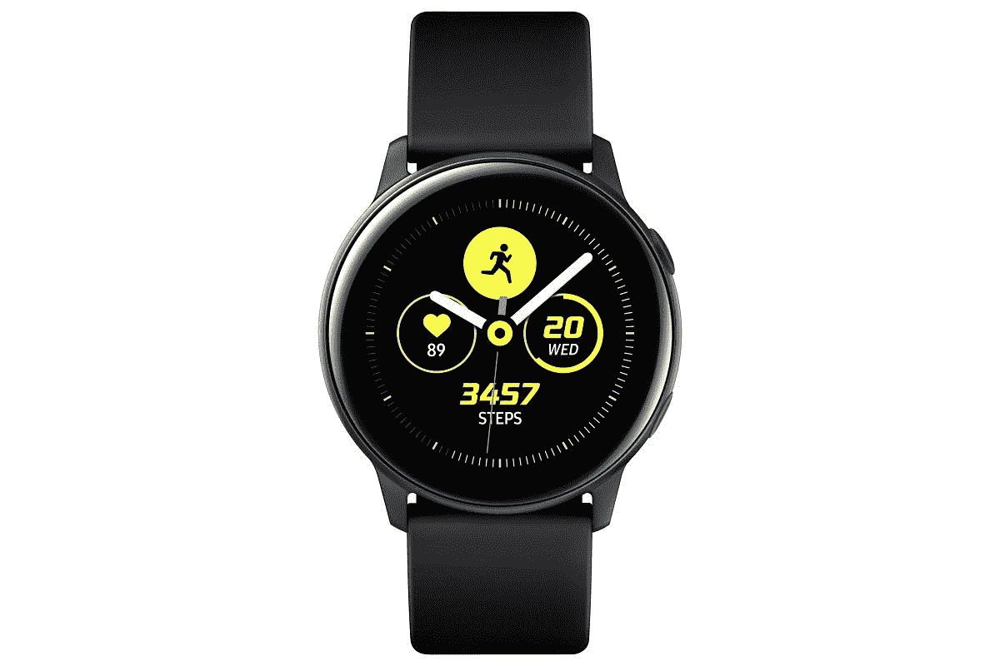

# 购买 Galaxy Watch Active 2 可节省 150 美元，现在就开始下决心吧

> 原文：<https://www.xda-developers.com/galaxy-watch-active-2-amazon/>

正如你可能已经听说的，今年的第一个三星拆包很快就要到来，它将包括关于[三星 Galaxy S21](https://www.xda-developers.com/samsung-galaxy-s21/) 和更多的信息。但是对于节俭的购物者来说，新技术的出现意味着完全不同的东西...为现在“过时”的设备节省大量资金！大多数三星产品都处于技术的前沿，所以对其他公司来说，一年前的技术仍然比现在的技术好。现在都 2021 年了，还有一件东西在大打折扣？银河手表主动 2。

现在也有很多理由让 Galaxy Watch Active 2 上市。这是新的一年的开始，这意味着许多人心中都有他们的新年决心。在最好的情况下，许多人在新的一年里都想着健康和健身，但更多的是为了 2021 年，因为我们大多数人去年花了很多时间闷在家里。Active 2 非常适合跟踪您的健康状况，具有心率读数、自动跟踪锻炼等功能。Active 2 的电池一次充电也能持续一天以上。全天跟踪您的健康状况，然后在晚上充电！

此外，尽管我有 [Galaxy Fit 2](https://www.amazon.com/Samsung-Galaxy-Bluetooth-Fitness-Tracking/dp/B08H78J3K3?tag=xda-4pb1h4h-20&ascsubtag=UUxdaUeUpU31305&asc_refurl=https%3A%2F%2Fwww.xda-developers.com%2Fgalaxy-watch-active-2-amazon%2F&asc_campaign=Short-Term) ，但我发现三星健康应用程序非常有用。该应用程序可以跟踪你需要了解的关于你健康的一切信息，无论是来自 Active 2 还是你手动输入的，它都很容易做到。我很难找到一个应用程序来做我希望它做的所有与健康相关的事情，三星健康非常非常接近我需要的一切。再加上像 Galaxy Watch Active 2 这样的智能手表，该应用程序可以很好地跟踪你需要了解的健康习惯。

目前，在亚马逊上，44 毫米型号的 Galaxy Watch Active 2 降价 150 美元，总价格降至 250 美元。你也可以注册一个付款计划，在五个月内支付 50 美元！不需要 Prime Rewards 卡。

 <picture></picture> 

Galaxy Watch Active 2 (44mm)

##### 三星 Galaxy Watch Active 2

想跟踪你今年的健康状况吗？Galaxy Watch Active 2 是一个很好的选择。购买这款智能手表可节省 150 美元，并在 2021 年保持健康！