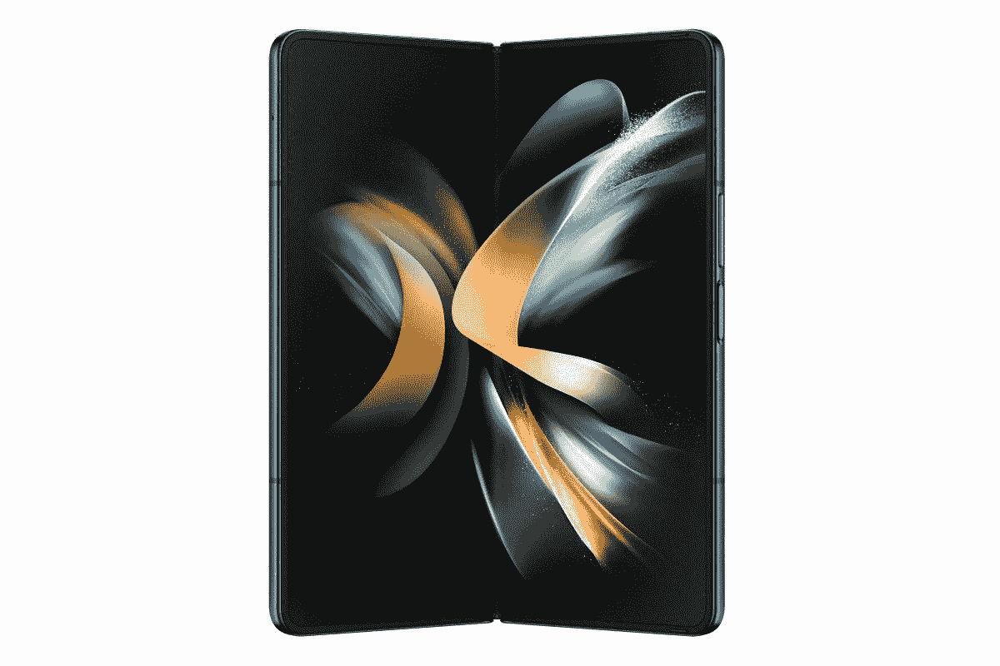

# 购买新的 Galaxy Z Fold 4 或 Galaxy Z Flip 4，即可获得免费内存升级和高达 1000 美元的以旧换新积分

> 原文：<https://www.xda-developers.com/galaxy-z-fold-4-galaxy-z-flip-4-memory-upgrade-trade-in-credit-deal/>

# 三星目前正在为其最新的可折叠产品提供免费的内存升级和高达 1000 美元的折价积分

除了亚马逊正在进行的 Prime Day 销售活动，三星还在其网站上举办了 48 小时的销售活动，其中包括 Galaxy Z Fold 4 和 Galaxy Z Flip 4 的优惠活动。

亚马逊今年的第二个 Prime Day 活动是各种类别的优惠活动。但这家电子商务巨头并不是唯一一家在今明两天举办销售活动的公司。三星还宣布了与之竞争的电视和移动销售，其最新的可折叠电视、标志性的框架电视、Neo QLED 8K 电视等都有惊人的优惠。

如果到目前为止你一直在推迟购买 Galaxy Z Fold 4 或 T2 Galaxy Z Flip 4，现在可能是点击购买按钮的最佳时机。这是因为三星正在为这两款设备提供免费的内存升级，这意味着你可以以 256GB 的价格获得 512GB 的版本。如果你选择 Galaxy Z Fold 4 的顶级 1TB 版本或 Galaxy Z Flip 4 的 512GB 版本，该公司会给你 350 美元或 150 美元的统一折扣。但这还不是全部。

 <picture></picture> 

Samsung Galaxy Z Fold 4

立即在 Galaxy Z Fold 4 上获得免费内存升级和高达 1000 美元的以旧换新积分！

对于那些有旧设备以旧换新的人，三星还为 Galaxy Z Fold 4 提供高达 1000 美元的增强以旧换新信贷，为 Galaxy Z Flip 4 提供高达 700 美元的信贷。这些优惠也适用于定制的 Galaxy Z Flip 4，如果你选择其中一个推荐的选项，你可以额外获得 100 美元的优惠(仅适用于 256GB 未锁定)。虽然亚马逊也在为三星最新的可折叠产品提供折扣，但如果你选择 512GB 的 Galaxy Z Fold 4 或 512GB 的 Galaxy Z Flip 4，三星网站上的优惠会稍微好一些。

 <picture></picture> 

Samsung Galaxy Z Flip 4

立即在 Galaxy Z Flip 4 上获得免费内存升级和高达 700 美元的以旧换新积分！

您可以通过点击上面提供的链接立即申请这些交易。请注意，优惠活动只持续到 10 月 12 日，所以请确保您尽快抓住机会。

*在三星的促销活动中，你会购买 Galaxy Z Fold 4 还是 Galaxy Z Flip 4？你会选择哪种型号，为什么？请在下面的评论区告诉我们。*