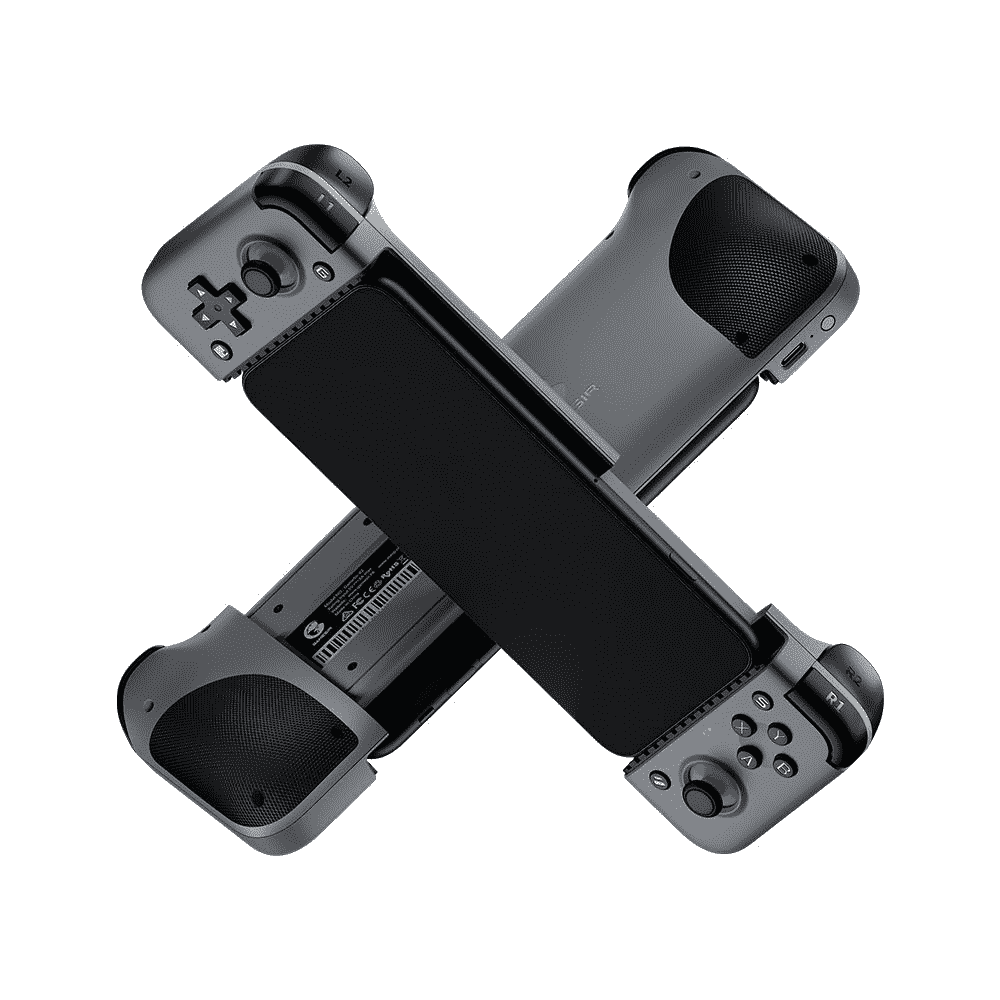

# GameSir 为手机和平板电脑推出新的蓝牙游戏控制器

> 原文：<https://www.xda-developers.com/gamesir-x2-bluetooth-f7-claw-controller-launch/>

移动游戏继续快速增长，我们看到了新的和创新的配件。最新的一款来自 GameSir，这是一家中国配件制造商，过去曾为移动设备生产过一些受欢迎的游戏控制器。他们最受欢迎的控制器是名为 GameSir X2 的伸缩/扩展游戏控制器，中间有一个 USB Type-C 连接器。该公司现在推出了一款支持蓝牙无线连接的新机型，以及一款可以与平板电脑挂钩的机型。

新的 GameSir X2 蓝牙移动游戏控制器和 GameSir F7 爪平板游戏控制器可与安卓和苹果设备兼容。X2 蓝牙版本采用了分离式设计，包括左右两侧的操纵杆和 ABXY 按钮。长达 173 毫米的智能手机可以与这款控制器配合使用，给您任天堂 Switch 般的体验。控制器配有 L1/L2 和 R1/R2 触发按钮，它们是接触间隙小、灵敏度高的微型开关。

该公司声称，X2 蓝牙支持大多数云游戏服务，包括 Xbox Game Pass Ultimate、Google Stadia、NVIDIA GeForce Now 和 Vortex。此外，该控制器还支持 Apple Arcade 和 MFi(专为 iPhone 打造)上的游戏。其他值得注意的功能包括专用的屏幕截图按钮，可持续 20 小时的 500 毫安时电池，以及 USB Type-C 充电端口。GameSir X2 蓝牙版售价为 59.99 美元/ 69.99 英镑。

该公司还宣布了 GameSir F7 爪控制器，据称是世界上第一款用于平板电脑的电容式游戏手柄。兼容 6-12mm 厚度范围的安卓平板或 iPads。控制器有两个独立的部分，可以使用强大的吸盘设计连接到平板电脑的左侧和右侧。它配备了 R1/R2 和 L1/L2 触发按钮以及两个“涡轮”按钮，允许游戏玩家玩 FPS 和 TPS 游戏，也是一个好的 PUBG 移动游戏配件。

F7 爪使用坚固、紧密和安全的吸盘设计简单地附着在平板电脑上，当它就位时，它允许玩家利用“触发”按钮，它包括 R1/R2、L1 和 L2 以及两个“涡轮”按钮，当按下时，分别控制 R1 和 L1 按钮的爆发频率；使它们成为所有屏幕控制 FPS 和 TPS 游戏的理想选择。

控制器可以快速进入记录模式，内部的芯片组可以确保快速响应和灵敏的触发操作。据称，F7 爪使用 USB Type-C 连接器充电仅 2 小时，可提供长达 120 小时的游戏时间和 200 天的待机时间。

## 定价和可用性

GameSir X2 蓝牙版售价为 59.99 美元/ 69.99 美元，目前在亚马逊上有售，而 F7 爪平板游戏手柄售价为 39.99 美元/ 33.99 美元，将于 5 月 24 日开始发售。

 <picture></picture> 

GameSir X2 Bluetooth Wireless Mobile Game Controller

##### 加美希尔·X2

GameSir X2 蓝牙无线游戏控制器支持所有长度为 173 毫米的 Android 和 iPhones。