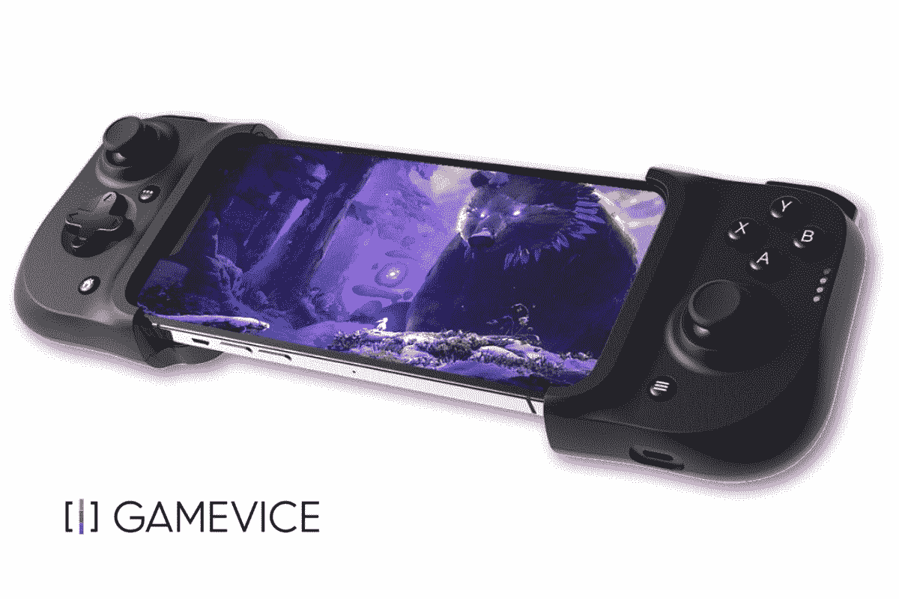

# “Android 版游戏服务”是 Razer Kishi 的一个更便宜的改进版本

> 原文：<https://www.xda-developers.com/gamevice-android-rebranded-razer-kishi/>

今天，Gamevice 宣布了一个新的里程碑，销售了一百万台游戏控制器配件。在发布公告的同时，该公司还发布了两款新的控制器，分别是“Android 版 Gamevice”和“iPad 版 Gamevice”。前者可能看起来熟悉，因为它与 2020 年发布的[雷蛇岸信介](https://www.xda-developers.com/razer-kishi-review-google-stadia-nvidia-geforce-now-steam-link-emulators/)几乎相同。在我们的评估中，我们发现 Razer Kishi 在游戏时提供了很大的好处，但我们确实有一个问题，即它无法容纳更大的智能手机。新的 Android Gamevice 显然解决了这个问题，声称支持更大的手机，如三星 Galaxy S21 和[三星 Galaxy S22 Ultra](https://www.xda-developers.com/samsung-galaxy-s22-ultra-review/) 。

## 一个更好的价格改进雷蛇岸本

如果你不熟悉 Gamevice，该公司已经存在了近十年，为各种[安卓智能手机](https://www.xda-developers.com/best-android-phones/)和 iOS 设备提供游戏配件。虽然其最初的努力是为特定的智能手机量身定制的，但其最近的产品允许最大限度地兼容其通用设计。为了提供最佳体验，Gamevice 的最新控制器使用了通过 USB-C 的直接连接。与无线连接相比，这提供了最低的延迟。USB-C 连接还提供了支持直通充电的额外好处，这意味着您可以在玩游戏的同时给手机充电。

此外，Android 的 Gamevice 提供了各种输入，如双可点击全尺寸模拟操纵杆、A、B、X 和 Y 按钮、D-pad、两个模拟触发器、两个模拟缓冲器、home、start 和 select 按钮。尽管它声称为更大的智能手机提供支持，但你的智能手机可能无法工作。如果你的设备背面有一个更大的摄像头，这一点尤其正确。如果你对新的控制器感兴趣，你可以直接从 Gamevice 网站和 Amazon.com 购买，价格为 59.95 美元。作为额外的奖励，你将获得一个月免费 Xbox Game Pass Ultimate 的数字代码。

 <picture></picture> 

Gamevice for Android

##### 安卓游戏

Gamevice for Android 是一款适用于 Android 设备的新控制器配件

* * *

**来源:** [Gamevice](https://gamevice.com)

**Via:**[9 to 5 Google](https://9to5google.com/2022/05/31/gamevice-for-android-razer-kishi/)