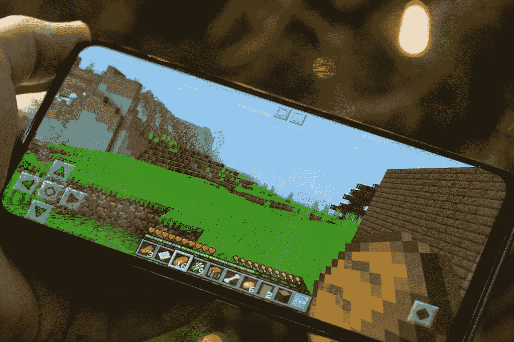

# 在 Honor 9X 的全视图显示器上玩游戏

> 原文：<https://www.xda-developers.com/gaming-on-the-full-view-display-of-the-honor-9x/>

今年，Honor 推出了 Honor 9X，作为市场上少数几款“全视图”手机之一。为了实现大尺寸无缺口显示，Honor 将自拍相机隐藏在电动弹出机构后面。由于完全不间断的显示，6.59 英寸的大手机提供了更加身临其境的体验。凹槽或打孔解决方案的大小可能看起来不太碍眼，但在玩游戏时，拥有全视图显示是一个明显的优势。

## 规范

| 

荣誉 9X

 | 

规范

 |
| --- | --- |
| 显示 | 6.59 英寸 1080 x 2340p 像素(391 ppi) |
| 芯片集 | 海思麒麟 710F |
| 随机存取存储 | 4/6GB |
| 储存；储备 | 128GB |
| 主摄像机 | 48MP/8MP(超宽)/2MP(深度传感器) |
| 自拍相机 | 16MP 电动弹出式 |
| 电池 | 4000 毫安时 |
| 操作系统 | 安卓 9.1.0 [EMUI](https://www.xda-developers.com/tag/emui/) 9.1.0 |

麒麟 710F 配有高达 6GB 的内存，在一些最流行的 3D 游戏中提供了出色的性能。你还会发现，尽管这款手机采用了较弱的芯片组，但系统性能确实令人印象深刻。

[caption align = " align none " width = " 473 "]

安图图基准[/caption]

[caption align = " align none " width = " 473 "]

安图图基准[/caption]

凭借 6GB 的内存，Honor 9X 保持了超快的应用程序启动速度和非常敏捷的系统导航。更多详细的基准测试结果见上图。

## 赌博

Honor 能够从低端规格获得非常好的性能。他们的秘密是 GPU Turbo 3.0。此功能旨在优化游戏性能，并能够提高游戏的帧速率和图形。由于 GPU Turbo 3.0 的效率提高了 10%，电池性能也得到提高。

 <picture></picture> 

Minecraft on the Honor 9X

《我的世界》在 Honor 9X 上运行完美，即使渲染距离一路颠簸到 11 块和最大的图形。世界创建速度非常快，地形加载没有延迟。同样的体验可以在你用这款手机玩的游戏中找到。

由于手机游戏旨在与尽可能多的手机兼容，全视图显示比处理能力的显著提高提供了更多的游戏改进。谈到在《我的世界》的体验，你会看到 Honor 9X 的性能与大多数旗舰设备相同。这为其他领域的改进留下了机会，如显示器。Honor 利用了这一点，结果是一款梦幻般的身临其境的游戏手机。

## 音频质量

2019 年，当判断智能手机的音频能力时，你必须解决的第一个问题是“手机有耳机插孔吗？”这里的答案是肯定的。除了耳机插孔，Honor 9X 还配有用于无线耳机的蓝牙 4.2 和一个底部发射扬声器。扬声器声音很大，音质也不错。视频听起来很清晰，高音和中音都很棒，但与其他智能手机相比，低音不足。[caption align = " align none " width = " 900 "]

Honor 9X 底部扬声器[/caption]在我们的游戏测试中，通过扬声器播放的音频表现非常好。使用有线耳机可以减少电池消耗，这对整体游戏体验有很大好处。华为 Histen 音效让您可以调整音频，以充分利用您的游戏会话。

## 电池寿命

Honor 9X 的电池容量为 4000mAh，专为需要充电前的长时间使用而设计。说到游戏，在需要充电之前，你可以毫不费力地连续玩 8 个小时。这些东西使 Honor 9X 成为一款真正优秀的游戏手机，值得以 249.99 美元的价格购买。

[**Honor 9X Forums**](https://forum.xda-developers.com/honor-9x)

###### 我们感谢 Honor 赞助了这篇文章。我们的赞助商帮助我们支付与运行 XDA 相关的许多费用，包括服务器成本、全职开发人员、新闻撰稿人等等。虽然您可能会在门户内容旁边看到赞助内容(这些内容将始终被标记为赞助内容),但门户团队对这些帖子不承担任何责任。赞助内容、广告和 XDA 仓库完全由一个独立的团队管理。XDA 绝不会通过接受金钱来赞扬一家公司，或以任何方式改变我们的观点或看法，从而损害其新闻诚信。我们的意见不能被收买。