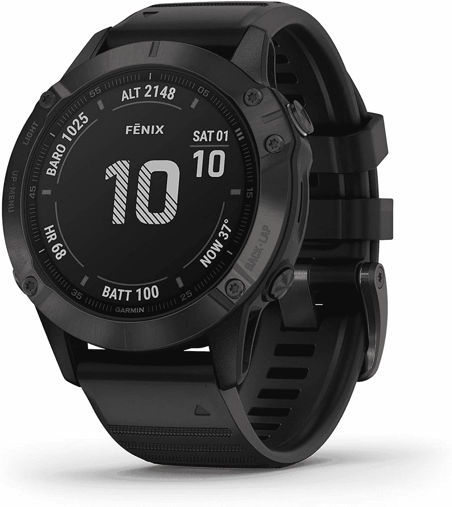

# Garmin 的菲尼克斯 6 Pro 现在打五折，降到了有史以来的最低价

> 原文：<https://www.xda-developers.com/garmin-fenix-6-pro-300-deal/>

 <picture></picture> 

Garmin Fenix 6 Pro

##### 佳明菲尼克斯 6 专业版

Garmin 菲尼克斯 6 Pro 是最好的优质耐用智能手表之一，具有军事认证，健身跟踪等功能。

### 更新时间:美国东部时间 2023 年 2 月 10 日 06:15 TIMI·坎蒂萨诺

交易变了，但价格仍然很高。

看起来价格现在已经改变了，但它仍然是一个惊人的交易，只需 369 美元。

有很多[智能手表可供选择](https://www.xda-developers.com/best-smartwatches/)，但谈到电池寿命，Garmin 是最优秀的，提供一次充电可以持续几天，几周，甚至近两个月的设备。如果你一直在考虑给自己买一款新的智能手表，可以考虑一下 Garmin 菲尼克斯 6 Pro，特别是它最近的折扣价，比零售价低了 50%，在有限的时间内降到了 300 美元。

Garmin 菲尼克斯 6 Pro 是一款外观相对时尚的手表，全黑，配有 1.3 英寸的大尺寸常亮彩色显示屏。这款手表采用不锈钢制成的表壳和柔软耐用的硅胶表带。菲尼克斯 6 Pro 具有许多可以跟踪的活动，如跑步、骑自行车、游泳、滑雪、打高尔夫等。它还可以通过使用许多传感器在这些活动中提供相关数据，如心率、脉搏和位置。或许这款手表最令人印象深刻的部分是，在智能手表模式下使用时，一次充电可以长达 14 天。

此外，这款手表还支持 GPS、GLONASS 和伽利略系统，以防你想去野外徒步旅行。使用这些卫星系统，它可以在外出时提供准确的跟踪，即使你已经偏离了道路。外出远足时，您还可以使用高度计、气压计和电子罗盘获取更多数据。最重要的是，Garmin 菲尼克斯 6 Pro 具有内置地图，让您能够绘制出您的路线并遵循导航指示。最重要的是，由于它是一款智能手表，它还可以让你在旅途中保持联系，通过你连接的智能手机发送短信、电子邮件和其他提醒通知。

如果这一切听起来很有趣，你可以在有限的时间内以折扣价购买手表。一定要尽快购买，因为一旦交易结束，就再也不会回来了。