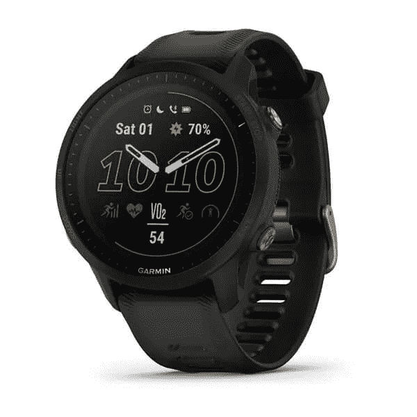
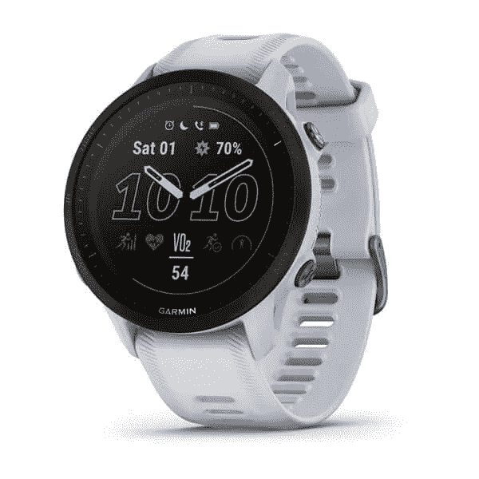

# Garmin 宣布先导 955 太阳能和先导 255 系列

> 原文：<https://www.xda-developers.com/garmin-forerunner-955-solar-forerunner-255-series/>

尽管 Garmin 有过

[other watches](https://www.xda-developers.com/garmin-fenix-7-series-epix-india-launch/)

过去有太阳能充电功能，像它的

[Fenix 7](https://www.xda-developers.com/garmin-launches-fenix-7-epix-smartwatches/)

今天，该公司宣布了其第一款针对跑步者的太阳能充电手表，Garmin Forerunner 955 Solar。此外，该公司还宣布了负担得起的佳明先行者 255 线。Garmin Forerunner 955 Solar 使用电动玻璃太阳能充电透镜，这应该有助于它在峰值时提供长达 20 天的电池寿命。当然，如果你想更积极一点，手表可以在 GPS 模式下提供长达 49 小时的使用。Forerunner 955 Solar 还配备了一个全彩色、始终在线的触摸屏显示器。那些想要更多触觉的人会很高兴地知道，这款手表还配备了五个物理按钮。正如你所料，这款手表提供了出色的健身跟踪功能和指导技巧，已经成为 Garmin 名称的代名词。

 

Garmin Forerunner 955 Solar 也有内部存储，足以存储 Spotify、Amazon Music 和 Deezer 等您最喜欢的支持服务中的多达 2，000 首歌曲。此外，它还在支持 Garmin Pay 的终端上提供非接触式支付。手表与支持的 iOS 和配对

[Android devices](https://www.xda-developers.com/best-android-phones/)

，允许用户接收通知更新。先行者 955 太阳能现在售价 599.99 美元。如果这对于你的钱包来说有点太贵，你也可以选择非太阳能型，它要便宜 100 美元。

如果你正在寻找一个更实惠的选择，Garmin 今天还推出了 Forerunner 255 系列。这些手表一次充电可提供长达 14 天的电池续航时间，在 GPS 模式下可续航 30 小时。Forerunner 255 系列基于其前辈，提供了多种活动跟踪功能，从铁人三项到心率跟踪等。先行者 255S 和先行者 255S 音乐有 41mm 尺寸，而先行者 255 和先行者 255 音乐有更大的 46mm 尺寸。

Forerunner 255 系列还通过 Garmin Pay 提供非接触式支付。此外，Garmin Forerunner 255S Music 和 Garmin Forerunner 255 Music 能够存储多达 500 首来自 Spotify、Amazon Music 和 Deezer 等受支持服务的歌曲。与 Garmin 系列中的其他手表一样，Forerunner 255 系列支持 iOS 和 Android 设备。先行者 255S 和先行者 255 的售价为 349.99 美元，而先行者 255S 音乐和先行者 255 音乐的起价为 399.99 美元。

* * *