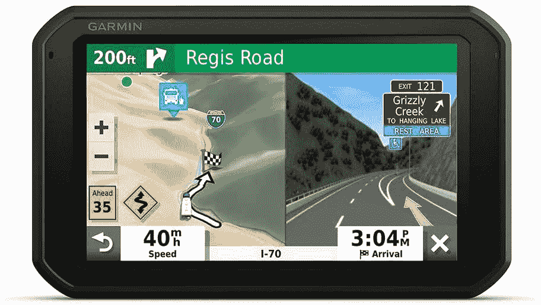

# 节省在亚马逊的 Garmin GPS 设备，永远知道去哪里

> 原文：<https://www.xda-developers.com/garmin-gps-amazon/>

# 在亚马逊上购买 Garmin GPS 设备省钱，并且随时知道你要去哪里

厌倦了开车时手机失去信号和谷歌地图让你失望？购买专用的 Garmin GPS，出行无忧。

是的，您可以将智能手机用作 GPS 设备。但是，你有多少次使用谷歌地图或 Waze 却把你带到了错误的地方？或者在你需要关闭出口的几分钟前你丢失了手机信号？或者你的[智能手机电池](https://www.xda-developers.com/best-portable-chargers/)有问题，不能让 GPS 连续运行几个小时？最好的解决方案是获得一个专用的 GPS 设备，今天亚马逊有一个 Garmin GPS 导航仪的销售！

不管你在找什么类型的 GPS 设备，Garmin 都能为你找到导航器。大多数人会关注[Garmin drive smart 55&Traffic](https://www.amazon.com/Garmin-DriveSmart-Traffic-Hands-Free-Information/dp/B07M98Z8DD?tag=xda-29r94vf-20&ascsubtag=UUxdaUeUpU31168&asc_refurl=https%3A%2F%2Fwww.xda-developers.com%2Fgarmin-gps-amazon%2F&asc_campaign=Short-Term)，这是标准的 Garmin GPS。如果交通堵塞或事故影响了您的正常路线，DriveSmart 55 将轻松绘制出您的路线，并提供替代路线。这款产品目前售价 150 美元，比建议零售价低 80 美元。

不过，如果你有一辆房车，你会想要一个 Garmin GPS，它会考虑到你的车的大小和重量。 [Garmin RV 785 & Traffic](https://www.amazon.com/Garmin-Advanced-Navigator-Voice-Activated-Navigation/dp/B07SVDCC8R?tag=xda-29r94vf-20&ascsubtag=UUxdaUeUpU31168&asc_refurl=https%3A%2F%2Fwww.xda-developers.com%2Fgarmin-gps-amazon%2F&asc_campaign=Short-Term) 就是这样做的，它绘制出你需要走的路线，并帮助你避开对你的 RV 来说太窄的街道。还有一个内置的仪表盘摄像头来帮助停车！这款 GPS 导航仪现在降价 100 美元，所以你只需花 400 美元就能买到。

那些有摩托车的人也没有被冷落。Garmin zh \u mo XT \u T1 专为摩托车打造，配有超亮防雨显示屏。您可以在纵向或横向模式下使用此 GPS 设备，这样您就可以找到车把之间的最佳位置。Garmin zmo XT 的售价为 450 美元。

无论你在寻找什么样的 GPS，Garmin 都有。查看下面的销售页面，了解所有打折商品，包括一些智能手表！

 <picture></picture> 

Garmin GPS (and more) Sale

##### Garmin 本能 2

有了 Garmin GPS，再也不会迷路了！各种各样的导航器在亚马逊出售，所以不管你在找什么，你一定会找到适合你的 GPS。