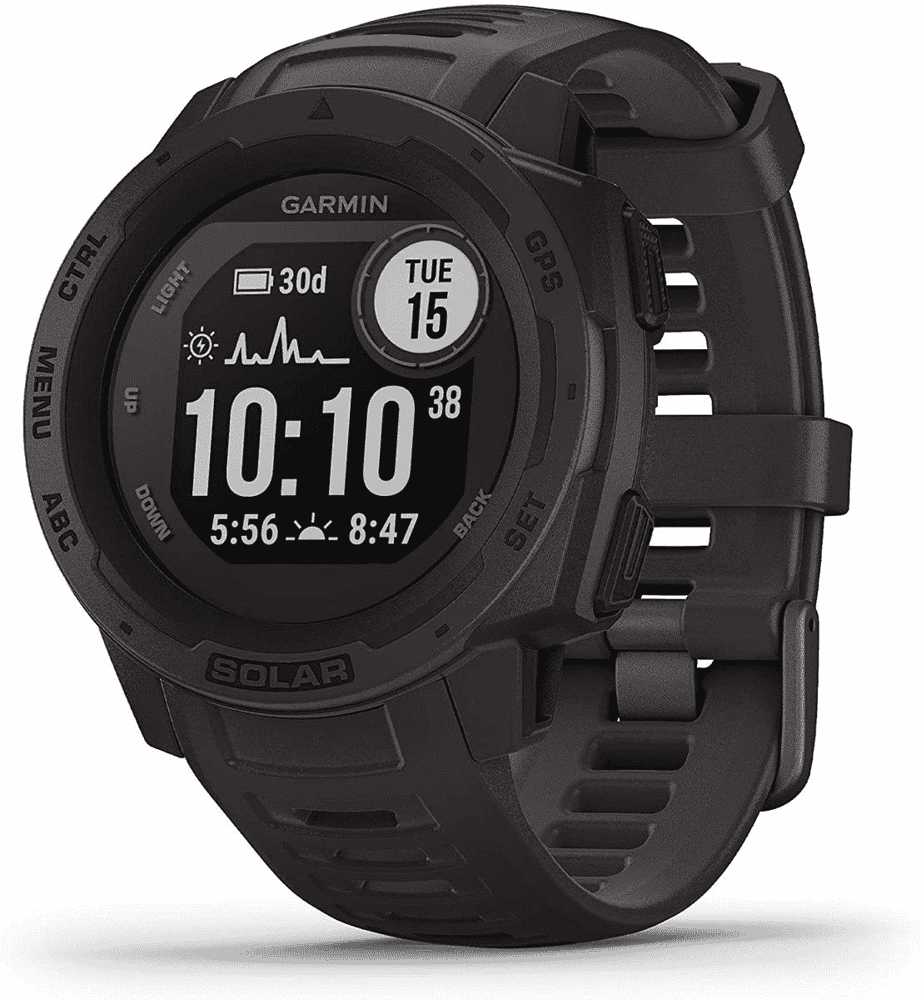
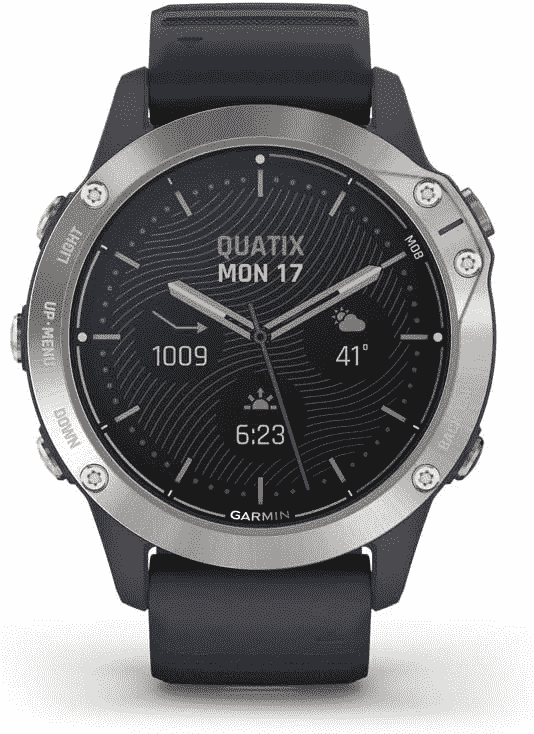

# 购买 Garmin rugged 智能手表最高可节省 100 美元！

> 原文：<https://www.xda-developers.com/garmin-rugged-smartwatches-deal/>

虽然三星和苹果经常为智能手表提供非常有吸引力的选择，但一些人认为 Garmin 的广泛智能手表系列是最好的选择之一，特别是在运动和健身方面。如果你是一名运动爱好者，想买一款智能手表，你可能以前就听说过 Garmin 的产品。他们的产品有点贵，如果你真的想去看看，他们的每一笔交易都会派上用场。现在，一些坚固的智能手表已经降价 100 美元。

Garmin 菲尼克斯 6 Pro 是可以随身携带的优质智能手表的最佳全能选择之一。它按照美国军事标准进行了测试，具有始终开启的 1.3 英寸阳光可读显示屏，支持 Garmin Pay 非接触式支付(考虑到并非所有国家和支付网络都符合条件)，兼容第三方优质流媒体服务，智能提醒等。菲尼克斯 6 Pro 拥有出色的电池续航时间，通常价格不菲，高达 649.99 美元。不过现在，你可以从 549.99 美元起买到它，这仍然不便宜，但肯定更容易买到。

 <picture></picture> 

Garmin Fenix 6 Pro

##### 佳明菲尼克斯 6 专业版

Garmin 菲尼克斯 6 Pro 是最好的优质耐用智能手表之一，具有军事认证，健身跟踪等功能。

Garmin Instinct Solar 至少与其他 Garmin 选项相比，没有那么耀眼。但是您可能仍然会发现它非常适合您的使用案例，因为它仍然经过军方认证，带有内置的 3 轴指南针和气压高度计以及多个全球导航卫星系统(GPS、Glonass 和 Galileo)，并在跑步、骑自行车或游泳时跟踪您的活动。它的零售价通常为 399.99 美元，但你现在可以以 319.99 美元的价格买到它，为自己节省 80 美元。

 <picture></picture> 

Garmin Instinct Solar

##### 佳明本能太阳能

Garmin Instinct Solar 可能不像一些最昂贵的手表那样功能齐全，但它仍然坚固耐用，具有相当不错的功能集。

最后，还有 Garmin Quatix 6，这是最高级的外观，也是这个列表中最专业的。这是一款专为帆船运动打造的“海洋”智能手表，兼容他们内部的海图绘图仪和其他设备，坚固的设计，帆船比赛辅助，以及 Garmin 智能手表的其他功能，包括支持 Garmin Pay。它通常以令人垂涎的 699.99 美元的价格出售，但亚马逊目前以 599.99 美元的价格出售，这是该榜单上最低的节省比例，但也是 100 美元的降价。

 <picture></picture> 

Garmin Quatix 6

##### Garmin Quatix 6

Garmin Quatix 6 是一款考虑到航海的智能手表，保留了 Garmin 智能手表的大部分功能，同时还添加了一些划船专用功能。

立即在亚马逊上查看这些交易！