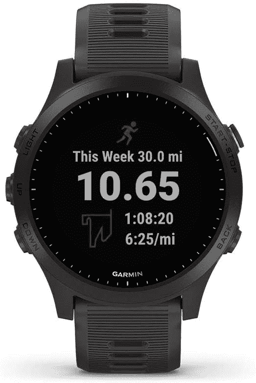

# 佳明智能手表在这次黄金日大减价中最多可优惠 350 美元

> 原文：<https://www.xda-developers.com/garmin-smartwatches-prime-day-sale/>

说到智能手表，Garmin 有一个值得维护的声誉。虽然不是市场上最便宜的，但 Garmin 制造了一些非常坚固、耐用、相当独特的智能手表。他们广泛的产品组合侧重于各种关键需求，但有一个明显的重点是耐用性和运动跟踪，如果你不看苹果和三星，这标志着 Garmin 是智能手表行业的最佳产品之一。如果你想尝试一些新的和*好的*，你可以考虑这些佳明智能手表，它们在黄金日打折。

## 佳明先行者系列

Forerunner 系列被认为为 Garmin 品牌的智能手表带来了运动追踪的吸引力。如果你是 Garmin 的新手，可以考虑将 Forerunner 系列专注于任何喜欢跑步的人，数字大致表示手表目标人群的专业知识。因此，如果你刚刚开始，像 Forerunner 245 这样的设备是一个很好的切入点，而严重的运动员应该考虑 Forerunner 945。像[先行者 955 太阳能和先行者 255](https://www.xda-developers.com/garmin-forerunner-955-solar-forerunner-255-series/) 这样的新设备是可以购买的，但不能以折扣价购买，所以记住这一点。

 <picture></picture> 

Garmin Forerunner 945

##### 佳明先行者 945

Forerunner 945 是 Garmin 为跑步者销售的最好的智能手表之一。这个原本卖 600 美元，现在 Prime day 降到 380 美元。

点击折扣价格，前往相应的产品列表。

| 

没有。

 | 

产品

 | 

厂商建议零售价

 | 

折扣价格

 |
| --- | --- | --- | --- |
| 1. | 先行者 45 | $170 | [$140](https://www.amazon.com/Garmin-Forerunner-Running-Training-Support/dp/B07R2YWVW8/?tag=xda-5apflkk-20&ascsubtag=UUxdaUeUpU42448&asc_refurl=https%3A%2F%2Fwww.xda-developers.com%2Fgarmin-smartwatches-prime-day-sale%2F&asc_campaign=Affiliate) |
| 2. | 先行者 245 | $350 | [$240](https://www.amazon.com/dp/B07QLVHBLF?tag=xda-5apflkk-20&ascsubtag=UUxdaUeUpU42448&asc_refurl=https%3A%2F%2Fwww.xda-developers.com%2Fgarmin-smartwatches-prime-day-sale%2F&asc_campaign=Affiliate) |
| 3. | 先行者 735XT | $350 | [$170](https://www.amazon.com/Garmin-Forerunner-735XT-Multisport-Running/dp/B01DOJDPQY/?tag=xda-5apflkk-20&ascsubtag=UUxdaUeUpU42448&asc_refurl=https%3A%2F%2Fwww.xda-developers.com%2Fgarmin-smartwatches-prime-day-sale%2F&asc_campaign=Affiliate) |
| 4. | 先行者 935 | $320 | [$264](https://www.amazon.com/dp/B06XGD6CS4/?tag=xda-5apflkk-20&ascsubtag=UUxdaUeUpU42448&asc_refurl=https%3A%2F%2Fwww.xda-developers.com%2Fgarmin-smartwatches-prime-day-sale%2F&asc_campaign=Affiliate) |

## Garmin Vivoactive 系列

Vivoactive 系列实质上是将 Garmin 的所有智能都封装在一个更加面向“生活方式”的智能手表中。请注意,“S”通常表示 Garmin 产品线中尺寸较小的产品，不会影响核心功能。

| 

没有。

 | 

产品

 | 

厂商建议零售价

 | 

折扣价格

 |
| --- | --- | --- | --- |
| 1. | Vivoactive 4 | $330 | [$188](https://www.amazon.com/dp/B07W7W8WBH/?tag=xda-5apflkk-20&ascsubtag=UUxdaUeUpU42448&asc_refurl=https%3A%2F%2Fwww.xda-developers.com%2Fgarmin-smartwatches-prime-day-sale%2F&asc_campaign=Affiliate) |
| 2. | 活跃的 4S | $330 | [$188](https://www.amazon.com/dp/B07W7W9DQQ/?tag=xda-5apflkk-20&ascsubtag=UUxdaUeUpU42448&asc_refurl=https%3A%2F%2Fwww.xda-developers.com%2Fgarmin-smartwatches-prime-day-sale%2F&asc_campaign=Affiliate) |

## Garmin Venu 系列

如果你想要一款以生活方式为导向的智能手表，但它在构造、功能和成本方面更轻，那么 Venu 系列就是你需要的。

| 

没有。

 | 

产品

 | 

厂商建议零售价

 | 

折扣价格

 |
| --- | --- | --- | --- |
| 1. | Venu Sq 音乐 | $250 | [160 美元](https://www.amazon.com/dp/B08SV6L6DF?tag=xda-5apflkk-20&ascsubtag=UUxdaUeUpU42448&asc_refurl=https%3A%2F%2Fwww.xda-developers.com%2Fgarmin-smartwatches-prime-day-sale%2F&asc_campaign=Affiliate) |
| 2. | Venu 2 | $400 | [$270](https://www.amazon.com/dp/B0911XHHCN/?tag=xda-5apflkk-20&ascsubtag=UUxdaUeUpU42448&asc_refurl=https%3A%2F%2Fwww.xda-developers.com%2Fgarmin-smartwatches-prime-day-sale%2F&asc_campaign=Affiliate) |
| 3. | Venu 2S | $400 | [$270](https://www.amazon.com/dp/B0911RWRL2?tag=xda-5apflkk-20&ascsubtag=UUxdaUeUpU42448&asc_refurl=https%3A%2F%2Fwww.xda-developers.com%2Fgarmin-smartwatches-prime-day-sale%2F&asc_campaign=Affiliate) |

## Garmin 本能系列

Instinct 系列是该公司产品组合中真正坚固的智能手表系列。

| 

没有。

 | 

产品

 | 

厂商建议零售价

 | 

折扣价格

 |
| --- | --- | --- | --- |
| 1. | 本能太阳能 | $350 | [$200](https://www.amazon.com/dp/B089YVPGR6?tag=xda-5apflkk-20&ascsubtag=UUxdaUeUpU42448&asc_refurl=https%3A%2F%2Fwww.xda-developers.com%2Fgarmin-smartwatches-prime-day-sale%2F&asc_campaign=Affiliate) |
| 2. | 本能战术 | $300 | [$260](https://www.amazon.com/dp/B07VQJGLJV?tag=xda-5apflkk-20&ascsubtag=UUxdaUeUpU42448&asc_refurl=https%3A%2F%2Fwww.xda-developers.com%2Fgarmin-smartwatches-prime-day-sale%2F&asc_campaign=Affiliate) |

## 佳明菲尼克斯和耐力赛系列

[菲尼克斯系列](https://www.xda-developers.com/garmin-launches-fenix-7-epix-smartwatches/)面向户外爱好者和冒险家，他们需要 multisport 手表的所有功能。Enduro 系列更进了一步，目标是需要轻量级、超高性能 GPS 智能手表的极限耐力运动员。

| 

没有。

 | 

产品

 | 

厂商建议零售价

 | 

折扣价格

 |
| --- | --- | --- | --- |
| 1. | 菲尼克斯 6S 专业版 | $600 | [$400](https://www.amazon.com/dp/B07W3Q2WX7?tag=xda-5apflkk-20&ascsubtag=UUxdaUeUpU42448&asc_refurl=https%3A%2F%2Fwww.xda-developers.com%2Fgarmin-smartwatches-prime-day-sale%2F&asc_campaign=Affiliate) |
| 2. | 菲尼克斯 6 Pro | $600 | [450 美元](https://www.amazon.com/dp/B07WL6QHWH/?tag=xda-5apflkk-20&ascsubtag=UUxdaUeUpU42448&asc_refurl=https%3A%2F%2Fwww.xda-developers.com%2Fgarmin-smartwatches-prime-day-sale%2F&asc_campaign=Affiliate) |
| 3. | 菲尼克斯 6X | $750 | [500 美元](https://www.amazon.com/dp/B07W59LRL9?tag=xda-5apflkk-20&ascsubtag=UUxdaUeUpU42448&asc_refurl=https%3A%2F%2Fwww.xda-developers.com%2Fgarmin-smartwatches-prime-day-sale%2F&asc_campaign=Affiliate) |
| 4. | 耐久钢 | $800 | [$500](https://www.amazon.com/dp/B08FSL97NT/?tag=xda-5apflkk-20&ascsubtag=UUxdaUeUpU42448&asc_refurl=https%3A%2F%2Fwww.xda-developers.com%2Fgarmin-smartwatches-prime-day-sale%2F&asc_campaign=Affiliate) |
| 5. | 耐久钛 | $900 | [$550](https://www.amazon.com/dp/B08FSYMLGC/?tag=xda-5apflkk-20&ascsubtag=UUxdaUeUpU42448&asc_refurl=https%3A%2F%2Fwww.xda-developers.com%2Fgarmin-smartwatches-prime-day-sale%2F&asc_campaign=Affiliate) |

* * *

*您打算购买哪一款 Garmin 智能手表？请在下面的评论中告诉我们！*