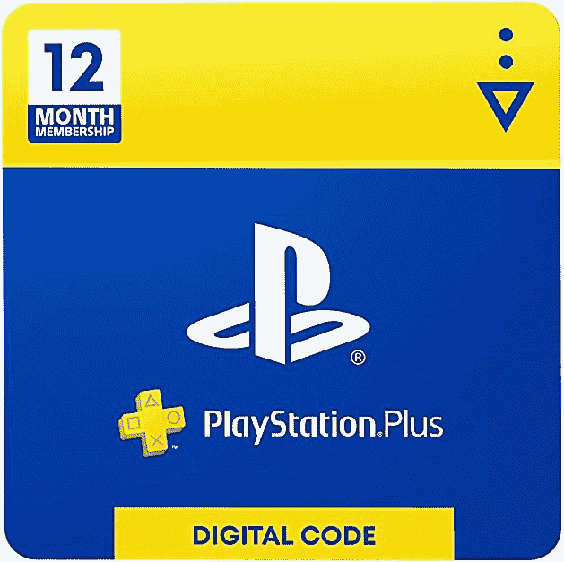

# 现在只需 45 美元即可获得 12 个月的 PlayStation Plus(优惠 15 美元)

> 原文：<https://www.xda-developers.com/get-12-months-of-playstation-plus-for-only-45-right-now-15-off/>

# 现在只需 45 美元即可获得 12 个月的 PlayStation Plus(优惠 15 美元)

PlayStation Plus 的 12 个月通行证以 15 美元的价格出售，PlayStation Plus 是为大多数 PS4 和 PS5 游戏提供在线多人游戏的服务。

自从 PlayStation 4 推出以来，索尼一直要求有效的 PlayStation Plus 订阅才能在线玩大多数游戏。该服务还免费提供每月精选的 PlayStation 4 游戏，以及一些独家销售和折扣。12 个月的期权通常为 60 美元，但在有限的时间内，索尼将价格降至仅 44.99 美元。

这 12 个月的订阅可以添加到现有帐户，并将根据您向索尼提供的任何支付信息自动续订，除非您在 12 个月到期前取消。1 个月和 3 个月的订阅仍处于正常价格(分别为 9.99 美元和 24.99 美元)，这使得 12 个月的选项成为目前的最佳报价(约 3.75 美元/月)。

 <picture></picture> 

PlayStation Plus: 12 Month

##### 索尼游戏机增强版

PlayStation Plus 的 12 个月订阅可以在大多数 PS4/PS5 游戏中进行多人游戏。代码是以数字形式发送的。

索尼还将 PlayStation Now 的 12 个月订阅折扣为同样的 44.99 美元(优惠 15 美元)。PlayStation Now 是一项游戏流媒体服务，在功能上可与微软的 Xbox 游戏 Pass/XCloud 相媲美，但其图书馆较小，主要是 PS4/PS2 时代的游戏。只要订阅有效，您还可以将 PlayStation Now 中的精选游戏直接安装到 PS4 上。