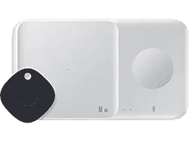

# 仅限今天:购买一体式 Galaxy Buds 2 套装，享受 25%的优惠

> 原文：<https://www.xda-developers.com/get-25-off-on-galaxy-buds-2-bundle/>

三星将在周日以一笔神奇的交易结束其发现三星活动。今天，您可以在一体式 [Galaxy Buds 2](https://www.xda-developers.com/samsung-galaxy-buds-2/) 套装上节省 25%的费用。该套装包括 Galaxy Buds 2、Wireless Charing Duo 和 Galaxy SmartTag，零售价通常为 239.99 美元。但今天，三星对捆绑包提供 60 美元的统一折扣，将价格降至 179.99 美元。

如果你身边有一副旧的有线或无线耳机，这笔交易会变得更加划算。在符合条件的以旧换新中，除了 25%的统一折扣外，三星还为您的旧耳机提供高达 40 美元的折扣。这意味着你只需 139.99 美元就能买到这三款出色的设备！请注意，该交易仅在今天有效——9 月 26 日周日——并且供应持续，所以请确保您行动迅速。

 <picture></picture> 

All-in-one Galaxy Buds 2 bundle

##### 三星 Galaxy 芽 2

购买 Galaxy Buds 2、Galaxy SmartTag 和无线充电器 Duo 仅需 179.99 美元(符合条件的以旧换新价格为 139.99 美元)。

三星的新 Galaxy Buds 2 是价格低于 150 美元的[最好的真正无线耳塞](https://www.xda-developers.com/best-wireless-earbuds/)之一。它们采用薄型设计，主动噪音消除(ANC)功能可消除背景噪音，可选环境模式，提供卓越的音频质量。在电池寿命方面，耳塞声称在 ANC 打开的情况下一次充电可持续五个小时，在 ANC 关闭的情况下可持续八个小时。

与此同时，无线充电 Duo 将方便地同时为您的手机和 Galaxy Watch 4 和 Galaxy Buds 2 等配件充电。该充电器支持快速充电(最高 9W)，由于它与 Qi 兼容，因此可以为任何 Qi 认证的设备充电，包括苹果的 iPhone 系列，甚至是 Galaxy S6 等更老的 Galaxy 智能手机。

最后， [Galaxy SmartTag](https://shop-links.co/1753056165998303300?u1=8bff308b-f581-42d3-939e-80ece15bd347) 可以让你随时关注你的重要物品。你可以将它挂在车钥匙、你的包甚至你的宠物上，并可以使用 [Galaxy SmartThings 应用](https://www.xda-developers.com/samsung-smarthings-find-members/)在地图上实时跟踪它们的位置。除了跟踪之外，Galaxy SmartTag 还可以用作遥控器来控制其他智能家居产品。