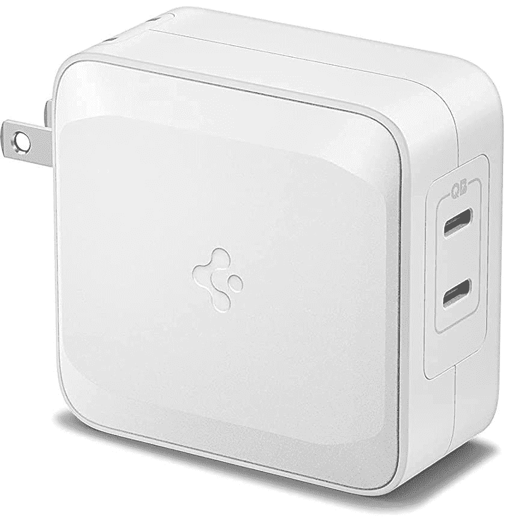

# 现在只需 37 美元，就能买到 100 瓦 Spigen USB Type-C 充电器

> 原文：<https://www.xda-developers.com/get-a-100w-spigen-usb-type-c-charger-for-only-37-today/>

# 现在只需 37 美元，就能买到 100 瓦 Spigen USB Type-C 充电器

Spigen 的墙壁适配器可以以 100W 的功率为一台设备充电，或者以 45W 的功率同时为两台设备充电，现在它面向亚马逊 Prime 会员发售。

你家里可能已经有一些单端口 USB Type-C 充电器，但多连接器墙壁适配器可能会很方便，特别是当它们可以提供更多电力的时候。Spigen 可能因其智能手机外壳而闻名，但该公司也生产一些充电器，包括一个强大的 100W 墙壁适配器，可以同时为两台设备充电。现在你只需花 37.16 美元就能买到 Spigen 100W 充电器，比通常 60 美元的价格节省了不少。

这是许多采用氮化镓(GaN)组件制造的现代壁式充电器之一，这使得设计更小而不会过热。因此，尽管这比苹果公司 MacBooks 附带的壁式充电器略小，但它更小，功率更大。充电器在单个端口上可以达到 100W，因此它非常适合任何 USB Type-C 笔记本电脑，两个 Type-C 端口可以同时以高达 45W 的功率充电*。*

 *<picture></picture> 

Spigen 100W Charger

##### Spigen 100W USB-C 充电器

这种充电器可以在单个端口上提供 100 瓦，或在两个端口上提供 45 瓦。你需要一个亚马逊 Prime 账户来获得销售价格，还需要点击价格下方的优惠券按钮。

对于一个 100W 的 USB Type-C 充电器来说，这是一个非常好的价格，尤其是有两个端口的充电器。例如，您可以使用它以最快的速度为手机和平板电脑/笔记本电脑充电，而无需带两个墙壁适配器。Anker 的壁式充电器是主要竞争对手，但[双连接器 PowerPort Atom PD](https://www.amazon.com/Anker-AK-A2029121-60W-PD-Ports/dp/B07DFGXLY4?tag=xda-10d37ve-20&ascsubtag=UUxdaUeUpU5192&asc_refurl=https%3A%2F%2Fwww.xda-developers.com%2Fget-a-100w-spigen-usb-type-c-charger-for-only-37-today%2F&asc_campaign=Short-Term) 比 Spigen 的充电器更贵，仅达到 60W。*