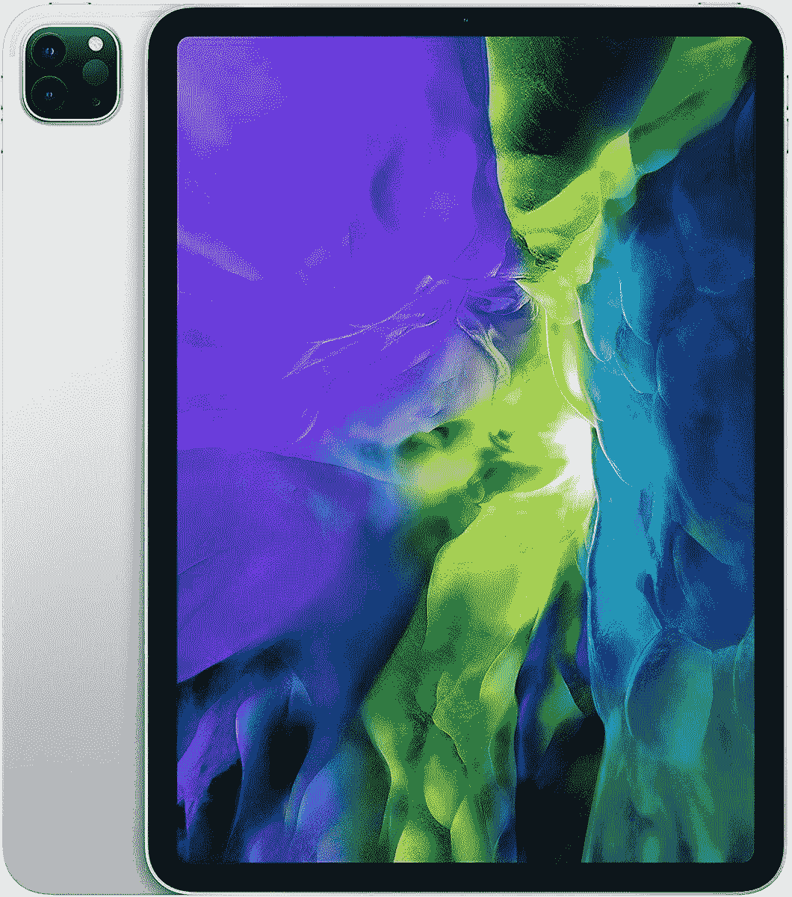

# 花 650 美元买一台 128GB 存储的 2020 iPad Pro，这是迄今为止的最低价

> 原文：<https://www.xda-developers.com/get-a-2020-ipad-pro-with-128gb-storage-for-650-its-lowest-price-yet/>

# 花 650 美元买一台 128GB 存储的 2020 iPad Pro，这是迄今为止的最低价

苹果的上一代 iPad Pro 仍然是最好的平板电脑之一，现在 128GB 的 11 英寸型号在亚马逊上仅售 650 美元。

iPad Pro 的迷你 LED 可以产生比典型的 LCD 面板更深的黑色，但仍然没有完全达到有机发光二极管水平的纯黑色。

苹果本月刚刚发布了一款新的 [iPad Pro](https://www.xda-developers.com/ipad-pro/) 型号，具有超高速 M1 芯片、5G 支持、迷你 LED 屏幕等等。然而，上一代 iPad Pro 仍然是最好的平板电脑之一，苹果正在寻求清理旧库存。现在你可以在亚马逊上以 649.99 美元的价格买到入门级的 iPad Pro 2020(第二代)，比最初的 MSRP 节省了 149 美元，比之前的价格低 50 美元。这也是 2020 年 iPad Pro 的最低记录价格，至少在亚马逊上是这样。

在售的型号有 11 英寸的“液体视网膜”屏幕，带神经引擎的苹果 A12Z 仿生芯片，12MP 主摄像头，10MP 超宽镜头，7MP 前置摄像头，用于 AR 应用程序的激光雷达扫描仪，四扬声器，Wi-Fi 6 和 128GB 的内部存储。它有一个 USB Type-C 端口用于充电和数据传输，但遗憾的是没有耳机插孔——你需要一个加密狗来用有线耳机听音乐。这款机型也没有蜂窝支持，只能连接 Wi-Fi。

 <picture></picture> 

2020 Apple iPad Pro (128GB, Wi-Fi)

##### 苹果 iPad Pro 11 英寸(2020 年)

这是去年 iPad Pro 的入门级型号，128GB 的存储空间，苹果 A12Z 仿生芯片。

这款机型已经很久没有以其最初的 799.99 美元的 MSRP 定价了，自 4 月份以来，该平板电脑的价格持续下跌。本月早些时候大约是 700 美元，但是 650 美元的新价格甚至更好。既然它是苹果的产品，它将在未来几年不断更新，你可以用像[键盘](https://www.amazon.com/Apple-Smart-Keyboard-11-inch-iPad-Pro/dp/B08635GZ8H?tag=xda-574lgp5-20&ascsubtag=UUxdaUeUpU3061&asc_refurl=https%3A%2F%2Fwww.xda-developers.com%2Fget-a-2020-ipad-pro-with-128gb-storage-for-650-its-lowest-price-yet%2F&asc_campaign=Short-Term)这样的配件来装饰它。