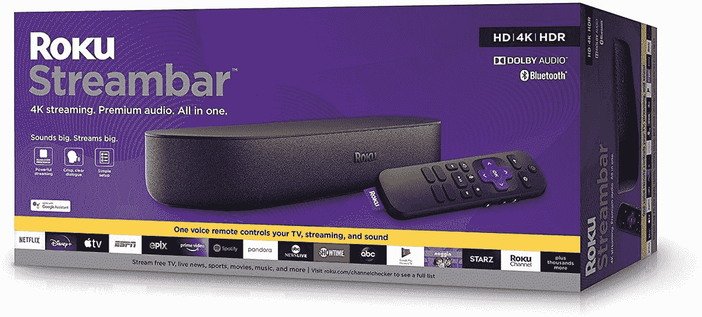

# 今天花 69 美元买一台 4K Roku Ultra，或者花 99 美元买一台 Roku Streambar

> 原文：<https://www.xda-developers.com/get-a-4k-roku-ultra-for-69-today-31-off-or-a-roku-streambar-for-99-31-off/>

Roku 是流媒体盒子世界中最古老的名字之一，该公司仍在稳步推出新设备和软件更新。Roku 在几个月前发布了几款新产品，包括超便宜的 Roku Express 4K+和 Roku Streambar Pro，后者可以兼作电视的音箱。现在，你可以分别以 69 美元(优惠 31 美元)和 99 美元(优惠 31 美元)的价格买到 Roku Ultra 和普通 Roku Streambar。

Roku Ultra 是该公司最高端的流媒体盒子，拥有一些你在大多数其他竞争产品上找不到的功能。除了所有常见的流媒体棒功能，背面还有全尺寸的 USB 和以太网端口，所以你可以轻松地从你的硬盘上观看完全合法下载的媒体内容，或者给你的 Roku 一个可靠的有线互联网连接。语音遥控器还有一个集成的耳机插孔，方便私人聆听。

 <picture></picture> 

Roku Streambar

##### Roku 流吧

这是一个 Roku 流棒和电视条形音箱在一个包。它以 99 美元的价格出售，比通常的价格低 31 美元。

 <picture></picture> 

Roku Ultra (2020)

##### Roku Ultra (2020 年)

这是 Roku 最好的流媒体播放器之一，遥控器上有很多端口和一个耳机插孔。

与此同时，Roku Streambar 是一个集音棒和流媒体棒于一体的产品。它拥有大多数 Roku 产品上的标准语音遥控器，集成了电视电源和音量控制。Streambar 可以安装在墙上，也可以放在电视机前面/下面的支架上。

这两款手机几个月前在[以同样的价格](https://www.xda-developers.com/roku-streambar-roku-ultra-on-sale/)上市，所以如果你错过了那个折扣，现在你的机会来了。这些年来，我用过一些 Roku 播放器，它们总是比谷歌、苹果和亚马逊的竞争对手更容易使用，速度也更快。然而，它们并不完美——Roku 已经卷入了几场与应用可用性的战斗，包括 [YouTube TV](https://www.xda-developers.com/roku-streambar-roku-ultra-on-sale/) 和 [HBO](https://techbullion.com/after-hbo-maxs-deal-roku-will-no-longer-offer-hbo-through-its-channel-store/) 。Roku 播放器也不像运行 Fire OS 或 Android/Google TV 的设备那样容易修改。

*免责声明:本文作者拥有 Roku 的股票。这并不影响这里陈述的观点。*