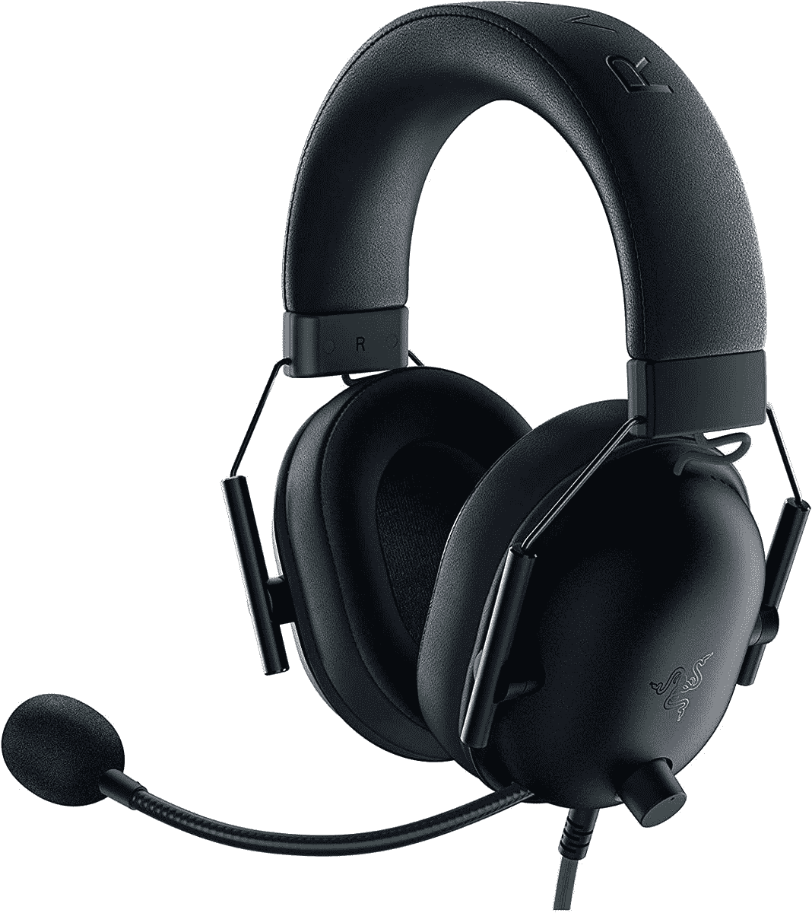

# 立即以 40 美元的价格获得 Razer BlackShark V2 游戏耳机

> 原文：<https://www.xda-developers.com/get-a-razer-blackshark-v2-gaming-headset-for-40-today/>

黑色星期五很快就要到了，许多零售商已经开始了他们的季节性销售。虽然 ps5 或桌面游戏电脑可能不会有很大的折扣(感谢黄牛和加密矿工)，但我们开始在游戏配件上获得不错的销售。现在，你可以在多个商店以 39.99 美元的价格购买 Razer 有线游戏耳机，比通常的价格优惠 10 美元，比 MSRP 低 20 美元。

这款耳机具有 50 毫米音频驱动器、基于软件的环绕声(像大多数游戏耳机一样)、内置音量和麦克风静音控制以及有线连接。这款耳机使用 3.5 毫米组合插孔进行连接，因此它几乎可以与任何东西兼容:PC、PS4、Xbox One、任天堂 Switch、Mac，甚至一些手机和平板电脑。如果你的电脑或其他设备没有耳机/麦克风组合插孔，你可能需要[一个 USB 适配器](https://www.amazon.com/MillSO-Sapphire-External-Headphone-Desktops/dp/B0828J36JD?tag=xda-3cljbbg-20&ascsubtag=UUxdaUeUpU5913&asc_refurl=https%3A%2F%2Fwww.xda-developers.com%2Fget-a-razer-blackshark-v2-gaming-headset-for-40-today%2F&asc_campaign=Short-Term)，它不在包装盒内。

 <picture></picture> 

Razer BlackShark V2 X Gaming Headset

##### 雷蛇黑鲨 V2 X

这款经济型游戏耳机具有 3.5 毫米接口和基于软件的环绕声。

Razer 将耳机的麦克风称为“超清晰”麦克风，心形拾音模式可以减少一些背景噪音。然而，麦克风不能拆卸(像其他一些耳机一样)，这使得黑鲨 V2 不太适合简单的音乐欣赏。

我们没有亲自试用过这款耳机，但它得到了买家和其他渠道的积极评价。硬件加人在[近日常使用六个月后](https://www.youtube.com/watch?v=86CyDqBCiZU)、[仍然喜欢黑鲨 V2 X，SoundGuys 因其舒适的设计和极简设计而拥有耳机 a 7.9/10](https://www.soundguys.com/razer-blackshark-v2-review-36783/) ，而 [Tom's Hardware 将其评为 3.5/5 星](https://www.tomshardware.com/reviews/razer-blackshark-v2-x-review-affordable-surround-sound)。

这不是世界上最好的游戏耳机，但在最初 59.99 美元的价格标签下，它已经是一个很好的价值，现在它甚至更便宜。