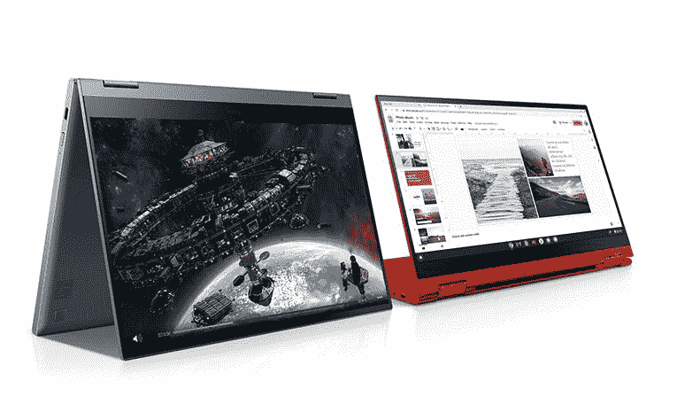

# 购买三星 Galaxy Chromebook 2 仅需 382 美元

> 原文：<https://www.xda-developers.com/get-a-samsung-galaxy-chromebook-2-for-as-little-as-382/>

# 购买三星 Galaxy Chromebook 2 仅需 382 美元

三星最新的 Galaxy Chromebook 正在销售，英特尔赛扬型号的价格为 382 美元，酷睿 i3 型号的价格为 400 美元。

三星的第一款 Galaxy Chromebook 并不太成功，这要归功于它糟糕的电池寿命和高昂的价格，但该公司在今年的 [Galaxy Chromebook 2](https://www.xda-developers.com/galaxy-chromebook-2-available-pre-order/) 中走了一个不同的方向。它以同样引人注目的设计达到了更低的价格点，现在它在三星的网站上进一步打折。赛扬型号现在售价为 382.49 美元(低于 549.99 美元)，而酷睿 i3 型号打折至 399.99 美元(低于 699.99 美元)。

Galaxy Chromebook 2 是一款中档笔记本电脑，配备英特尔赛扬 5205U 或酷睿 i3-10110U 处理器。赛扬版本有 4GB 内存和 64GB 存储空间，而酷睿 i3 版本的内存和存储空间是前者的两倍，达到 128GB 和 8GB 内存。两者之间只有 18 美元的差距，没有太多的理由去选择赛扬型号，特别是考虑到额外的内存。

其他规格包括 45.5 瓦时电池、两个 USB Type-C 端口(均可用于充电)、microSD 读卡器、3.5 毫米耳机/麦克风组合插孔、Wi-Fi 6、蓝牙和背光键盘。Galaxy Chromebook 2 还支持任何 USI 手写笔，但包装盒中没有这种手写笔。

 <picture></picture> 

Samsung Galaxy Chromebook 2

##### 三星 Galaxy Chromebook 2

Galaxy Chromebook 2 可配备英特尔赛扬或酷睿 i3 CPU，最高可配 8GB 内存和 128GB 存储。酷睿 i3 型号在这里更划算。

如果你在以旧换新清单上有一台电脑、平板电脑或手机，你可能会从售价中减去数百美元。例如，一台工作状态下没有裂缝的 Note9 价值 200 美元，这使得 Core i3 Chromebook 的价格达到 240 美元(税前)。