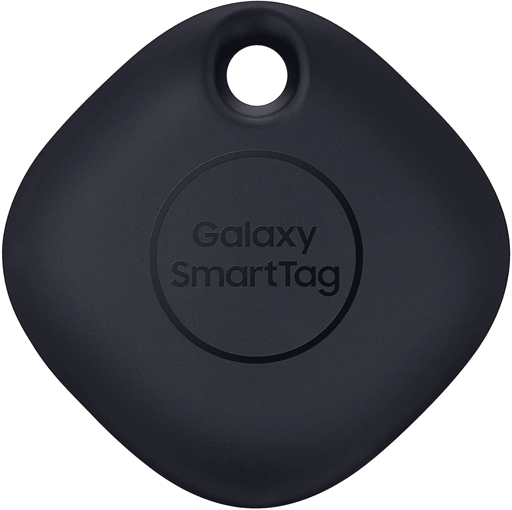

# 现在只需 15 美元(半价)就能获得三星 Galaxy SmartTag

> 原文：<https://www.xda-developers.com/get-a-samsung-galaxy-smarttag-for-just-15-50-off-right-now/>

# 现在只需 15 美元(半价)就能获得三星 Galaxy SmartTag

三星的蓝牙追踪标签 Galaxy SmartTag 目前是正常价格的一半。

与苹果的 AirTags 非常相似，三星 Galaxy SmartTag 是一种蓝牙追踪器，可以附着在物体上，便于用手机或平板电脑进行定位。Galaxy SmartTag 通常售价 30 美元，但现在你只需 15 美元就能买到一个。这是正常价格的一半，尽管你需要亚马逊 Prime 会员才能享受折扣。

这种追踪器可以附着在任何东西上——钥匙、水瓶，甚至是宠物——然后通过蓝牙定位。当你需要找到标签时，如果标签在你的手机或平板电脑的范围内，标签会开始发出蜂鸣声来帮助你找到它。如果您丢失了标签并且超出了范围，您可以将其标记为丢失，以便在 [SmartThings Find network](https://www.xda-developers.com/smartthings-find-helps-find-lost-samsung-galaxy-devices/) 内的某人找到它时收到带有位置数据的通知。与一些竞争对手的追踪器不同，内部电池一旦耗尽还可以更换。

 <picture></picture> 

Samsung Galaxy SmartTag (1-pack)

##### 三星 Galaxy 智能标签

三星的蓝牙追踪器现在是正常价格的一半。需要亚马逊 Prime 会员才能享受折扣。

不过，Galaxy 智能标签也有一些缺点。三星的追踪网络覆盖范围远不如苹果的 AirTags 网络，所以你在正常的家庭/工作区域(你通常携带手机的地方)之外找到丢失标签的机会不大。Galaxy SmartTag 也只适用于三星手机和平板电脑，这肯定很奇怪，因为它只是一个蓝牙追踪器。