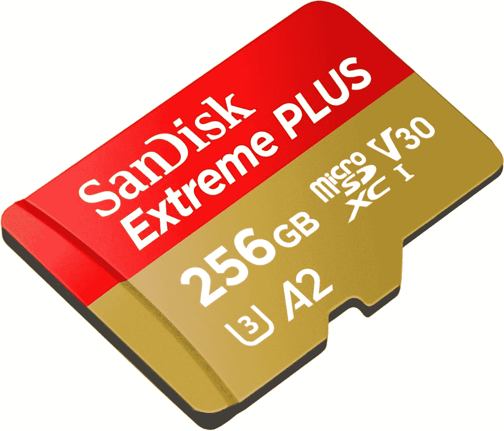

# 现在只需 58 美元就能获得一张超快的 256GB microSD 卡

> 原文：<https://www.xda-developers.com/get-a-super-fast-256gb-microsd-card-for-58-today/>

# 现在只需 58 美元就能获得一张超快的 256GB microSD 卡

这款来自 SanDisk 的 A2 级 256GB microSD 卡是您的 Android 手机/平板电脑、相机或任天堂 Switch 的绝佳选择。

即使智能手机和平板电脑现在比以往任何时候都有更多的存储空间，但 microSD 卡仍然有无数的用途。许多类型的相机和无人机仍然需要它们，它们可以用作从安卓平板电脑到任天堂 Switch 游戏机的所有设备的附加存储。现在，你可以在百思买以 57.99 美元的价格买到最快的 256GB microSD 卡，比最初的 MSRP 节省 42 美元，比典型价格低约 20 美元。

这是 SanDisk 的“Extreme Plus”256 GB micro SD 卡，最大读取速度约为 170 MB/s，最大写入速度约为 90 MB/s，具体取决于读卡器的处理能力。它是 A2 级的，所以它是你可以用来存储应用程序和游戏的最好的 SD 卡之一，尽管它仍然比大多数类型的内部闪存慢。

 <picture></picture> 

Western Digital/SanDisk sale

##### SanDisk Extreme Plus microSD 卡

这款 SD 卡兼具高容量和高性能，是高端相机、安卓设备或任天堂 Switch 游戏机的绝佳选择。

这张卡是一个很好的选择，可以为你的 Android 手机或平板电脑增加更多存储空间(只要它有 SD 卡插槽)，将更多游戏下载到你的任天堂 Switch，或做高容量 SD 卡可能有助于做的任何事情。它比许多其他 256GB 卡更贵，如 [EVO Select 256GB 卡](https://www.amazon.com/Samsung-Electronics-microSDXC-Adapter-MB-ME256HA/dp/B0887P21Z2?tag=xda-2mtb2mb-20&ascsubtag=UUxdaUeUpU3437&asc_refurl=https%3A%2F%2Fwww.xda-developers.com%2Fget-a-super-fast-256gb-microsd-card-for-58-today%2F&asc_campaign=Short-Term)(根本不是 A1/A2 级)，但这种 SanDisk 型号的优势是提供大量存储*和更快的速度*。