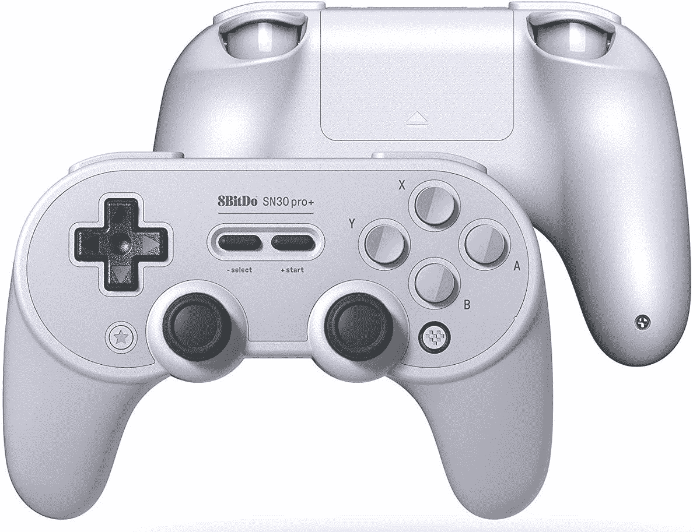

# 现在只需 42 美元即可获得 8 位 SN30 Pro+控制器

> 原文：<https://www.xda-developers.com/get-an-8bitdo-sn30-pro-controller-for-just-42-right-now/>

# 现在只需 42 美元即可获得 8 位 SN30 Pro+控制器

8Bitdo 的全尺寸控制器 SN30 Pro+今天面向亚马逊 Prime 会员发售。它适用于 Windows、macOS、Android 和 Switch。

第三方游戏手柄通常口碑很差(Mad Catz，有人吗？)，但 8Bitdo 的游戏手柄是个例外。该公司出售多种尺寸的控制器，与多种平台兼容。8Bido 的高端游戏手柄 SN30 Pro+目前在亚马逊售价 42.49 美元。这比正常价格节省了 7.5 美元，但折扣仅适用于亚马逊 Prime 会员。

SN30 Pro+(好名字！)是一款全尺寸无线控制器，兼容 Windows、macOS、Android 和任天堂 Switch。它最适合复古游戏和 2D 游戏，D-Pad 位于大多数其他控制器上左操纵杆的位置。不过，这款控制器仍然拥有玩现代游戏所需的所有按钮和操纵杆。

 <picture></picture> 

8Bitdo Sn30 Pro+

##### 8Bitdo SN30 Pro+

这款多平台控制器是复古游戏的绝佳选择。需要亚马逊 Prime 会员才能获得 42.49 美元的售价。

这款控制器的主要问题是，当与任天堂 Switch 一起使用时，它不如任天堂的官方 Pro 控制器好——它不能使用高清隆隆声或扫描 Amiibo 图形。尽管如此，如果你正在寻找一个可以在多个平台上工作的复古游戏控制器，任何 8Bitdo 游戏手柄都不会错。