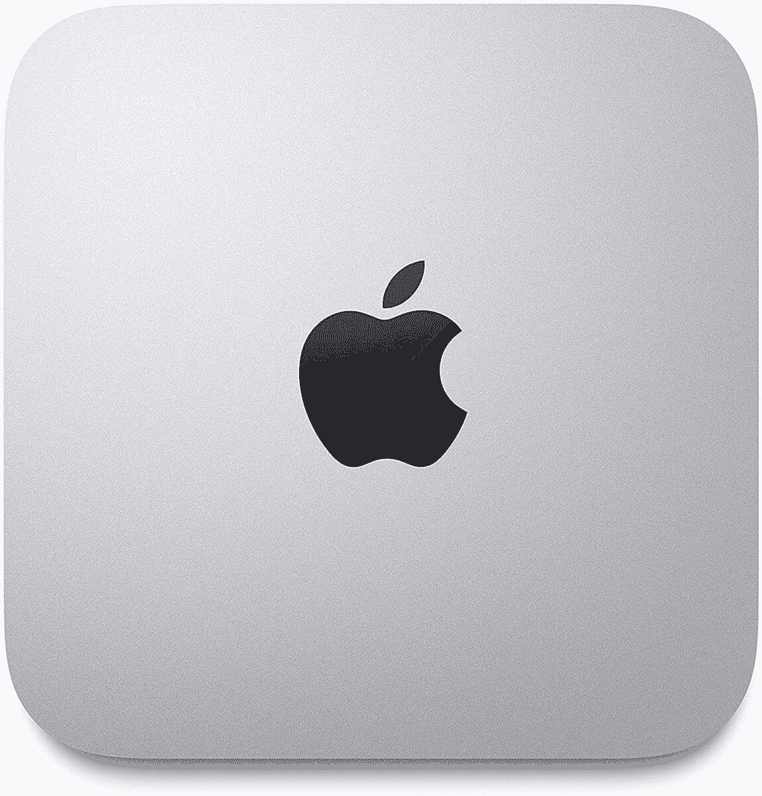

# Mac Mini 交易:只需 600 美元就能买到一台 M1 Mini(优惠 69 美元)

> 原文：<https://www.xda-developers.com/get-an-apple-mac-mini-with-m1-chip-for-69-off-today/>

# 立即以 69 美元的价格购买一台采用 M1 芯片的苹果 Mac Mini

这一新的 Mac Mini 交易将最新的 8GB RAM/256GB 存储型号降至 600 美元，比通常的价格节省了 69 美元。

由于苹果 M1 系统芯片设计的出色性能，苹果最新的 MAC 电脑是你现在可以买到的最好的电脑之一。Mac Mini 是去年首批从英特尔转向 M1 的 Mac 电脑之一，现在你可以在亚马逊上花 599.99 美元买到这款入门级机型。这比通常的价格节省了 69 美元。

2020 Mac Mini 拥有 8 核苹果 M1，将 GPU、CPU、神经引擎、I/O 和其他功能集成到单个芯片中，以提高性能。M1 还为 MacBook 系列带来了令人难以置信的电池续航时间，但由于 Mini 是台式电脑，电力需求不是问题。

 <picture></picture> 

2020 Mac Mini (256GB)

##### 苹果 Mac Mini (M1，2020 年)

苹果最新的 Mac Mini 拥有超快的 M1 处理器，在售配置有 8GB 内存和 256GB 固态硬盘用于存储。结账时享受 69 美元的折扣。

许多 macOS 应用程序已经更新为可以在 M1 MAC 上本地运行，并且您也可以通过包含的 Rosetta 兼容层运行大多数旧软件(不包括需要直接硬件访问的应用程序，如虚拟机)。在许多情况下，模拟英特尔软件的运行速度仍然比在原生英特尔 MAC 上运行的速度快。

在售的具体配置有 M1 芯片、8GB 内存、256GB 固态硬盘存储、Thunderbolt / USB 4 支持、HDMI、Wi-Fi 6 和千兆以太网。如果有更多的可用内存就更好了，但是硬件的其他部分都很棒。你还需要自己的显示器、键盘和鼠标。