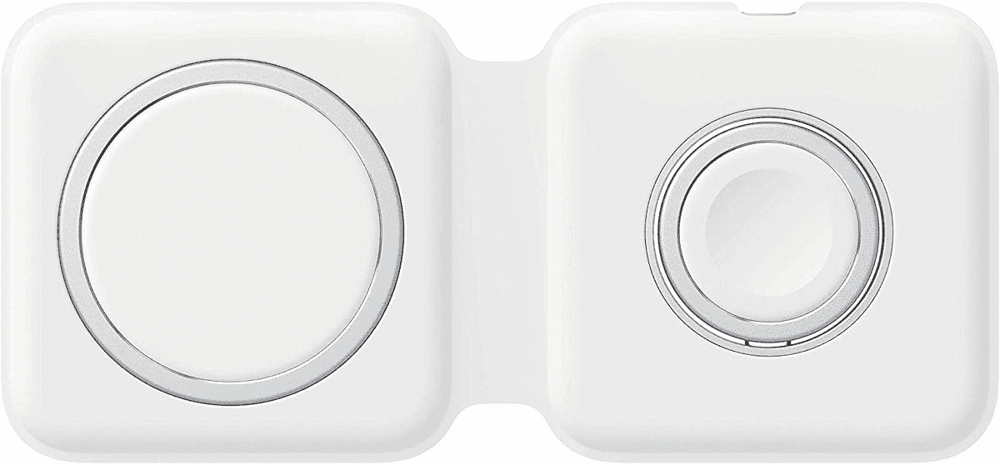

# 今天就花 97 美元买一个苹果 MagSafe Duo 充电器(优惠 32 美元)

> 原文：<https://www.xda-developers.com/get-an-apple-magsafe-duo-charger-for-97-today-32-off/>

# 今天就花 97 美元买一个苹果 MagSafe Duo 充电器(优惠 32 美元)

这款充电器可以同时为 iPhone 和 Apple Watch 供电，它可以对折，便于旅行携带。

新款 iPhones 上的 MagSafe 磁性充电技术导致了新配件的激增，包括苹果自己的 MagSafe Duo 充电器。正如“Duo”的名字所暗示的那样，它可以同时为 iPhone 和 Apple Watch 供电，而无需你随身携带多个墙壁适配器和电缆。它几乎从不打折，但现在威瑞森的折扣让价格降到了 97.74 美元，比通常的价格低了 32.25 美元。

这款充电器主要用于旅行，因为它可以对折，但作为床头柜的永久附件也足够好了。一面是给你的 iPhone 充电，MagSafe 用磁铁把它吸住。另一面是苹果手表，可以调整，让手表直立(充电时像时钟一样使用)或平放在手机旁边。

 <picture></picture> 

Apple MagSafe Duo Charger

##### 苹果 MagSafe Duo 充电器

威瑞森的在线商店正在以 96.74 美元的价格出售 MagSafe Duo 充电器，低于通常 129 美元的价格。你不需要成为威瑞森的用户来购买一个。

Duo 充电器有一个缺点——它没有电源适配器。如果你没有一个，我们总结的[最佳 USB PD 快速充电器](https://www.xda-developers.com/best-usb-pd-fast-charger/)中的任何一个都可以解决问题，或者你可以使用官方的 USB Type-C 苹果充电器，用于 iPhones 或 MacBooks。任何 20W 的壁式适配器都可以为手机提供高达 11W 的无线充电，而 27W 的壁式充电器则可以达到 14W。当你使用没有 MagSafe 的 iPhone 或非苹果手机时，无线充电被限制在 7.5W。

对于任何拥有 iPhone 12 或 13 和 Apple Watch 的人来说，这是一个非常棒的多功能充电器，只要你已经有一个墙上电源适配器(或者不介意购买一个)。如果你的目标是一些看起来更好的东西，并且不介意失去便携性， [Belkin 的 3 合 1 无线充电站](https://www.amazon.com/Belkin-Wireless-Charger-Charging-Station/dp/B086KNLM5M?tag=xda-2oeult5-20&ascsubtag=UUxdaUeUpU6119&asc_refurl=https%3A%2F%2Fwww.xda-developers.com%2Fget-an-apple-magsafe-duo-charger-for-97-today-32-off%2F&asc_campaign=Short-Term)是一个可靠的替代选择。