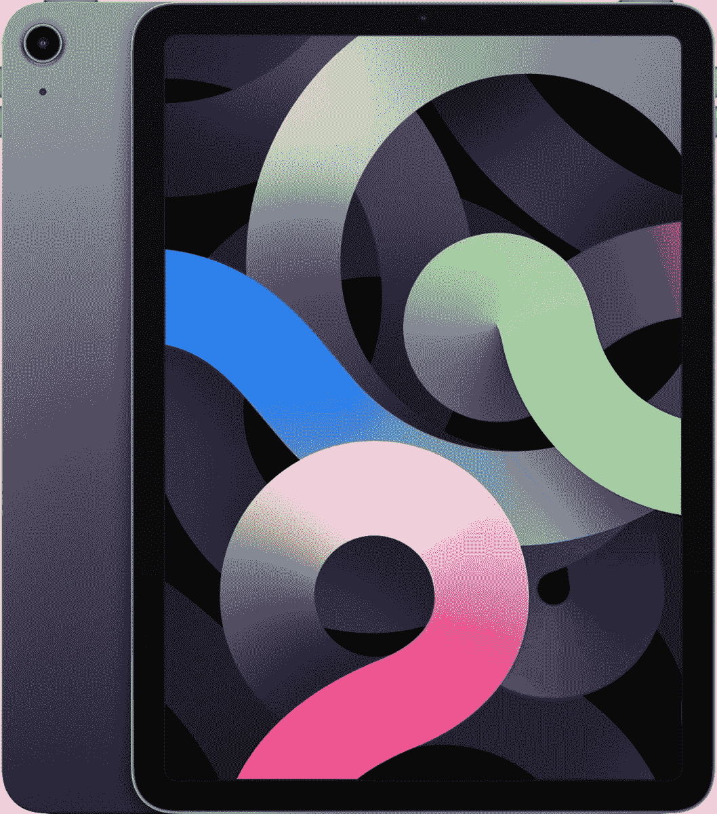

# 苹果 iPad Air 交易:在多家商店以 100 美元的价格购买 iPad Air

> 原文：<https://www.xda-developers.com/get-an-ipad-air-today-for-100-off-at-multiple-retailers/>

# 今天在多家零售商处以 100 美元的价格购买 iPad Air

64GB 的 Wi-Fi iPad Air 现在售价 500 美元。你也可以花 650 美元买一台 256GB 的，或者花 630 美元买一台 64GB 的 iPad Air。

iPad Air 现在已经是第四代了，从功能和设计上来说，它位于入门级 iPad(没有附加名称)和高端 iPad Pro 之间。最新款有 10.9 英寸显示屏和苹果 A14 仿生芯片，64GB 的起价通常在 540-550 美元左右。苹果现在将 iPad Air 的所有配置都打折 100 美元，将最便宜的选项降至 499.99 美元。多家商店也在现场销售。

最新的 iPad Air(2020 年发布的第四代)有一个带“神经引擎”的苹果 A14 仿生芯片，一个 10.9 英寸的液晶显示屏，一个 12MP 的后置摄像头，一个 7MP 的前置摄像头，支持 Wi-Fi 6，以及一个用于充电和配件的 USB Type-C 端口。它还支持苹果的 Magic Keyboard、Smart Keyboard Folio 和第二代 Apple Pencil——但所有这些都是单独销售的。

 <picture></picture> 

10.9-Inch iPad Air 5

##### 苹果 iPad Air (2020 年)

这是最便宜的 iPad Air，没有蜂窝支持，64GB 存储。它是 500 美元，比正常价格低 100 美元。

 <picture></picture> 

10.9-Inch iPad Air 5

##### 苹果 iPad Air (2020 年)

这款机型拥有 256GB 的内部存储空间，但仍不支持蜂窝网络。它的价格是 650 美元，比正常价格低了 100 美元。

 <picture></picture> 

10.9-Inch iPad Air 5

##### 苹果 iPad Air (2020 年)

这是最便宜的带蜂窝连接的 iPad Air。630 美元，比正常价格低 100 美元。

这次销售让所有型号的 iPad Air 降价 100 美元，最便宜的版本只要 500 美元。您还可以从所有可用的颜色中挑选，包括玫瑰金、太空灰、银色和绿色。一些型号或颜色在某些商店售罄或延期交货——例如，亚马逊显示 64GB Wi-Fi 型号“很快有货”，有些颜色完全没有。