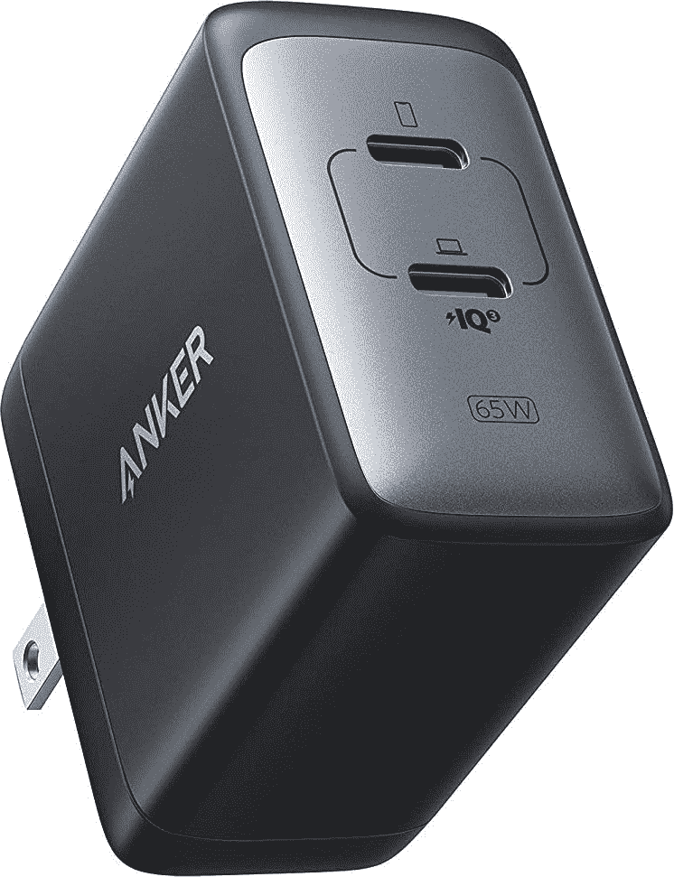

# 购买 Anker 新的 65W USB Type-C 充电器，价格 40 美元(优惠 10 美元)

> 原文：<https://www.xda-developers.com/get-ankers-new-65w-usb-type-c-charger-for-40-10-off/>

# 购买 Anker 新的 65W USB Type-C 充电器，价格 40 美元(优惠 10 美元)

PowerPort III 可以通过 USB Type-C 为两台设备充电，支持 PPS 和紧凑的设计。

Anker 生产一些最好的充电器，包括几个使用氮化镓技术进行较小设计的型号。该公司刚刚发布了带有两个 USB Type-C 端口的 PowerPort III 墙壁适配器，现在你可以花 40 美元买到一个。这比正常价格低了 10 美元，这不是一个令人难以置信的节省，但这是一个全新的设备，与其他充电器相比已经具有价格竞争力。

PowerPort III 有两个 USB Type-C 端口，可以以高达 65W 的功率为一台设备充电。这对大多数手机、平板电脑和笔记本电脑来说绰绰有余。当两个设备连接时，充电器会智能地在它们之间共享功率——它无法同时向两个设备提供 65 瓦的功率。这也是少数支持 PPS 的双端口充电器之一(根据[的一篇评论](https://www.amazon.com/gp/customer-reviews/R3122AAUFDUH1K/ref=cm_cr_getr_d_rvw_ttl?tag=xda-5o6mgvp-20&ascsubtag=UUxdaUeUpU3888&asc_refurl=https%3A%2F%2Fwww.xda-developers.com%2Fget-ankers-new-65w-usb-type-c-charger-for-40-10-off%2F&asc_campaign=Short-Term))，因此它可以为需要 PPS 的新款三星手机和平板电脑提供全速充电，如 Galaxy Note20 和 S21。

 <picture></picture> 

Anker PowerPort III

##### Anker PowerPort Atom III 65W 超薄充电器

Anker 的这款 65W 充电器非常适合为您的所有设备充电。在结账时输入代码 MRAKA602 即可享受折扣。

Anker 的充电器尺寸为 2.11 x 2.05 x 1.14 英寸，比大多数其他大功率 USB 墙壁适配器都要小。这是任何情况下的绝佳选择，无论您只是需要更换笔记本电脑或平板电脑的墙上适配器，还是想要同时为两台设备充电。唯一的缺点是没有 USB 型连接器，所以如果你需要给旧设备充电，你可能需要不同的电缆或[适配器](https://www.amazon.com/NIMASO-Adapter-Adaptor-Compatible-Pixel-Gray/dp/B07TJ38SDW?tag=xda-5o6mgvp-20&ascsubtag=UUxdaUeUpU3888&asc_refurl=https%3A%2F%2Fwww.xda-developers.com%2Fget-ankers-new-65w-usb-type-c-charger-for-40-10-off%2F&asc_campaign=Short-Term)。