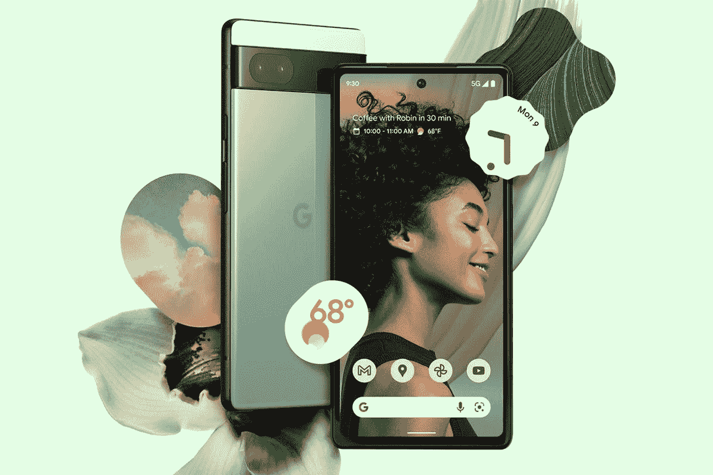

# 你现在可以在威瑞森上免费获得谷歌 Pixel 6a

> 原文：<https://www.xda-developers.com/get-google-pixel-6a-free-verizon/>

谷歌在 5 月份的 2022 年 T2 输入/输出大会上首次推出了 Pixel 6a T1。这款手机将于本月开始发售，今天开始[预购。威瑞森宣布，将从 7 月 28 日开始在其网络上提供超宽带兼容手机，今天开始接受预购。](https://www.xda-developers.com/pixel-6a-pre-order-us-uk/)

新威瑞森用户将很高兴地知道，当激活 5G Start、5G Do More、5G Play 或 5G Get More Unlimited 计划的新智能手机系列时，无线运营商将智能手机的价格降低了 499.99 美元。你没看错的话，这款手机将是完全免费的，在 36 个月的时间里，折扣将作为每月信用点数来使用。那些已经在威瑞森的用户可以获得 100 美元的 5G Start、5G Do More、5G Play 或 5G Get More Unlimited 计划折扣。该折扣也将在 36 个月内按月发放。

## 谷歌最新的免费

此外，威瑞森将在购买新款 Pixel 手机时提供一些配件折扣。感兴趣的人还可以通过购买谷歌 Pixel 6a 来享受谷歌 Pixel Buds Pro 的优惠折扣。在有限的时间内，当从威瑞森购买手机时，您还可以获得 100 美元的 Pixel Buds Pro 折扣。谷歌 Pixel Buds Pro 的折扣将使耳塞的价格降低近一半。当您购买五件或更多符合条件的产品时，您还可以获得高达 40%的谷歌 Pixel 6a 配件折扣。如果你对手机感兴趣，这些都是不错的选择。

谷歌像素将有三种颜色可供选择:木炭色、粉笔色和鼠尾草色。这款手机由谷歌的 Tensor SoC、6GB RAM 和 128GB 内部存储提供支持。此外，这款手机将拥有 6.1 英寸有机发光二极管显示屏，12MP 主摄像头，4，306mAh 电池，以及五年的软件支持。如果有兴趣，可以登录威瑞森的网站或者通过百思买查看手机，我们在下面有链接。

 <picture></picture> 

Google Pixel 6a

谷歌 Pixel 6a 是该品牌最实惠的手机，售价 499.99 美元

* * *

**来源** : [威瑞森](https://www.anrdoezrs.net/links/100122946/type/dlg/sid/UUxdaUeUpU42637/https://www.verizon.com/about/news/google-pixel-6a-verizon-5g)