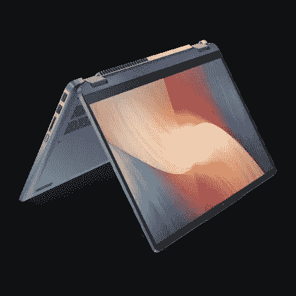
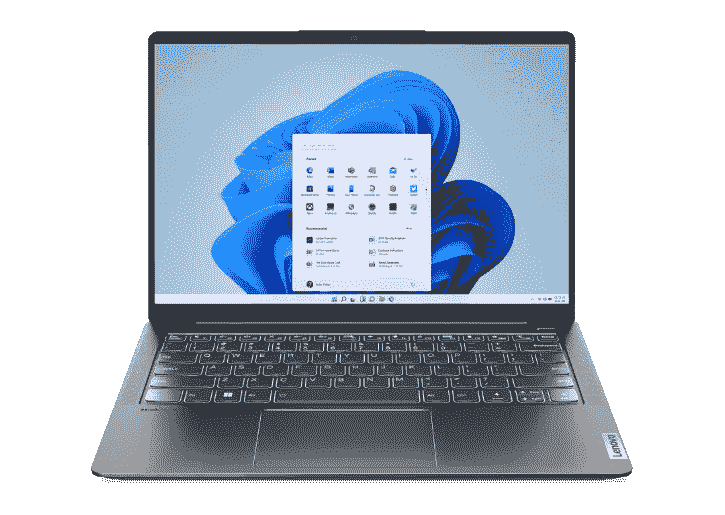

# 利用本周末的促销活动，以不到 550 美元的价格获得联想最新的 IdeaPads

> 原文：<https://www.xda-developers.com/get-lenovos-newest-ideapads-for-less-than-550-with-this-weekends-sales/>

寻找新的笔记本电脑，错过了之前的劳动节销售？不要担心，因为随着新的秋季硬件季节的到来，[联想的](https://www.xda-developers.com/best-lenovo-laptops/)夏季清仓活动正在本周末进行。联想的 IdeaPad 笔记本电脑降价高达 40%，低至 550 美元。一些最好的销售包括新的 IdeaPad Flex 5i 和新的 IdeaPad 5i Pro。联想的其他夏季清仓交易也将 Yoga 7i 等流行的 Yoga 平板电脑打八五折。不过，最好快点行动，因为这些交易只会持续到 9 月 25 日。

排在销售榜首的是 IdeaPad 部门，是新的 IdeaPad Flex 5i。这款设备通常售价 749 美元，但现在减价 547 美元。它也是一款出色的二合一设备，因为 IdeaPad Flex 5i 系列配备了新的 16:10 宽高比 14 英寸 1920 x 1200 分辨率显示器，可以帮助您在工作时在屏幕上显示更多内容。除此之外，它由最新的[第 12 代](https://www.intel.com/content/www/us/en/products/docs/processors/core/12th-gen-processors.html)英特尔酷睿 i3 处理器驱动，搭配 8GB 内存，足以快速浏览网页和执行其他任务。512GB 的存储对于这个价格来说也是便宜的，因为增加超过 256GB 的存储通常是一种昂贵的升级。

 <picture></picture> 

Lenovo IdeaPad Flex 5i (14-inch)

##### 联想 Chromebook Flex 5i

IdeaPad Flex 5i 集成了身临其境的显示屏，以及用于日常任务的强大英特尔功能，所有这些都不到 550 美元。

接下来是 IdeaPad 5i Pro。这款传统笔记本电脑功能强大，售价 995 美元，仅略低于 1000 美元。通常是 1225 美元。它配备了第 12 代英特尔酷睿 i5-1240P 处理器和 Nvidia GeForce MX550 显卡，非常适合视频编辑和轻度游戏。更好的是，这款笔记本电脑配备了 2.2k 分辨率的 14 英寸显示器，在屏幕上为您提供了大量像素，例如并排堆叠窗口，甚至在编辑电影时查看时间线。这次销售降价 18%。

 <picture></picture> 

IdeaPad 5i Pro (14-inch)

##### 联想 IdeaPad 5i Pro

IdeaPad 5i Pro 拥有 2.2K 分辨率的屏幕，以及用于基本照片和视频编辑和游戏的 Nvidia MX550 显卡，所有这些都不到 1000 美元

联想本周末的销售还包括 Yoga 笔记本电脑。Yoga 7i 16 英寸的顶级车型是联想最强大的敞篷车之一，此次销售将价格从 1400 美元降至 1120 美元，节省了 15%。以这个价格，您购买的是最新的英特尔显卡，英特尔 Arc。这些图形是全新的，旨在挑战英伟达的 MX 芯片，并为这笔钱包装了大量的权力。当我们评论这款 Yoga 时，我们喜欢它的基本型号，并将其称为“[,一款时尚的主流笔记本电脑，价值不菲。](https://www.xda-developers.com/lenovo-yoga-7i-2022-review/)

 <picture></picture> 

Lenovo Yoga 7i (16-inch) with Arc Graphics

##### 联想 Yoga 7i 2 合 1 (16 英寸)

联想 Yoga 7i 是一款出色的可转换笔记本电脑，具有强大的处理能力和出色的 GPU，可用于轻度游戏以及照片和视频编辑。

如果我们提到的这些 IdeaPads 或 Yogas 不符合你的口味，那么不要太担心。你可以在联想的网站上看到[所有在售的 idea pad](https://shop-links.co/1785995771703234823?u1=8cad71f6-fbe3-4820-9c75-6f27899800b0)，以及所有在售的 [Yoga 型号](https://shop-links.co/1785995772337123263?u1=d83e8951-798f-406c-82cc-5d170d1ff7c4)。你不需要优惠券代码，所以只需选择你想要的模型，并检查出来！您还可以在任何一台免费送货的电脑上使用代码 **EXTRA5** 额外节省 5%的费用。