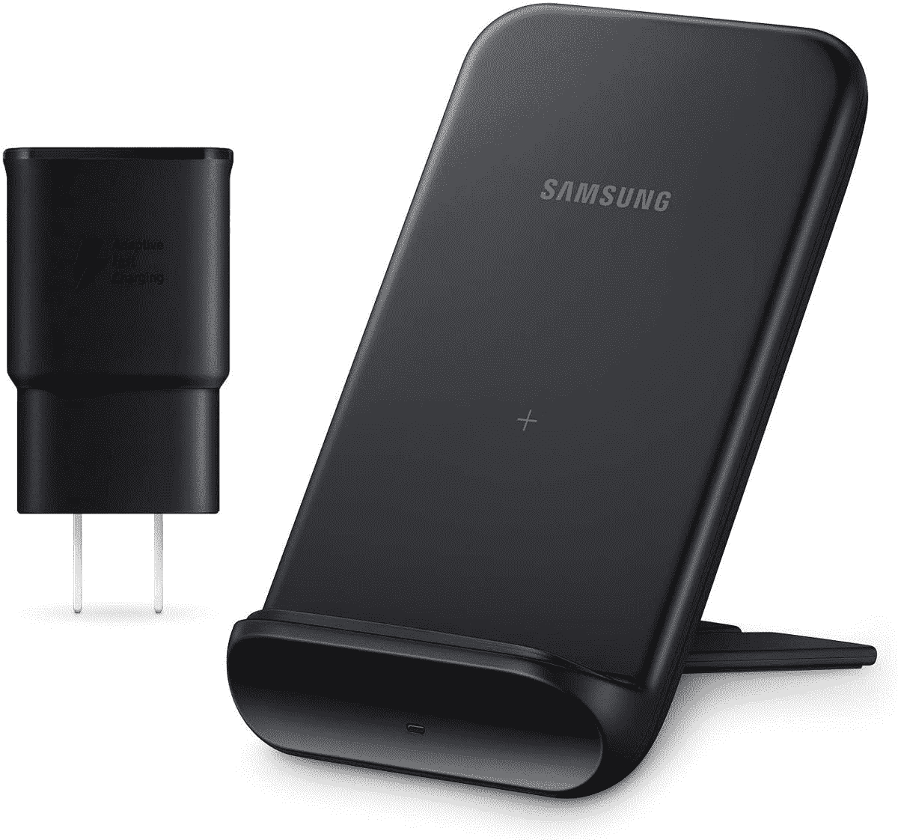

# 现在只需 30 美元就能买到三星的无线充电支架

> 原文：<https://www.xda-developers.com/get-samsungs-wireless-charging-stand-for-only-30-today/>

# 现在只需 30 美元就能买到三星的无线充电支架

三星的无线充电器可以直立或平放在桌子上，现在它在亚马逊限时出售，售价 30 美元。

三星一直销售其手机和平板电脑的配件，但它们的价格通常高于竞争对手，导致人们在其他地方购买充电器和外壳。然而，三星最近[将其双无线充电板打折至 36 美元](https://www.xda-developers.com/get-the-samsung-pad-duo-charger-for-just-36-today/)，对于任何想同时给手机和智能手表(或耳塞)充电的人来说，这都是一个很好的选择。这一销售仍在进行，现在三星也将其垂直充电支架的价格降至 29.99 美元。这比通常价格低 10 美元，比建议零售价低 20 美元。

这款充电器可以水平放置或垂直站立，这要归功于背面的可调节支腿。它适用于所有 Qi 认证的设备，包括 iPhones、一些 Galaxy 智能手机和智能手表、耳塞等。它可以为 iPhones 充电高达 7.5W，为 Galaxy 智能手机充电高达 9W。

 <picture></picture> 

Samsung Wireless Charger

##### 三星 15W 无线充电器支架

三星的无线充电器可以直立或平放在桌子上。只有黑色在打折。

找到这个价格(甚至更低)的快速无线充电器并不罕见，但三星包括了所需的墙上适配器。大多数其他 Qi 充电板在包装盒中不包括电源适配器。如果你也有使用无线充电的配件，请记住[三星 Pad Duo 也仍在销售](https://www.xda-developers.com/get-the-samsung-pad-duo-charger-for-just-36-today/)。