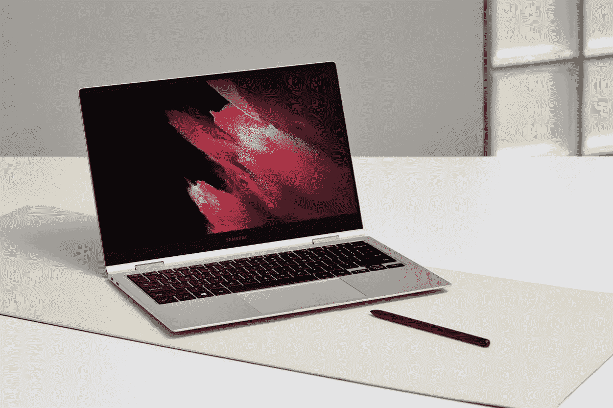
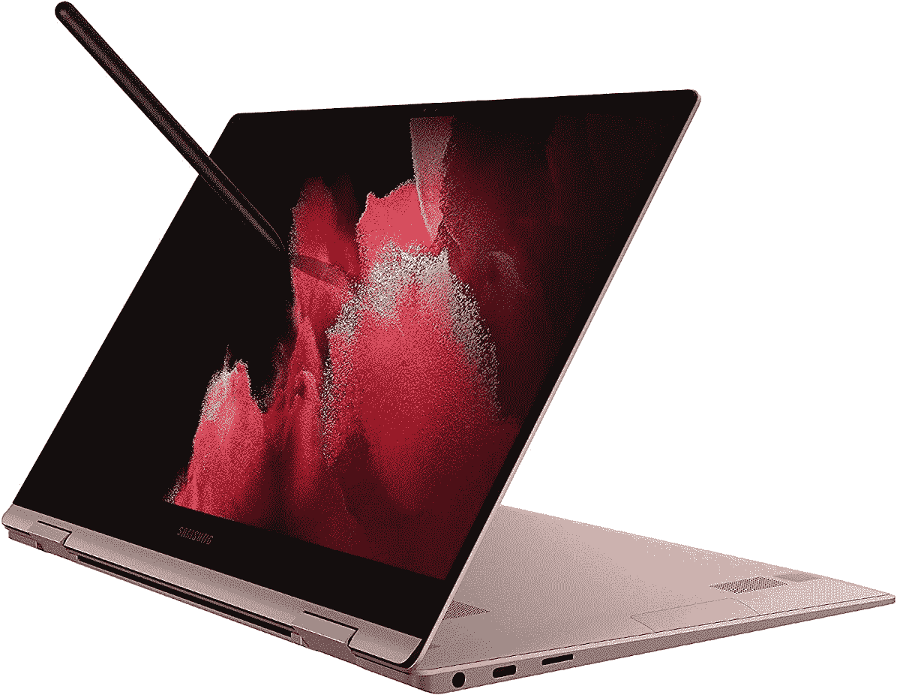

# 三星 Galaxy Book 和 Galaxy Book Pro 现已上市

> 原文：<https://www.xda-developers.com/get-the-15-inch-galaxy-book-pro-for-170-off-or-the-2-in-1-model-for-150-off/>

# 以 170 美元的价格购买 15 英寸的 Galaxy Book Pro，或者以 150 美元的价格购买 2 合 1 机型

三星全新的 Galaxy Book Pro 现在的 Core i5/15.6 英寸机型售价为 930 美元。Galaxy Book Pro 360 的两个尺寸也在打折。

 <picture></picture> 

Mass Image Compressor Compressed this image. https://sourceforge.net/projects/icompress/ with Quality:100

三星在 4 月发布了其新的 Galaxy Book Pro 笔记本电脑[，采用第 11 代英特尔酷睿处理器，时尚的设计，以及一些从 Galaxy 手机和平板电脑移植而来的应用和服务。自那以后，Galaxy Book Pro 的价格一直在缓慢下降，现在 15 英寸的 Core i5 型号在亚马逊的售价为 930 美元，原价为 170 美元。2 合 1 Galaxy Book Pro 360 也在销售，但这并不是一笔好交易。](https://www.xda-developers.com/samsung-galaxy-book-pro-laptops-2021/)

Galaxy Book Pro 有几个不同的版本，但亚马逊只有一款机型在黄金日打折销售:搭载英特尔酷睿 i5 CPU 的 15.6 英寸笔记本电脑。您还可以获得时尚的轻薄设计、8GB 内存、512GB 固态硬盘存储、长达 20 小时的电池续航时间以及 snd Wi-Fi 6E 支持。显示器也是 AMOLED 屏幕，所以从电影到 Word 文档的一切看起来都很棒。

 <picture></picture> 

Samsung Galaxy Book Pro

##### Galaxy Book Pro 15.6 英寸(酷睿 i5)

配备酷睿 i5 CPU 的 15 英寸版 Galaxy Book Pro 降至 930 美元，节省了 170 美元。需要亚马逊 Prime 会员。

 <picture></picture> 

Galaxy Book Pro 360 13.3"/15.6"

##### Galaxy Book Pro 360 13.3 英寸/15.6 英寸

三星新的二合一笔记本电脑现在售价 1050 美元，或者你可以花 1150 美元买到更大的 15 英寸型号。两者都比正常价格低 150 美元。

与此同时，三星在其网站上略微下调了 Galaxy Book Pro 360 的价格。配备酷睿 i7 CPU 和 8GB 内存的 13.3 英寸型号现在售价为 1050 美元，相同规格的 15.6 英寸版本为 1150 美元。这比正常价格低了 150 美元，还不如亚马逊在 Galaxy Book Pro 上的价格。然而，三星的网站为你提供了选择手机、平板电脑和个人电脑的交易选项，这可能会进一步降低最终价格(取决于你能给三星多少)。