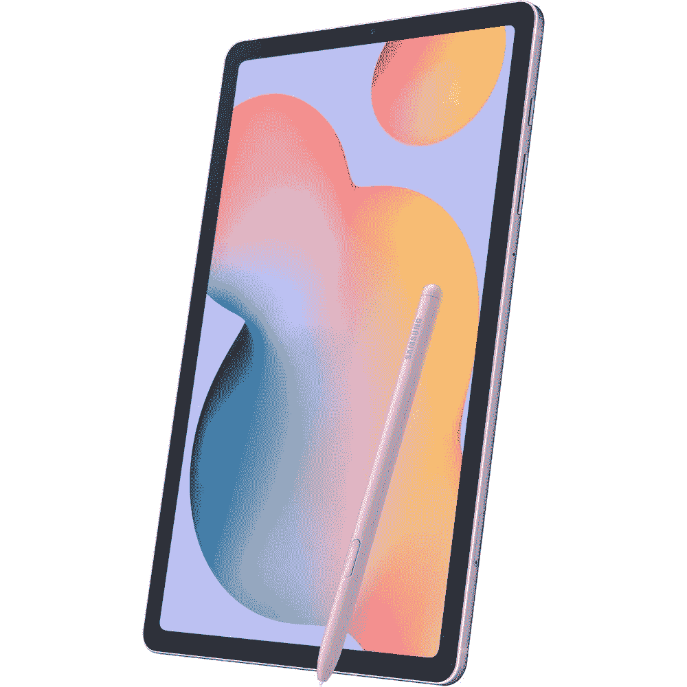

# 现在只需 270 美元就能买到 64GB 的 Galaxy Tab S6 Lite(优惠 80 美元)

> 原文：<https://www.xda-developers.com/get-the-64gb-galaxy-tab-s6-lite-for-just-270-right-now-80-off/>

# 现在只需 270 美元就能买到 64GB 的 Galaxy Tab S6 Lite(优惠 80 美元)

Galaxy Tab S6 Lite 保证可以更新到 Android 12 和 13，目前 64GB 的型号比原价低 80 美元。

Galaxy Tab S6 Lite 于去年发布，是苹果入门级 iPads 的竞争对手，尽管它已被 [Tab S7 FE](https://www.xda-developers.com/galaxy-tab-s7-fe-quietly-launched/) 所取代，但 Tab S6 Lite 仍然是一款非常适合轻型生产力和媒体流的平板电脑。128GB 型号最近在 T2 和 T4 上市了几次，但现在更便宜的 64GB 型号在多家零售店以 269.99 美元的价格出售。这是我们最近看到的 64GB 型号的较好价格之一——过去一个月，它在亚马逊上的价格在 280 美元和 350 美元之间波动。

这款机型采用 Exynos 9611 芯片组，64GB 内部存储，4GB 内存，10.4 英寸 2000 x 1200 液晶显示屏。还有一个用于增加更多存储空间的 microSD 卡插槽，外加一个用于绘图的 S Pen 手写笔。至于连接，你可以使用 Wi-Fi 5(可惜不是 Wi-Fi 6)、蓝牙 5.0 和 USB Type-C。最后，还可以使用 3.5 毫米耳机插孔，这是新款 Tab S7 和 Tab S7 FE 所不具备的。

 <picture></picture> 

Galaxy Tab S6 Lite (64GB Wi-Fi)

##### 三星 Galaxy Tab S6 Lite

这是我们在 64GB Galaxy Tab S6 Lite 上看到的最低价格之一。这是 Wi-Fi 模式，它不能连接 LTE/5G。

三星去年确认了 Tab S6 Lite 将获得至少三年的 Android 操作系统更新。既然它已经收到了 Android 11 的更新，它应该会在谷歌发布这些更新后的某个时候得到 Android 12 和 13。