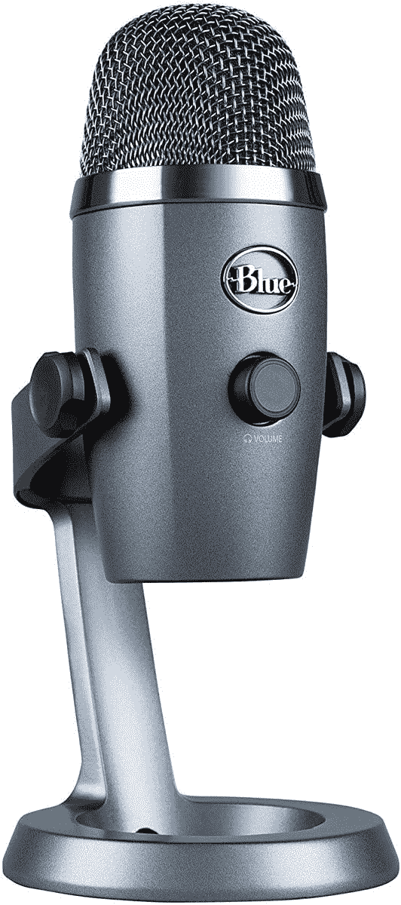

# 购买蓝色 Yeti Nano 电容话筒，优惠 20 美元

> 原文：<https://www.xda-developers.com/get-the-blue-yeti-nano-condenser-microphone-for-20-off/>

# 购买蓝色 Yeti Nano 电容话筒，优惠 20 美元

Blue 的有趣大小的 Yeti 纳米电容麦克风售价为 79.99 美元，比通常的价格低 20 美元，创下历史新低。

Blue 是最受欢迎的音频公司之一，特别是由于该公司的 Blue Yeti 桌面电容麦克风的广泛使用。Yeti 是一款出色的麦克风，但 Blue 也销售一款较小的版本，具有大多数相同的功能，价格较低。现在你可以在亚马逊上以 79.99 美元买到更小的蓝色雪人 Nano，比通常的价格低 20 美元。这也是 Yeti Nano 有史以来最便宜的，至少从亚马逊的商店来看是这样。

蓝色 Yeti Nano 是一款电容话筒，有两种拾音模式。全向模式可以拾取各个方向的声音，非常适合多人参加的电话会议。还有一个心形模式用于正常通话和直播，专注于麦克风正前方的声音。除了用于在录音模式之间切换的按钮，还有一个音量旋钮(用于直接插入麦克风的耳机)和一个静音按钮。

 <picture></picture> 

Blue Yeti Nano

##### 蓝色雪人纳米

Blue 的小型电容麦克风售价为 79.99 美元，比通常价格节省了 20 美元。它有两种拾音模式和 USB 连接。

该麦克风具有 24 位深度、48kHz 的采样率和用于连接 PC 的 USB 端口。你不需要安装软件来使用麦克风，但 Blue 确实有一个桌面应用程序来控制增益和其他设置，而不必触摸麦克风的按钮。