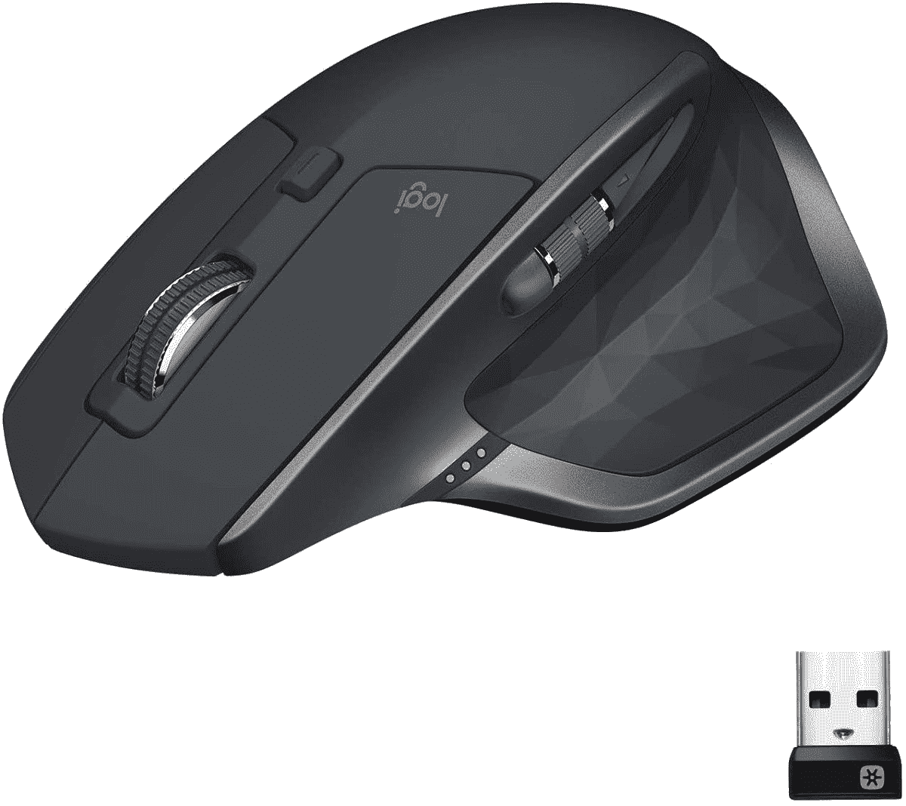

# 只需 50 美元，即可获得神奇的罗技 MX Master 2S 鼠标

> 原文：<https://www.xda-developers.com/get-the-fantastic-logitech-mx-master-2s-mouse-for-just-50/>

# 只需 50 美元，即可获得神奇的罗技 MX Master 2S 鼠标

罗技神奇的 MX Master 2S 鼠标可以通过蓝牙或 UBS 适配器连接，具有适用于多台电脑的额外软件功能。

罗技生产一些最好的个人电脑配件，该公司的 MX Master 鼠标因其设计和软件功能而广受欢迎。MX Master 2S 有多个连接选项和一个桌面配套应用程序，用于创建快捷方式和多设备设置，现在你只需花 49.99 美元就可以从联想获得鼠标。这比最初的建议零售价低了一半，比目前亚马逊的价格低了 10 美元。

MX Master 2S 是一款无线鼠标，有两个连接选项。首先，您可以将附带的无线适配器插入任何 USB 端口，这为您提供了最低的延迟和简单的配置。该鼠标还支持蓝牙配对，非常适合平板电脑和任何 USB 端口不可用的地方。您可以在鼠标中存储多达三个连接(其中一个是 USB 接收器)，因此并不总是需要重新配对。

 <picture></picture> 

Logitech MX Master 2S

##### 罗技 MX Master 2S

这款无线鼠标适用于从台式机到平板电脑的所有设备。在购物车页面输入代码 **MXMASTER50** 即可享受全额折扣。

如果你打算在 Windows 或 macOS 电脑上使用鼠标(对不起，Linux 用户)，罗技的桌面软件允许你为按钮设置快捷键/宏。该应用程序还可以在最多三台电脑之间移动鼠标光标(就像它们是外部显示器一样)，甚至可以在电脑之间拖放文件。

这里的主要缺点是 MX Master 2S 使用 microUSB 端口进行充电，而不是较新的 USB Type-C 连接器。鼠标的传感器也可以达到 4,000 DPI，而大多数游戏鼠标至少可以达到 16,000 DPI。尽管如此，MX Master 2S 仍然是生产力电脑的绝佳伴侣，并且足够灵活，可以与您的所有电子产品配合使用。