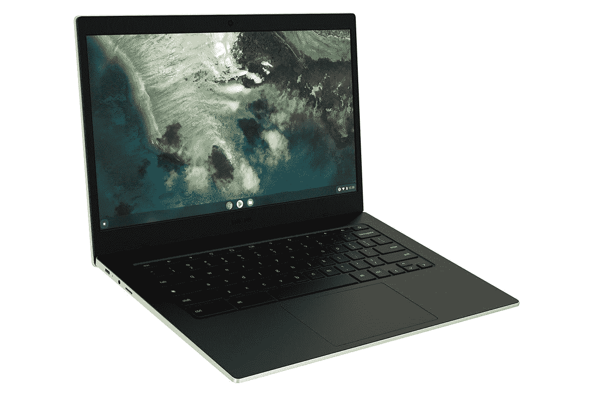

# 立即以 299 美元的价格购买 Galaxy Book Go(优惠 51 美元)

> 原文：<https://www.xda-developers.com/get-the-galaxy-book-go-for-299-today-51-off/>

# 立即以 299 美元的价格购买 Galaxy Book Go(优惠 51 美元)

三星最新的 ARM 笔记本电脑现在以低于正常价格 51 美元的价格出售，在亚马逊上的售价仅为 299 美元。

今年早些时候，三星发布了一系列 Windows 笔记本电脑，包括一款使用高通最新台式骁龙芯片的机型。Galaxy Book Go 的性能无法与 M1 MacBook Air 和 Pro 相媲美，但基于 ARM 的设计确实使其电池续航时间更长，温度也比许多其他 Windows 笔记本电脑更低。现在你可以花 299 美元买到 Galaxy Book Go，比原价降低了 51 美元。

这款笔记本电脑采用高通骁龙 7c Gen 2 芯片组，128 GB eUFS 存储，4GB lpddr 4x 内存，5,480mAh 电池，14 英寸 1080p LED 屏幕。还有两个 USB 3.1 Type-C 端口，一个用于旧配件的 USB 2.0 Type-A 连接器，以及一个 720p 网络摄像头。笔记本电脑整体包裹在塑料外壳中，感觉并不超级溢价，但这毕竟是一台 299 美元的笔记本电脑。查看[我们完整的 Galaxy Book Go 评论](https://www.xda-developers.com/samsung-galaxy-book-go-review/)了解更多细节。

 <picture></picture> 

Samsung Galaxy Book Go

##### 三星 Galaxy Book Go

最新的 ARM 驱动的 Galaxy Book Go 现在比原价低 51 美元，降至 299 美元。

这种笔记本电脑有一些缺点。与普通的 x86 Windows 相比，Windows for ARM 仍有局限性，比如使用仅支持 x86 的软件时性能较慢([和 x64 仿真仍在预览中](https://blogs.windows.com/windows-insider/2020/12/10/introducing-x64-emulation-in-preview-for-windows-10-on-arm-pcs-to-the-windows-insider-program/))。4GB 的内存也意味着你不会被很多 Chrome 标签所困扰。不过，在这个价格范围内，很少有笔记本电脑拥有更大的内存。