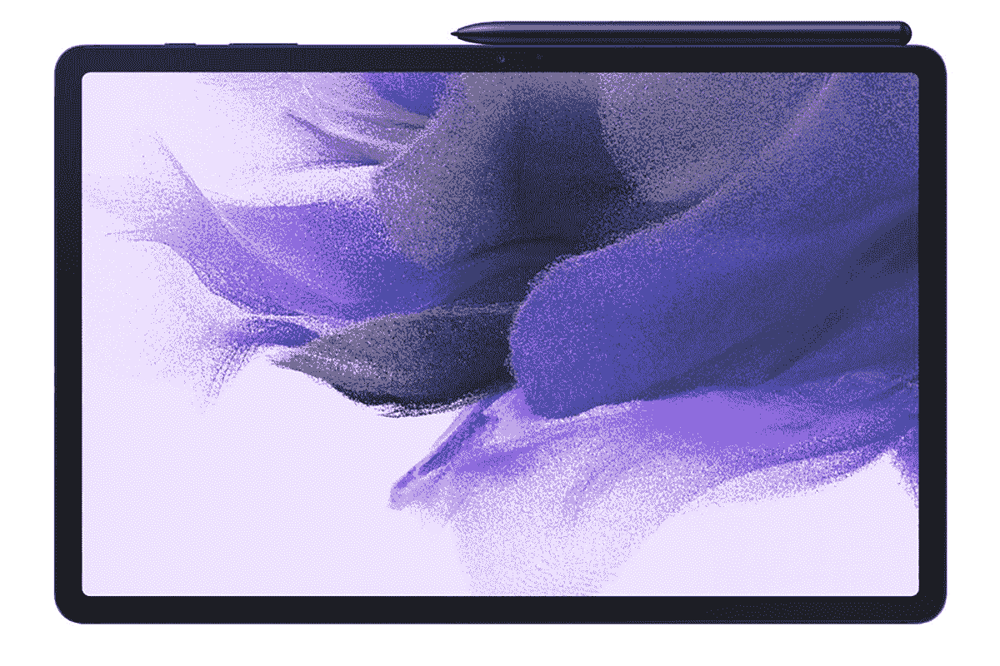
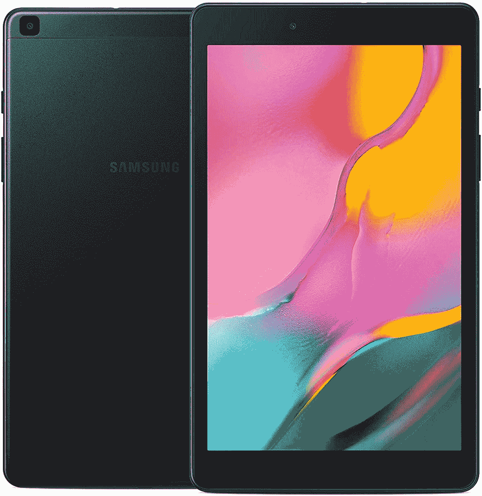

# 售价 450 美元(折 80 美元)的 Galaxy Tab S7 FE，或售价 130 美元的 Tab A 8.0

> 原文：<https://www.xda-developers.com/get-the-galaxy-tab-s7-fe-for-450-80-off-or-the-tab-a-8-0-for-130-70-off/>

三星是少数几个真正尝试安卓平板电脑的制造商之一。该公司今年早些时候在[发布了新的 Galaxy Tab S7 系列，包括一款新的“粉丝版”型号](https://www.xda-developers.com/samsung-galaxy-tab-s7-fe-us-launch/)，作为中端替代产品。现在你可以在多个零售店以 450 美元的价格获得 Galaxy Tab S7 FE，比原价优惠 80 美元，更低端的 Tab A 8.0 也再次发售。

Galaxy Tab S7 FE 是一款 12.4 英寸的 Android 平板电脑，配有 2560x1600 LCD 屏幕，骁龙 750G SoC，4GB RAM，64GB 内部存储(外加 SD 卡插槽)，10,090mAh 电池，45W 快速充电支持(但盒子里的充电器仅达到 15W)，以及 S Pen 触控笔。这款平板电脑搭载的是 Android 11，一旦 Android 12 和 13 上市，它至少应该能接收到。

 <picture></picture> 

Samsung Galaxy Tab S7 FE (2021)

##### 三星 Galaxy Tab S7 FE

三星最新的中端 Android 平板电脑现在售价 450 美元，比原价节省了 80 美元。

 <picture></picture> 

Galaxy Tab A 8.0 (2019)

##### 三星 Galaxy Tab A 8.0 (2019)

这款低端平板电脑是亚马逊 Fire 平板电脑的绝佳替代品，价格为 130 美元(优惠 70 美元)。

[Galaxy Tab S7 FE](https://www.xda-developers.com/samsung-galaxy-tab-s7-fe-review/)首次发布时，我们对其进行了评测，虽然它是一款功能强大的中端 Android 平板电脑，但 530 美元的原始价格根本没有竞争力*。在目前的折扣下，Tab S7 现在比最便宜的苹果 iPad 便宜，尽管如果你愿意使用 iOS 设备，iPad 仍然会给你更好的性能。*

 *与此同时，较小的 Galaxy Tab A 8.0 再次在亚马逊以 129.99 美元的价格出售，比原价节省了 70 美元。这是三星对亚马逊 Fire 平板电脑系列和其他低端 Android 平板电脑的回应，但与 Fire 平板电脑不同，它拥有你可能想要的所有谷歌应用和服务。它拥有骁龙 429 芯片组，8 英寸 800 x 1280 显示屏，64GB 内部存储和 2GB 内存。这款平板电脑最初搭载的是 Android 9.0 Pie，它可以更新到 Android 11。三星*很可能*不会推出 Galaxy Tab A 8.0 的另一个重大更新，但它会在一段时间内继续收到安全补丁。*