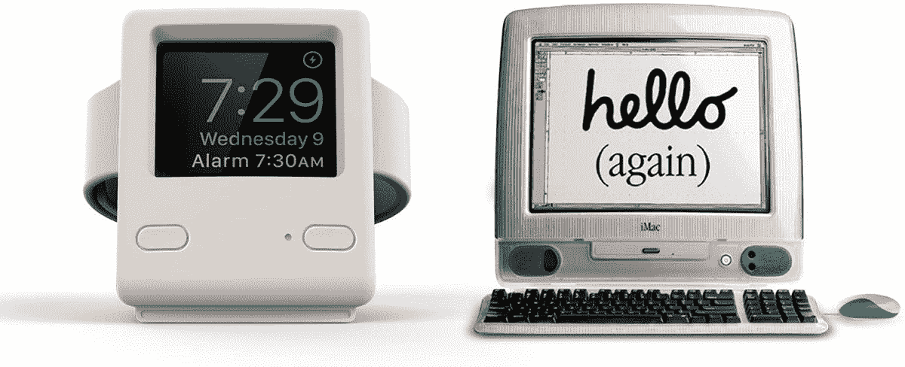

# 只需 11 美元，就能买到受 iMac 启发的埃拉戈 W4 苹果手表支架

> 原文：<https://www.xda-developers.com/get-the-imac-inspired-elago-w4-apple-watch-stand-for-just-11/>

# 只需 11 美元，就能买到受 iMac 启发的埃拉戈 W4 苹果手表支架

这个充电支架让任何苹果手表看起来都像一个微型的 iMac G3，现在你可以在亚马逊上花 11 美元买到一个。

Apple Watch 不缺充电器，但 Elago W4 有点不同。它将你现有的 Apple Watch 充电器与复古风格的外壳配对，为你的书桌或床头柜增添一点乐趣。现在你可以花 10.99 美元买一个，比原价低 14 美元，比之前的价格低 2 美元。

Elago W4 包裹着现有的苹果手表充电板，并模仿标志性的苹果 iMac G3。你的 Apple Watch 屏幕会出现在 iMac 屏幕所在的地方，有两种颜色可以与 iMac G3 的一些透明塑料风格隐约匹配——水粉色和水蓝色。它适用于所有 Apple Watch 型号，当与 [Apple Watch 的床头柜模式](https://www.howtogeek.com/311211/how-nightstand-mode-works-on-the-apple-watch/)搭配时，看起来很棒。

 <picture></picture> 

Elago W4 Apple Watch Stand

##### 埃拉戈 W4 苹果手表支架

这种支架的设计类似于经典的 iMac G3 电脑，并使用现有的 Apple Watch 充电板。

支架中没有实际的电子设备，它由防刮擦硅胶制成，所以它不会刮伤你的 Apple Watch 或在表面上移动。简而言之，Elago W4 是一种有趣的装饰方式，可以用来装饰你的 Apple Watch。然而，它将*而不是*为你的 Apple Watch 添加 Mac OS 9 兼容性，这很遗憾。