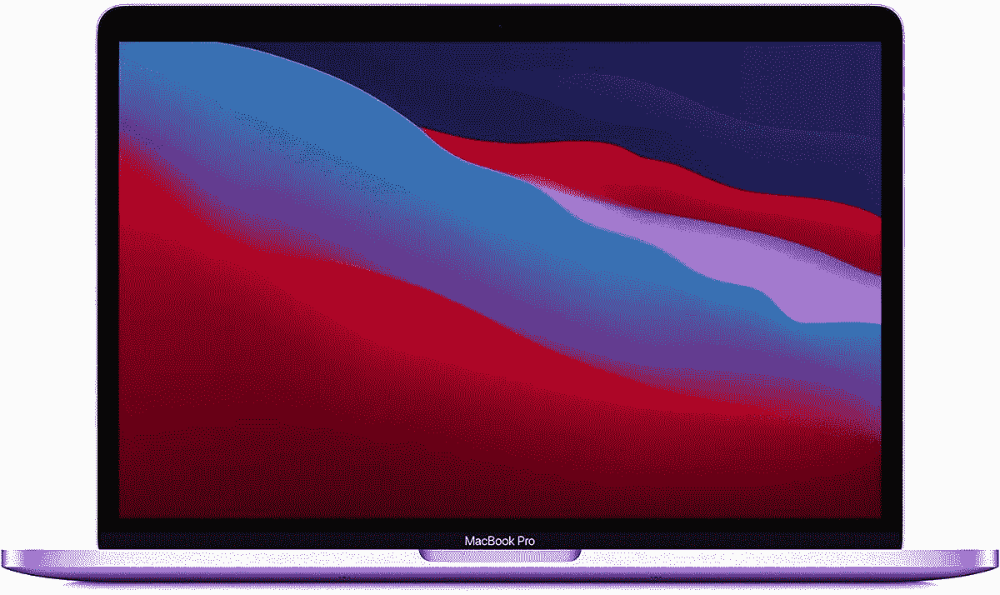

# 在多家商店以 200 美元的价格购买最新的 M1 MacBook Pro

> 原文：<https://www.xda-developers.com/get-the-latest-m1-macbook-pro-for-200-off-at-multiple-stores/>

# 在多家商店以 200 美元的价格购买最新的 M1 MacBook Pro

搭载 M1 芯片的 13.3 英寸 MacBook Pro 重新开始销售，售价为 1099.99 美元，比通常价格节省了 200 美元。

苹果已经开始更新其所有的 Mac 电脑，以使用自己的 M1 片上系统(SoC)，这种系统比许多基于英特尔的电脑速度更快，设计更节能。配备 M1 芯片的最新款 13.3 英寸 MacBook Pro 已经几次跌至 1099.99 美元(优惠 200 美元)，但现在多家商店都回到了这个价格。

2020 MacBook Pro 拥有 8 核苹果 M1，将 CPU、GPU、神经引擎、I/O 和其他功能集成到单个芯片中，以提高性能和电池寿命。许多 macOS 应用程序已经更新，可以在 M1 MAC 上运行，但你也可以通过包含的 Rosetta 兼容层运行大多数旧软件。在许多情况下，仿真英特尔软件的运行速度仍然比在原生英特尔 MAC 上运行的速度快。您还可以[使用 Parallels](https://www.xda-developers.com/windows-10-arm-apple-silicon-macs/) 之类的软件在虚拟机中运行 ARM Windows(它本身可以模拟大多数 x86 Windows 软件)。

 <picture></picture> 

Apple MacBook Pro 13.3 (8GB/256GB)

##### 苹果 MacBook Pro 13 英寸(M1，2020 年)

这是最新的 13.3 英寸 MacBook Pro，配有苹果的 M1 芯片组和触摸条。

在售的具体型号有一个 8 核苹果 M1 芯片，一个 13.3 英寸的 2560 x 1600“视网膜”LED 屏幕，一个 256GB 的固态硬盘，8GB 的内存，两个雷电 3 端口(也可以用作 USB Type-C 连接器)，以及一个位于键盘上方的触摸条。它使用随附的 61W 电源适配器充电，但您也可以使用许多第三方 USB Type-C 壁式充电器。