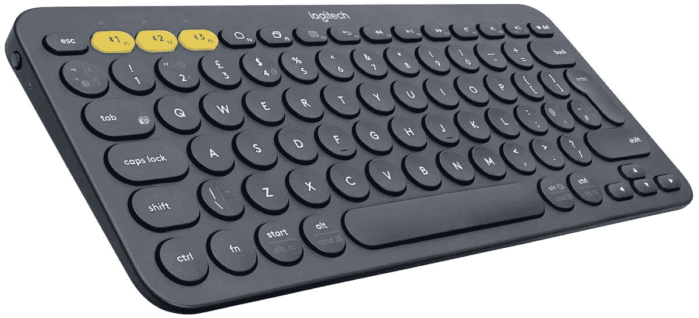

# 只需 21 美元就能买到罗技 K380 多设备蓝牙键盘

> 原文：<https://www.xda-developers.com/get-the-logitech-k380-multi-device-bluetooth-keyboard-for-just-21/>

# 只需 21 美元就能买到罗技 K380 多设备蓝牙键盘

这种小巧便携的键盘现在可以从亚马逊拥有的 Woot 翻新而来，售价仅为 20.99 美元，比通常的新价格低 9 美元。

罗技生产大量键盘和鼠标，但该公司最好的廉价键盘之一是 K380。这是一个简单的蓝牙键盘，但圆形的按键和对多种连接的支持使 K380 从大多数其他竞争键盘中脱颖而出。现在你可以以 20.99 美元的价格从 Woot 买到翻新的型号——比亚马逊 T3 上新型号的当前价格[低 9 美元。](https://www.amazon.com/Logitech-K380-Multi-Device-Bluetooth-Keyboard/dp/B0148NPH9I/?tag=xda-5kj6qrd-20&ascsubtag=UUxdaUeUpU3575&asc_refurl=https%3A%2F%2Fwww.xda-developers.com%2Fget-the-logitech-k380-multi-device-bluetooth-keyboard-for-just-21%2F&asc_campaign=Short-Term)

这是一个紧凑的键盘，没有数字键盘(对不起，Excel 用户)，能够存储最多三个设备的蓝牙连接。您可以用顶部的三个黄色键在连接之间切换。罗技 K380 可以与任何支持蓝牙键盘的设备兼容，包括大多数 Windows PCs、MAC、Android 设备、iPads 等等。

 <picture></picture> 

Logitech K380

##### 罗技 K380 键盘

Woot 正在以 20.99 美元的价格出售翻新的 K380 键盘，比亚马逊上新 K380 的价格低 9 美元。亚马逊 Prime 会员运费全免。

这里的主要问题是，Woot 只出售深灰色的模型，而不是罗技生产的任何有趣的其他颜色。该清单还被贴上了翻新的标签，Woot 将其定义为“买家后悔退货和缺陷已被修复的产品”。“目前还不清楚键盘是否以原包装发货。