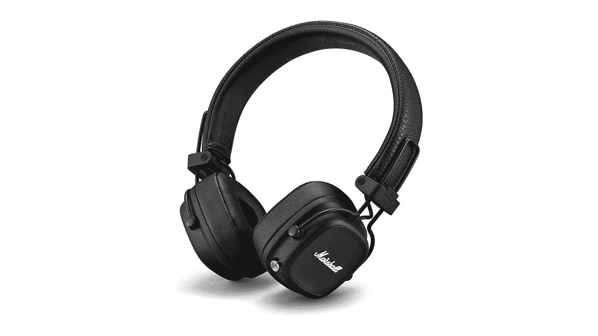

# 今天花 100 美元就能买到马歇尔少校 IV 蓝牙耳机(优惠 50 美元)

> 原文：<https://www.xda-developers.com/get-the-marshall-major-iv-bluetooth-headphones-for-100-today-50-off/>

# 今天花 100 美元就能买到马歇尔少校 IV 蓝牙耳机(优惠 50 美元)

这些无线耳机支持蓝牙、有线 3.5 毫米音频、无线充电、USB Type-C 充电，音质都很棒。

马歇尔是音乐设备行业历史最悠久的品牌之一，可追溯到 1962 年。该公司以其吉他放大器而闻名，但它也生产大量耳机和普通扬声器。在这个早期的网络星期一大减价中，你可以在亚马逊上以 99.99 美元买到马歇尔少校 IV，比原价节省了 50 美元。如果你喜欢在百思买购物，它也可以多卖 5 美元。

Marshall Major IV 是一副功能丰富的耳机，配有定制的动态驱动器，超过 80 小时的蓝牙播放时间(至少根据 Marshall 的说法)，柔软的耳垫，以及音乐和电源控制的多方向旋钮。还有一个标准的 3.5 毫米有线音频连接器，还有一个额外的独特功能——其他人可以将他们的耳机插入你的耳机来分享音乐。要为 Major IV 充电，您可以使用 USB Type-C 电缆或将其设置在无线充电板上。你不会看到很多无线充电的耳挂式耳机，所以这很整洁。

 <picture></picture> 

Marshall Major IV

##### 马歇尔少校四世

这些无线耳机提供了出色的音质和较长的电池寿命，但没有 ANC。

这里的主要问题是 Marshall Major IV 没有任何主动噪音消除功能，所以如果你需要将周围环境屏蔽到最高程度的耳机，你可能需要去别处看看。不过，如果你追求音质出色的无线耳机，马歇尔少校 IV 是一个可靠的选择。

查看我们的[网络星期一](https://www.xda-developers.com/black-friday/)综述，了解过去几天我们发现的所有其他销售。如果您仍然需要为朋友或家人进行假日购物，或者仍然在为自己寻找完美的商品，我们可以满足您的需求。