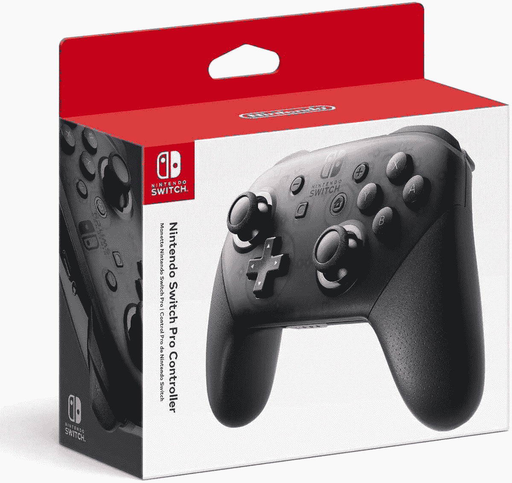

# 今天就以 11 美元的价格购买任天堂 Switch Pro 控制器

> 原文：<https://www.xda-developers.com/get-the-nintendo-switch-pro-controller-for-11-off-today/>

# 今天就以 11 美元的价格购买任天堂 Switch Pro 控制器

目前亚马逊上任天堂 Switch 最好的控制器价格是 59 美元。它也适用于一些 Android 设备。

任天堂 Switch Pro 控制器(大多数人认为)是任天堂 Switch 最好的游戏手柄。它比交换机包装盒中的 Joycon 安装支架更适合，但具有与 Joycon 相同的触觉。这款控制器的售价几乎总是 69.99 美元，但目前在亚马逊上售价为 59.00 美元。

该控制器比任天堂 Switch 附带的 Joycon 控制器具有更标准的形状和适合度。有一个 USB Type-C 端口用于充电(就像开关本身一样)，两组触发按钮，以及与 Joycons 相同的触觉。Pro 控制器还具有一个用于 Amiibo 的 NFC 传感器，在极少数情况下，您实际上会将 Amiibo 人物用于其预期目的(而不仅仅是在货架上看起来整洁)。

 <picture></picture> 

Nintendo Switch Pro Controller

##### 任天堂 Switch 专业控制器

这是任天堂 Switch 现有的最好的控制器，亚马逊以低于通常价格 11 美元的价格出售。

尽管 Pro 控制器与任天堂 Switch 配合使用效果最佳，[大多数运行 Android 10 或更高版本的设备](https://www.xda-developers.com/android-10-nintendo-switch-pro-controller-mapping-support/)也应该能够连接到它。在 Windows PCs 和 Steam 上使用 Pro 控制器还有各种方式。