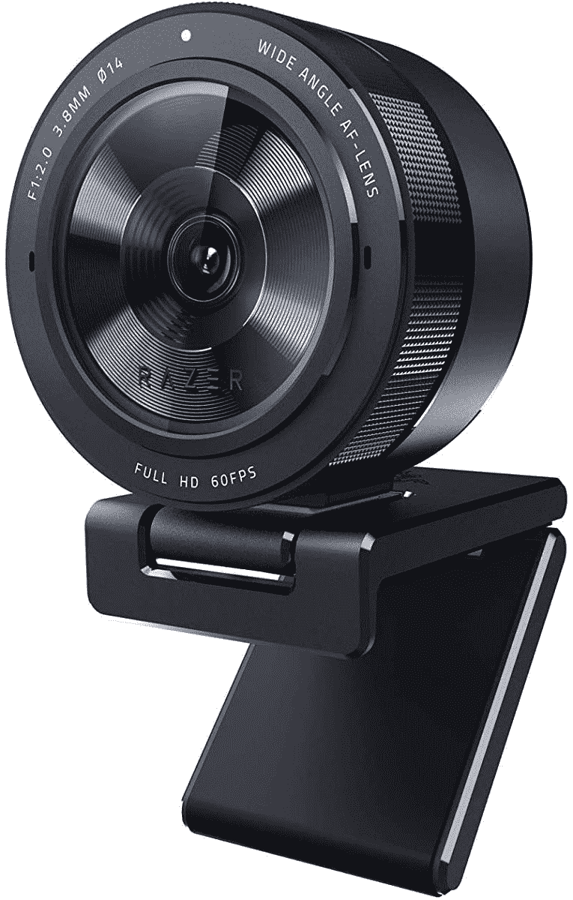

# 以 50 美元的价格购买 Razer Kiyo Pro 网络摄像头，升级您的视频通话

> 原文：<https://www.xda-developers.com/get-the-razer-kiyo-pro-webcam-for-50-off-and-upgrade-your-video-calls/>

# 以 50 美元的价格购买 Razer Kiyo Pro 网络摄像头，升级您的视频通话

Razer 的高端网络摄像头 Kiyo Pro 现在售价为 249.99 美元。这比通常的价格低了 50 美元，创下了历史新低。

视频会议的突然兴起导致了高质量网络摄像头的激增，现在普通大众已经意识到大多数笔记本电脑中可怕的 720p 摄像头并不能满足要求。Razer 在今年早些时候推出了 Kiyo Pro 网络摄像头，具有 1080p/60FPS 传感器和内置环形灯，但 199.99 美元的原价让许多人敬而远之。现在这款摄像头在多家零售商处售价 149.99 美元，是我们见过的最低价格。

Razer Kiyo Pro 配备了 1/2.8 型 CMOS 传感器，可调 FOV，USB 3.0 连接，两个安装选项(在显示器或三脚架上)，以及 1080p @ 60FPS 视频输出。在这个价格上拥有 4K 当然很好，但这里的主要卖点是内置的环形灯，它在光线不好的情况下有很大的帮助。

 <picture></picture> 

Razer Kiyo Pro

##### Razer Kiyo Pro

Razer Kiyo Pro 的分辨率为 1080p，内置环形灯，视频质量更好。这是目前最好的网络摄像头之一。

这是目前最好的网络摄像头之一，与其他高端型号竞争，如[戴尔 UltraSharp 网络摄像头](https://www.xda-developers.com/dell-ultrasharp-webcam/)和[罗技布里奥](https://www.amazon.com/Logitech-BRIO-Conferencing-Recording-Streaming/dp/B01N5UOYC4/?tag=xda-2uj3v56-20&ascsubtag=UUxdaUeUpU3901&asc_refurl=https%3A%2F%2Fwww.xda-developers.com%2Fget-the-razer-kiyo-pro-webcam-for-50-off-and-upgrade-your-video-calls%2F&asc_campaign=Short-Term)。这两个摄像头都没有环形灯，但值得注意的是，Kiyo Pro 偶尔会出现自动对焦问题，所以如果你经常走动，你可能会更好地使用其他东西。