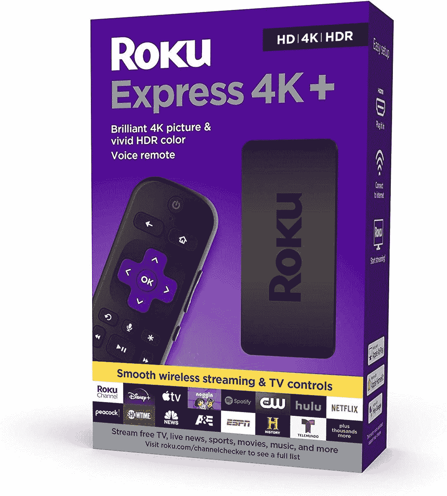

# 今天只需 29 美元(优惠 11 美元)就能获得 Roku Express 4K+流媒体盒子

> 原文：<https://www.xda-developers.com/get-the-roku-express-4k-streaming-box-for-just-29-today-11-off/>

# 今天只需 29 美元(优惠 11 美元)就能获得 Roku Express 4K+流媒体盒子

Roku Express 4K+在亚马逊和百思买的售价分别为 29 美元和 30 美元，分别比原价低 9 美元和 10 美元。

Roku 是流媒体盒子市场的第一品牌之一，该公司继续不时地通过新的硬件产品保持竞争力。Roku 早在 4 月份就发布了一系列新设备，包括一款新的流媒体棒，将 4K 回放带到了 39.99 美元的超低价格。现在，快递 4K+棒甚至更便宜了，这要归功于多家零售商的新促销活动，价格降至 29.99 美元。这与我们在 6 月份报道的[上一次销售情况](https://www.xda-developers.com/rokus-new-4k-streaming-box-is-now-on-sale-for-just-30/)相符。

Roku Express 4K+是该公司迄今为止最便宜的 4K 流媒体盒子。它支持你可以在其他 Roku 设备上获得的所有服务和应用程序——迪士尼+、苹果电视、网飞、Hulu 等。—只需要一个 5V/1A USB 接口供电。随附的遥控器有一个用于语音控制的麦克风，以及用于电视的音量/电源按钮。

 <picture></picture> 

Roku Express 4K+

##### Roku 快递 4K+

这是 Roku 最新的(也是最便宜的)4K 流媒体盒子。它在亚马逊的售价为 29 美元，在百思买的售价为 30 美元，分别比原价低 9 美元和 10 美元。

然而，与价格更高的 Roku 设备相比，它缺少一些功能。遥控器上没有耳机插孔供私人收听，但如果你愿意，你仍然可以使用 Roku 应用程序通过手机发送电视音频。遥控器上还有四个快捷按钮，通过硬连线连接到特定的服务。

*免责声明:本文作者拥有 Roku 的股票。这并不影响这里陈述的观点。*