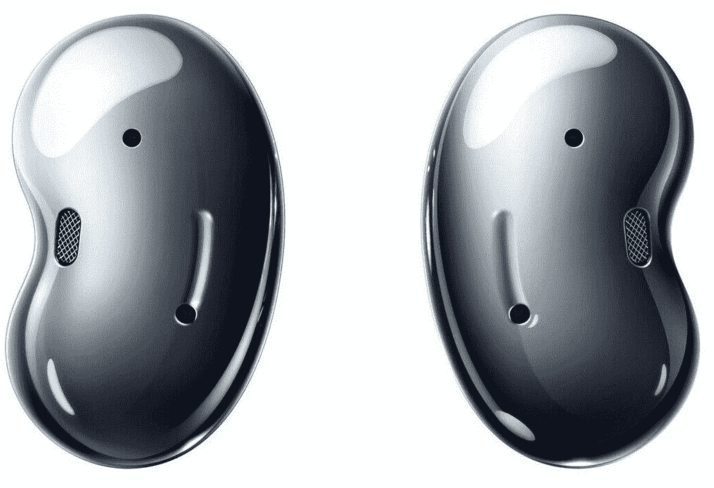

# 只需 70 美元，即可获得三星 Galaxy Buds Live 耳塞

> 原文：<https://www.xda-developers.com/get-the-samsung-galaxy-buds-live-earbuds-for-just-70/>

# 只需 70 美元，即可获得三星 Galaxy Buds Live 耳塞

三星通过其易贝官方商店以 69.99 美元的价格出售翻新的 Galaxy Buds Live，比原来的新价格节省了 100 美元。

Galaxy Buds Live 是真正的无线耳塞，设计独特，因此获得了“Galaxy Beans”的昵称。耳塞提供了良好的音质，但没有入耳式橡胶塞，尽管它们并不适合所有人，这似乎是三星迄今为止尚未发布续集的原因。这款耳塞在 6 月份曾短暂降价 95 美元，现在你只需花 69.99 美元就能从三星买到。

这些耳塞有 12 毫米的扬声器，一个用于增强低频声音的低音管道，以及用于暂停/跳过播放的(挑剔的)触摸控制。Buds Live 在技术上也是*提供主动噪音消除(ANC)，但在现实世界的使用中几乎没有效果，所以如果你需要带噪音消除的耳塞，请到别处看看。查看[我们的完整评论](https://www.xda-developers.com/samsung-galaxy-buds-live-review/)了解更多详情。耳塞外壳使用 USB Type-C 进行充电，或者您可以将其设置在任何 Qi 无线充电板的顶部。*

 *<picture></picture> 

Samsung Galaxy Buds Live

##### 三星 Galaxy Buds 直播

三星通过其易贝官方商店出售翻新的 Galaxy Buds Live，售价 69.99 美元。

三星易贝官方商店的这一列表是针对翻新的 Galaxy Buds Live，每个单元都经过测试，可以像新的一样工作。三星甚至将耳塞放在原始零售包装中运输，翻新的电子产品并不总是如此，而且你可以获得两年的保修。*