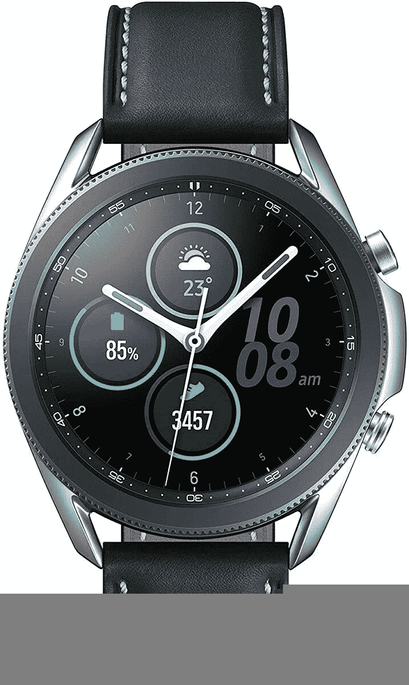

# Galaxy Watch 3 交易:以 170 美元的价格购买三星的最新手表

> 原文：<https://www.xda-developers.com/get-the-samsung-galaxy-watch-3-for-as-low-as-230-today-170-off/>

三星的 [Galaxy Watch 3](https://www.xda-developers.com/tag/samsung-galaxy-watch-3/) 是目前最好的智能手表之一，尤其是如果你将它与三星手机配对的话。亚马逊现在有 Galaxy Watch 3 的交易，两种尺寸都比原价低 170 美元。较小的 41 毫米型号现在仅售 230 美元，而较大的 45 毫米手表售价 260 美元。这是两种型号的最低记录价格，不包括各种以旧换新或运营商折扣。

Galaxy Watch 3 的两个版本都配备了两个物理按钮，1GB RAM，8GB 内部存储，一个扬声器，一个麦克风，IP68 防尘和防水保护，以及各种用于检测身体活动的传感器。这些手表可以自动跟踪几十种不同类型的锻炼，并将数据发送到三星健康应用程序(可在 iOS 和 Android 上使用)。还有心电图和血压监测，这在智能手表中仍然很少见，但并非所有国家都有。心电监护仪[在美国](https://www.xda-developers.com/samsung-galaxy-watch-3-watch-active-2-ecg-monitoring-app-us/)可以工作，但是不能检测血压。

 <picture></picture> 

Samsung Galaxy Watch 3 (41mm)

##### 三星 Galaxy 手表 3

这是较小的 41 毫米 Galaxy 手表。它有一个 1.2 英寸的屏幕，一个旋转的转盘和一大堆传感器。

 <picture></picture> 

Samsung Galaxy Watch 3 (41mm)

##### 三星 Galaxy 手表 3

这是更大的 45 毫米 Galaxy Watch 3，配有 1.4 英寸的显示屏。除此之外，它与较小的手表完全相同。

三星为 Galaxy Watch 3 提供了两种尺寸:41 毫米的 1.2 英寸屏幕型号和 45 毫米的 1.4 英寸屏幕型号。如果你的手腕比较小，你应该选择 41 毫米的手表。否则，45 毫米型号的大显示器更容易阅读文本。

Galaxy Watch 3 自去年发布以来已经更新了多次。睡眠评分[在 8 月](https://www.xda-developers.com/samsung-galaxy-watch-3-first-update-blood-oxygen-monitoring/)加入，对 SmartThings Find 的支持[在 2 月](https://www.xda-developers.com/galaxy-watch-3-update-smartthings-find/)到来，与朋友的行走挑战[出现在 3 月的更新](https://www.xda-developers.com/galaxy-watch-3-update-sleep-score-measurements-walking-challenges/)。最近，三星在上个月推出了一个更新[版本](https://www.xda-developers.com/samsung-galaxy-watch-3-update-improves-wifi-system-stability/)，其中包括性能改进和漏洞修复。Galaxy Watch 4 系列可能只有几个月的时间了，但如果三星的其他手表有任何迹象的话，这一代手表将在未来几年继续工作。