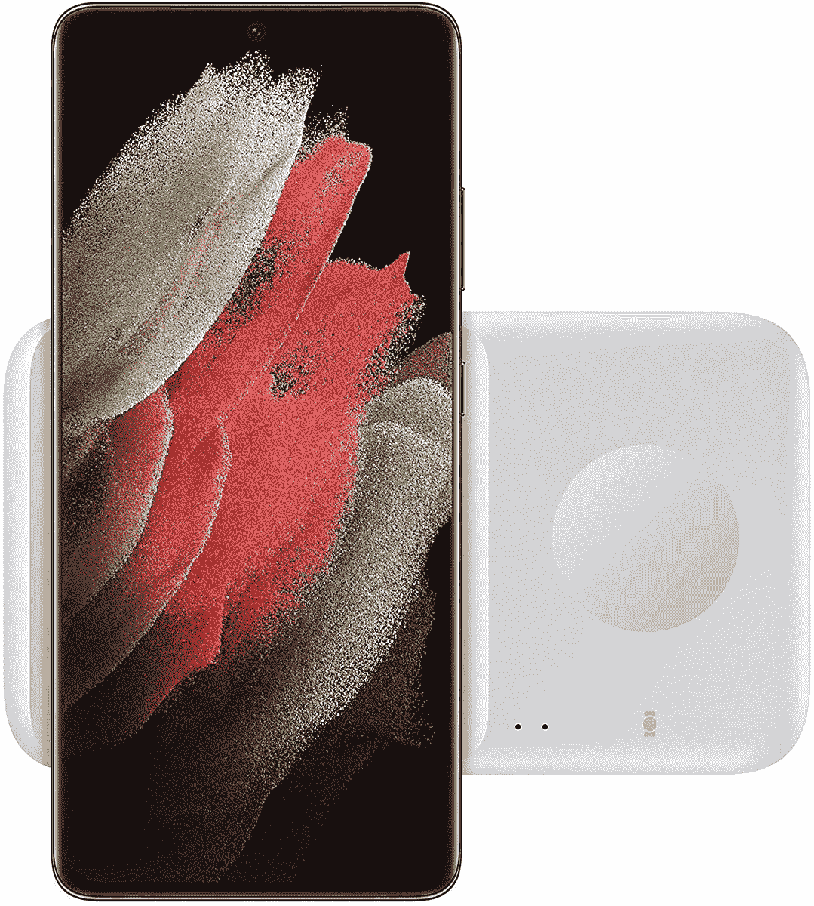

# 立即购买三星 Pad Duo 充电器，仅需 36 美元

> 原文：<https://www.xda-developers.com/get-the-samsung-pad-duo-charger-for-just-36-today/>

# 立即购买三星 Pad Duo 充电器，仅需 36 美元

这可以同时为一部智能手机和一个配件充电，三星甚至在盒子里包含了一个墙壁适配器。

多年来，三星销售了许多手机和手表充电器，但大多数时候，人们会从 Belkin 和 Anker 等第三方公司购买充电器。三星的电源适配器和底座通常比竞争对手更贵，但今天 Duo 无线充电板有特价。它通常售价 50 美元(尽管 MSRP 是 60 美元)，现在在亚马逊上售价 35.99 美元。

这种充电板可以同时为两台设备无线供电，尽管第二个充电板主要用于配件——如 Galaxy 手表或耳塞套。较小的衬垫还带有磁铁，因此 Galaxy 手表的附着更加牢固。主 pad 上的快速充电适用于三星和苹果手机，其他设备获得标准的 5W 充电速度。Galaxy 智能手机在 Pad Duo 上使用附带的壁式充电器可以达到 9W，而 iPhones 最高为 7.5W。

 <picture></picture> 

Wireless Charger Fast Charge Pad DUO (2021)

##### 三星 15W 无线充电器 Duo

这款充电板有两个插槽，一个用于手机，一个用于智能手表/耳塞。与许多其他充电垫不同，墙壁适配器包含在包装盒中。

这款充电垫物有所值，尤其是考虑到三星在包装盒中包括了墙壁适配器——许多无线充电垫(包括苹果官方的 MagSafe 充电器)在销售时都没有电源适配器。尚不清楚销售将于何时结束，但亚马逊已经延期交货。