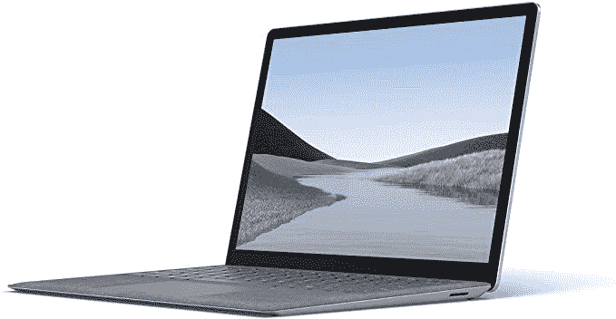

# Surface Laptop 交易:以 200 美元的价格购买酷睿 i7 Surface Laptop 3

> 原文：<https://www.xda-developers.com/get-the-surface-laptop-3-with-a-core-i7-for-200-off-today/>

# 立即以 200 美元的价格购买配备酷睿 i7 处理器的 Surface 笔记本电脑 3

一款搭载酷睿 i7 处理器和 16GB 内存的微软 Surface Laptop 3 售价为 1400 美元。这比以前的成本低了 200 美元。

微软的 Surface 笔记本电脑是目前最高端的 Windows 笔记本电脑之一，它通常有与之匹配的价位。然而，随着最近 Surface Laptop 4 的到来，微软正在寻求摆脱旧库存。这意味着你可以在亚马逊上以 1399.99 美元的价格买到 Core i7 版本的 Surface Laptop 3，比之前的价格节省了 200 美元，比最初的建议零售价低 599 美元。

在售的配置有英特尔酷睿 i7 处理器、16GB 内存、支持笔输入的 13.3 英寸方形触摸屏和 512GB 固态硬盘。所有 Surface Laptop 3 型号的其他硬件都是相同的，包括 USB Type-C 和 Type-A 连接，类似 MagSafe 的专有充电连接器，长电池续航时间，时尚的设计，以及预装的 Windows 10 Home。

 <picture></picture> 

Surface Laptop 3 (Core i7, 16GB RAM, 512GB SSD)

##### 微软 Surface Laptop 3

这款高端 Surface Laptop 3 是一款非常适合移动办公的电脑，尤其是它的屏幕更高。现在比之前的价格低了 200 美元，创历史新低。

尽管对于上一代产品来说，1400 美元仍然是一个很高的价格，但酷睿 i7-1065G7 处理器和 16GB RAM 意味着这款笔记本电脑在未来几年将成为一款强大的生产力(和轻度游戏)PC。如果你对微软目前的产品更感兴趣，看看[我们对 Surface Laptop 4 的评论](https://www.xda-developers.com/microsoft-surface-laptop-4-review/)。