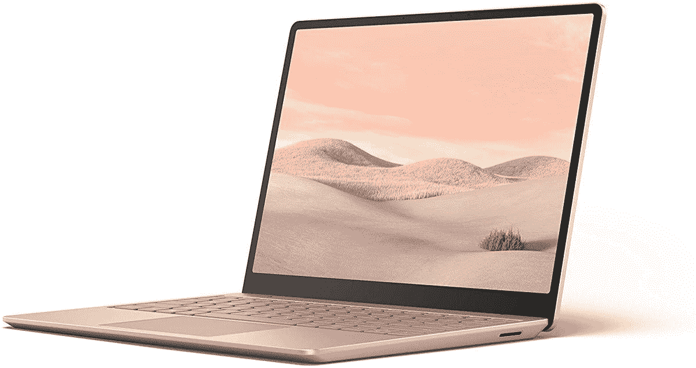

# 以 200 美元的价格购买配备酷睿 i5 和 256GB 存储的 Surface 笔记本电脑 Go

> 原文：<https://www.xda-developers.com/get-the-surface-laptop-go-with-a-core-i5-and-256gb-storage-for-200-off/>

# 以 200 美元的价格购买配备酷睿 i5 和 256GB 存储的 Surface 笔记本电脑 Go

微软的 Surface Laptop Go 配备酷睿 i5 CPU、8GB 内存和 256GB 存储空间，目前降价 200 美元。

Surface Laptop Go 是微软的中端笔记本电脑，旨在成为一款性能卓越、价格合理的高性能电脑。配备英特尔酷睿 i5 CPU 和 128GB 存储空间的最便宜的型号现在已经在 630 美元左右(低于最初的 700 美元建议零售价)，但现在你可以在亚马逊上以 699.99 美元的价格买到 256GB 版本。这比原价低了 200 美元，也是有史以来的最低价格。

在售的型号有一个[英特尔酷睿 i5-1035G1 处理器](https://ark.intel.com/content/www/us/en/ark/products/196603/intel-core-i5-1035g1-processor-6m-cache-up-to-3-60-ghz.html)，它有 4 个内核，8 个线程，时钟速度提高到 3.6GHz。你还可以获得 1536x1024 的 12.4 英寸液晶显示屏，8GB 内存，256GB 固态硬盘，USB Type-A 和 Type-C 端口，耳机插孔和 Windows Hello 支持(用于通过网络摄像头登录)。对于不到 1000 美元的价格来说，一点也不差。

 <picture></picture> 

Microsoft Surface Laptop Go (Core i5/8GB RAM/256GB storage)

##### 微软 Surface Laptop Go

Surface Laptop Go 的这一配置降至 699.99 美元，比最初的建议零售价低 200 美元。似乎只有砂岩色可用。

微软 Surface Laptop Go 有一些缺点。首先，8GB 内存是[焊接到主板](https://www.youtube.com/watch?v=jzRb_3U2vs0)上的，所以不能升级(不过 SSD 可以替换)。这款笔记本电脑还配备了 Windows 10 S 模式，只能运行从微软商店安装的软件。谢天谢地，你可以通过系统设置关闭 S 模式，不需要额外的费用。