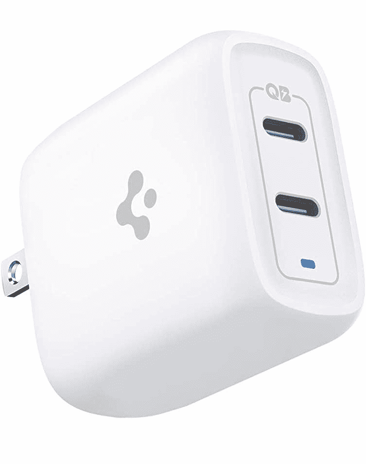

# 这款 Spigen 40W USB Type-C 充电器售价 21 美元(优惠 9 美元)

> 原文：<https://www.xda-developers.com/get-this-spigen-40w-usb-type-c-charger-for-21-9-off/>

# 这款 Spigen 40W USB Type-C 充电器售价 21 美元(优惠 9 美元)

Spigen 的这款充电器可以同时为两台设备供电，功率为 20W(总共 40W)，或者为一台设备供电，功率高达 30W，现在便宜 9 美元。

Spigen 以其智能手机外壳和盖子而闻名，但该公司也生产一些硬件配件。其中一款是紧凑型 40W USB Type-C 壁式充电器，通常售价 29.99 美元，但现在售价 20.99 美元。这比通常的价格低了 9 美元，比以往任何时候都更适合为手机、平板电脑和其他设备充电。

当插入一个设备时，该充电器可以提供高达 30W 的功率，或者同时插入两个设备时，每个连接器可以提供 20W 的功率(总共 40W)。这使得它成为给手机和平板电脑充电的绝佳选择，比如 iPhone 11 和 12 系列(尽管你需要一根 C 型到 Lightning 的电缆)、任天堂 Switch 和 iPad Pro。它还将为大多数三星手机和平板电脑充电高达 15W——充电速度更高的 Galaxy 手机和平板电脑(如 S21 和 Note20)通常需要 [PPS 支持](https://www.xda-developers.com/best-galaxy-note-20-fast-chargers/)超过 15W，这在这款 Spigen 机型上不存在。

 <picture></picture> 

Spigen 40W Dual USB Type-C Charger

##### Spigen 40W ArcStation Pro 双 USB-C 充电器

这款带有两个 Type-C 端口的紧凑型 40W 充电器降至 20.99 美元，但你需要一个亚马逊 Prime 帐户才能看到折扣。

30W 的最大单次充电速度意味着大多数超极本，如 MacBook 和大多数 Chromebooks，充电速度将比使用普通墙壁适配器慢。然而，这种 Spigen 插头仍然是在旅途中为两部 USB Type-C 手机或平板电脑充电的绝佳选择。