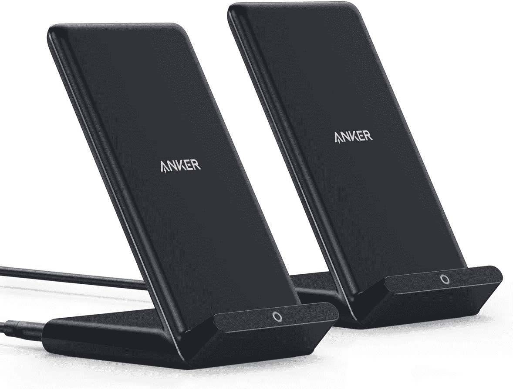

# 29 美元买两个 Anker PowerWave 充电座

> 原文：<https://www.xda-developers.com/get-two-anker-powerwave-charging-stands-together-for-29/>

# 29 美元买两个 Anker PowerWave 充电座

Anker 正在以 28.99 美元的价格出售两个 10W PowerWave 无线充电站，比通常的价格节省了 7 美元。

无线充电板和底座是保持手机 100%容量的好方法，无需插入电缆，如果您的家庭使用苹果和(旗舰)安卓设备，Qi 充电器是唯一的通用充电解决方案。现在，你可以在亚马逊上买到两个 Anker 的 PowerWave 支架，价格仅为 29 美元，比通常的价格节省了 7 美元。

PowerWave 支架是一个 Qi 垂直充电底座，底部有一个小唇，用于固定您的手机。底部有一盏灯，当你的手机正在充电时，它会亮起。它支持所有设备的 5W 充电，并为兼容的 iphone(12 系列、11 系列、XR、XS 等)提供额外的 10W 模式。)和三星 Galaxy 设备(Galaxy S8+，Note 系列等。).

 <picture></picture> 

Anker PowerWave Charger

##### Anker 313 PowerWave 支架

这款无线充电板最高可为您的手机充电 10W。不含墙壁适配器。

这款充电器唯一的缺点是 Anker 的盒子里没有交流适配器，只有一根 3 英尺长的 microUSB 电缆。你需要使用自己的 USB 墙壁适配器，或者购买一个——[Anker](https://www.amazon.com/Anker-PowerPort-Compatible-Qualcomm-Certified/dp/B077HFFLMS?tag=xda-3cjugdr-20&ascsubtag=UUxdaUeUpU3455&asc_refurl=https%3A%2F%2Fwww.xda-developers.com%2Fget-two-anker-powerwave-charging-stands-together-for-29%2F&asc_campaign=Short-Term)的这款 18W 电池应该可以让 PowerWave 以最快的速度为苹果和安卓设备充电。