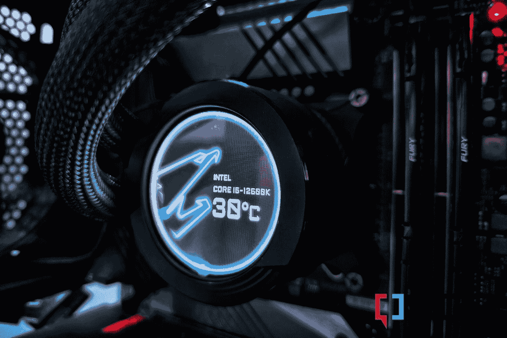
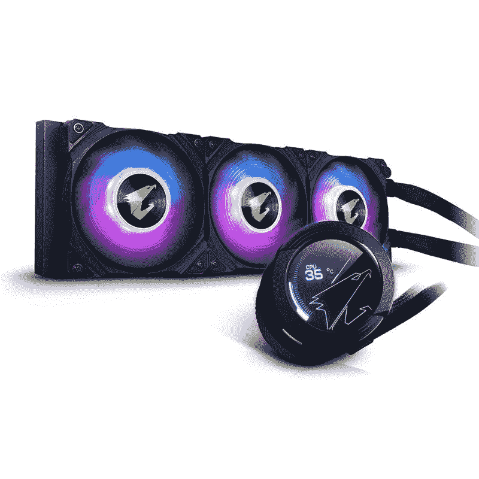

# 技嘉奥鲁斯沃特福德 X360 AIO 冷却器评论

> 原文：<https://www.xda-developers.com/gigabyte-aorus-waterforce-x360-review/>

在[建造一台个人电脑](https://www.xda-developers.com/how-to-build-a-computer-beginners/)或者升级和安装一个新处理器的时候，选择[最好的 CPU 冷却器](https://www.xda-developers.com/best-cpu-coolers/)是你必须做出的关键决定之一。英特尔新的[第 12 代 Alder Lake CPU](https://www.xda-developers.com/intel-12th-gen-alder-lake/)的推出让市场上的一波 CPU 冷却器重新浮出水面，Gigabyte Aorus Waterforce X360 AIO 冷却器恰好是其中之一。这种特殊的冷却器属于英特尔 Alder Lake socket LGA 1700 的 [CPU 冷却器列表，其中包括带有兼容安装支架的新旧冷却器。](https://www.xda-developers.com/cpu-coolers-socket-lga-1700/)

在测试新的阿尔德湖 CPU 时，我们能够接触到 Gigabyte Aorus Waterforce X360 AIO 冷却器。这款售价 270 美元的 AIO 液体冷却器配有 360 毫米散热器，是市场上首批支持新 LGA 1700 插座的冷却器之一。我们决定将它与一款[英特尔酷睿 i9-12900K](https://www.xda-developers.com/intel-core-i9-12900k-vs-amd-ryzen-5950x/) 搭配使用，以检验它的性能，并告诉您它是否值得考虑用于您的下一款电脑。以下是我们对其整体冷却性能的看法:

**浏览此评论:**

## 技嘉奥鲁斯沃特福德 X360 AIO 冷却器:规格

在我们开始之前，这里有一个快速浏览技嘉奥鲁斯沃特福德 X360 AIO 冷却器的一些规格:

| 

规格

 | 

技嘉 X360 水资源公司

 |
| --- | --- |
| **CPU 插座** | 

*   英特尔:2066，2011，1366，115 倍，1200，1700
*   AMD: TR4、AM4、sTRX4

 |
| **液晶显示器** | 60 x 60mm 毫米全彩色液晶显示器 |
| **散热器** | 360 毫米 |
| **散热器尺寸** | 394 x 119 x 27mm 毫米 |
| **泵尺寸** | 82 x 82 x 74mm 毫米 |
| **范** | 

*   规格:3 个 120 毫米 ARGB 风扇
*   风扇转速:800~2500 转/分钟+/-10%
*   轴承类型:套筒(石墨烯纳米润滑剂)
*   空气流量:16.92~60.07 CFM
*   气压:0.25 ~ 3.14 毫米汞柱 20
*   预期寿命:73，500 小时
*   噪声级:7.9~37.6 分贝

 |
| **保修** | 3 年 |

Aorus Waterforce X360 公司为最常见的英特尔和 AMD CPU 插槽配备了安装硬件，包括 AM4 和 Threadripper。这些可互换的安装支架和通用背板使得将冷却器带到不同的地方变得非常容易。它还享有 3 年的制造商保修。

## 技嘉奥鲁斯沃特福德 X360 AIO 冷却器:设计和制造质量

Aorus Waterforce X360 的泵安装在铝制外壳内。它的顶部有一个偏移面环，覆盖了 60 毫米的液晶面板。您也可以旋转外部的环来调整 LCD 本身的方向。冷却液管通过一对旋转 90°的配件连接到泵上。这些管子完全套在黑色编织尼龙上。这个特殊的装置是之前推出的原始 Aorus Liquid Cooler 360 的升级版，因此有一些细微的差异。

这款新机型的新增功能之一是 waterblock 的 microSD 卡插槽。这将允许您存储视频和图片，并使用 RGB Fusion 2.0 软件在 LCD 上播放它们。整个装置由 12v SATA 供电，而活动显示器可以通过软件 UI 从 9 针 USB 主板接头轻松管理。小心不要丢失这根 USB 线，因为您将需要它来定制 waterblock 上的活动显示。

正如你所看到的，waterblock 的底座具有一个环齿保持系统，用于固定可互换的安装板。waterblock 的铜基板带有一个预先应用的热化合物补丁，但在构建 PC 或简单地安装 CPU 冷却器时，总是建议您额外准备一个最好的热糊注射器。

Aorus Waterforce X360 冷却器采用 360 毫米铝制散热器。你还可以在盒子里找到三个 120 毫米的 ARGB 风扇和散热器。Gigabyte 巧妙地将风扇和 LED 电缆移到了散热器的一侧，使电缆布线相对容易。这意味着您只需担心如何从 waterblock 连接 SATA 和 USB 接头。可以使用 aRGB 公头和母头分别处理风扇连接。

考虑到所有的事情，可以说沃特福德 X360 安装相当简单。只要你知道你周围的 AIO 液体冷却器的方式，你应该能够安装这个特殊的 AIO 冷却器没有任何重大问题。

## X360 AIO 冷却器:冷却性能

我们将这种特殊的 CPU 冷却器与英特尔酷睿 i9-12900K 以及千兆字节 Z690 Aorus Pro 游戏主板上的 RTX 3080 游戏 GPU 配对。英特尔酷睿 i9-12900K 是目前最强大的 CPU 之一，因此这最终成为冷却器的坚实试验场。我们使用 HWInfo64 来跟踪实时内核温度读数、CPU 速度、功耗、散热迹象等。

 <picture></picture> 

Use RGB Fusion 2.0 Software to customize what shows up on the LCD panel

我们能够在空闲条件下记录低至 25°C 的核心温度。这更符合你对顶级 AIO CPU 冷却器的期望。从那时起，我们开始运行一系列测试，作为测试过程的一部分，看看我们能在多大程度上推动 CPU 和冷却器本身的极限。我们记录了长时间游戏时 CPU 的核心温度，最终平均核心温度约为 45°c。这本身就是一个令人印象深刻的数字，但我们继续用一些 CPU 压力基准进行测试。

我们进行了几次 CPU 压力测试，包括 Cinebench R23 循环，以推动 CPU 的极限，最终获得了 79°C 的峰值核心温度读数。即使在超频的情况下，游戏时 CPU 温度也从未超过 55°C，这意味着沃特福德 X360 冷却器确实像宣传的那样工作。下面快速浏览一下温度读数，总结一下我们的读数:

**注:**在整个测试过程中，所有风扇设置为 50%，泵设置为 100%。

| 

试验

 | 

记录的峰值核心温度

 |
| --- | --- |
| **闲着** | 23 摄氏度 |
| **博彩** | 43 摄氏度 |
| **游戏(超频)** | 54 摄氏度 |
| **压力** | 79 摄氏度 |

## 技嘉奥鲁斯沃特福德 X360 AIO 冷却器:最终想法

Aorus Waterforce X360 AIO 冷却器检查所有正确的框，以在我们的测试中获得一些好的数字。冷却器设法轻松驯服 12900K 的热输出，而不影响整体性能或导致 CPU 节流。我们还使用这种特殊的冷却器测试了 Core i5-12600K，并看到了类似的性能水平。沃特福德 X360 设法保持热量在检查两个 CPU，即使在极端负荷下。

关于冷却器，有一点值得指出，那就是如果你把风扇转速开到最大，它会发出很大的噪音。我们能够记录高达 50 dBA 的噪声水平，这是相当高的。您的里程可能会有所不同，但这绝对是要考虑的事情。但除此之外，我们认为沃特福德 X360 是 2022 年你可以为你的高端游戏装备购买的最好的 AIO 冷却器之一。标价 270 美元，这当然不是最便宜的 AIO 冷却器，但它出色的冷却性能令人难以辩驳。

市场上并不缺少优质的 AIO CPU 冷却器，所以我们将继续接触更多的冷却器进行测试。与此同时，您可以查看我们收集的[最佳液体 CPU 冷却器](https://www.xda-developers.com/best-liquid-coolers/)来寻找沃特福德 X360 的一些很好的替代品，包括冷却器 MasterLiquid ML360 Illusion 和 Corsair H150i Elite Capellix 冷却器。

 <picture></picture> 

Gigabyte Aorus Waterforce X360 AIO liquid cooler

##### 技嘉奥鲁斯沃特福德 X360 AIO 液体冷却器

Aorus Waterforce X360 AIO 冷却器检查所有正确的框，在我们的测试中获得一些好的数字，成为奥尔德湖 CPU 周围最好的冷却器之一。