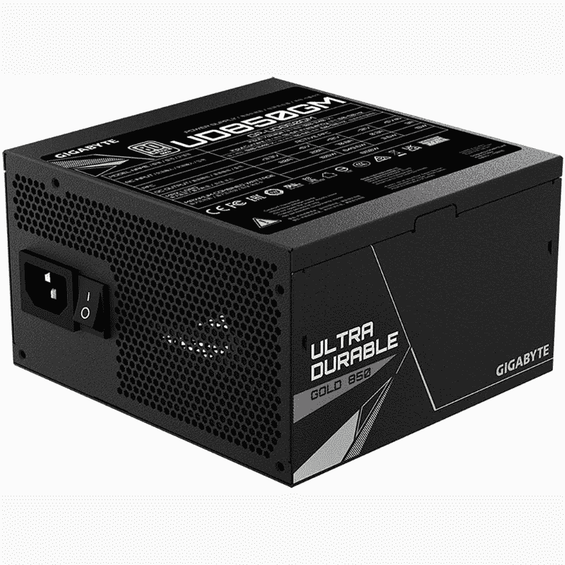

# 技嘉 UD850GM PSU 评论:新游戏电脑的可靠选择

> 原文：<https://www.xda-developers.com/gigabyte-ud850gm-psu-review/>

技嘉对个人电脑部件并不陌生，因为该公司在市场上有很深的根基，提供了几种可靠的产品。如果你想建造一台中高端电脑，新的 UD-850GM 电源是一个不错的选择。它提供稳定、干净、可靠的电力，自身不会发生故障或产生太多噪音。我们还喜欢与许多其他类似规格的高瓦数电源设备相比，UD850GM 的紧凑程度。这也是一个模块化单元，具有 80+黄金评级，这是我们对这个范围内的 PSU 的期望。

您可以轻松地将这款 PSU 与相对高端的组件搭配起来，打造一台稳定的游戏电脑。我们能够使用英特尔的新 Alder Lake 12700k 和 RTX 2080 超级 GPU 运行测试平台，没有出现任何问题。不过，对于未来的升级，850 瓦 PSU 可能没有足够的空间，所以请记住这一点。也就是说，850W 达到了包括主流游戏设备在内的许多 PC 的最佳点，119 美元的千兆字节 UD850GM 不会错。

 <picture></picture> 

Gigabyte UD850GM PSU

##### 千兆字节 UD850GM PSU

如果你想建造一台拥有相对强大组件的中高端电脑，千兆字节的 UD850GM 是一个不错的选择。

* * *

**浏览此评论:**

## 规范

在我们开始之前，让我们快速浏览一下千兆字节 UD850GM 的规格，以了解它的价格

| 

规格

 | 

千兆字节 UD850GM PSU

 |
| --- | --- |
| **麦克斯。DC 输出:** | 850 瓦 |
| **效率:** | 80 加金 |
| **外形规格:** | ATX |
| **冷却:** | 1x 120mm 毫米液压轴承(HYB)风扇 |
| **模块化:** | 是 |
| **MTBF 小时数:** | 10 万小时 |
| **保修:** | 5 年 |

正如您所看到的，这款特殊的电源设备适用于 ATX 外形的电脑。它配有一个 120 毫米液压轴承(HYB)风扇用于冷却，额定平均无故障时间(MTBF)约为 100，000 小时，这正是我们对大多数 PSU 的期望。

* * *

## 设计和硬件

*   紧凑和完全模块化的设计使 UD850GM 成为一款出色的 PSU。
*   该单位有一个 120 毫米液压轴承(HYB)风扇冷却，它保持热量在大部分检查。

UD850GM PSU 的一大亮点是其紧凑的外形。Gigabyte 已经设法将这个单元的长度减少到 140 毫米，使它比市场上的许多 ATX PSU 更加紧凑。如果你想知道，典型的 ATX 850W PSU 的尺寸约为 160 毫米，所以 UD850GM 绝对是一个改进。这使得将 UD850GM PSU 安装在许多底盘上非常容易，没有任何间隙问题。Gigabyte 设法在不做任何妥协的情况下减小了整体尺寸，这很棒。

UD850GM 配备 120 毫米智能液压轴承(HYB)风扇。这个 120 毫米的装置不仅能够保持内部冷却，即使是在相当大的负荷下。我们将在后面的评论中更多地讨论风扇噪音，但可以肯定地说，它运行非常安静，你根本不会注意到这个 PSU。由于具有自动电源检测功能，风扇速度也可以自动调节。当系统空闲或负载低于 20%时，它会停止。

与所有电源装置一样，UD850GM 装置本身由金属制成。它的漆面是全黑的，所以我们认为它和市面上的大多数电脑看起来都很好，除非你打算买一个[白色](https://www.xda-developers.com/best-white-pc-cases/)或[粉色的电脑外壳](https://www.xda-developers.com/best-pink-pc-cases/)。UD850GM 也是完全模块化的，这意味着只需添加构建所需的线缆，将其余线缆留在盒子中，即可轻松管理线缆。对于那些好奇的人，Gigabyte UD850GM 的包装盒内有以下电缆:

*   1 个 24 针 ATX
*   2 个 CPU (4+4 个引脚)
*   4x PCIe 6+2 针
*   8x SATA
*   3 个外设

附带的电缆都有相当长的长度，但不幸的是，技嘉没有将电缆梳与 PSU 捆绑在一起，所以你必须单独购买它们，以保持机箱内的一切看起来整洁。还值得指出的是，UD850GM 只配有标准的 PCIe 电源连接器，而不是 PCIe 5.0 显卡的+12VHPWR 连接器。你必须购买 UD1000GM PSU，才能利用新的和即将推出的 [PCIe 5.0](https://www.xda-developers.com/pcie-5/) 显卡的 16 针电源线，所以要记住这一点。下面快速浏览一下 UD850GM PSU 的所有连接器:

总的来说，我们认为技嘉在设计和硬件方面做得相当不错。你不会因为价格而错过任何东西。事实上，技嘉正在提供一种非常紧凑的 PSU，带有高质量的液压轴承风扇，以控制热量。它也是完全模块化的，这意味着，它将更容易与机箱内的 PSU 工作，最大限度地减少电缆混乱。

* * *

## 表演

*   UD850GM 的电源效率达到 80 Plus Gold 等级。
*   即使在极端负载下，它也能为所有组件提供稳定的功率。
*   在极端负载下，PSU 往往会变得有点吵，但这不是一个交易破坏者，因为温度在可接受的范围内。

为了测试 UD850GM PSU 在现实世界中的表现，我们将它与一个运行英特尔酷睿 i7-12700K、NVIDIA GeForce RTX 2080 超级 GPU、16GB DDR 4 内存和单个 M.2 SSD 棒的普通测试台进行了配对。

正如我们前面提到的，千兆字节的 UD850GM 是 80 Plus 黄金级 PSU，这是我们建议您的电脑选用的。当然，80 Plus 钛 PSU 将会更加节能，但这些通常是为高端电源预留的，也要花很多钱。根据 Gigabyte 的说法，UD850GM 具有单个+12V 轨，可提供最佳的功率输出、稳定性和兼容性。有竞争对手的 PSU 具有多个 12V 供电轨以提供额外的安全性，但这通常也是为高端 PSU 保留的。

【80Plus 认证的效率要求:

| 

认证级别

 | 

效率为 20%

 | 

效率为 50%

 | 

效率为 100%

 |
| --- | --- | --- | --- |
| **80 加铜牌** | 85% | 88% | 88% |
| **80 加银** | 87% | 90% | 87% |
| **80 加金** | 90% | 92% | 89% |
| **80 加白金** | 92% | 94% | 90% |
| **80 加钛** | 94% | 96% | 94% |

至于测试，我们能够运行不同批次的 CPU 和 GPU 压力测试，以了解 PSU 如何处理负载。我们运行了一系列 Cinebench R23 循环测试和 3DMark 基准测试套件来测试 CPU 和 GPU。这个想法是推动组件的极限，迫使 PSU 在最大负荷下运行。UD850GM 成功地在上运行了我们的所有测试，没有出现任何问题。+12V 线路能够在满载和大幅波动期间保持稳定的 12V+读数，因此系统在测试运行期间不会出现稳定性问题或随机重启。

我们使用 AIDA64 在 PC 空闲和负载情况下测量电压读数。

| 

闲置期间的 12V 线路

 | 

负载下的 12V 线路

 |
| --- | --- |
| **12.981 伏** | 12.980 伏 |

我们确实注意到风扇几乎立即启动，全速旋转以应对热负荷。这对于具有自动电源检测功能的 PSU 来说是完全正常的。至于温度读数本身，我们能够在满负荷下记录 55°C 左右的温度，这正是我们所期望的。最大负载时，PSU 噪声峰值约为 45 dBA。它本来可以更安静，但请记住，我们在测试时也将系统推到了极限。还值得指出的是，风扇在低于 10%的负载下空转，几乎没有任何噪音。

技嘉还增加了许多保护，以确保您的系统在任何时候都稳定运行，其中最重要的是“过功率保护”(OPP)。OPP 安全功能设计用于当电源负载超过装置的设计运行瓦特数时关闭装置。我们无法用我们的测试台将限制提高到 850 瓦以上，但如果峰值瓦数超过预期的使用范围，内置的 OPP 安全功能将防止对您的组件造成任何损坏。

* * *

## 你应该买技嘉的 UD850GM PSU 吗？

2022 年，千兆字节的 UD850GM 是许多 PC 制造商的一个伟大选择。我们认为 850W 规格击中了许多建设者的甜蜜点，UD850GM 以其 119 美元的价格舒适地坐在这个空间。但是这个 PSU 到底是给谁的呢？

### 谁应该购买技嘉 UD850GM PSU？

*   那些希望在 2022 年用一些强大的组件制造相对高端的个人电脑的人
*   那些希望构建一台中档电脑，但又希望有足够的功率余量用于未来升级的人。
*   那些想要为他们的第一台 PC 购买一台紧凑型全模块化 PSU 的人。

### 谁不应该购买技嘉 UD850GM PSU？

*   如果你正在构建一台配备强大组件的极限 PC，比如 RTX 3090 Ti 和酷睿 i9-12900K CPU，就不要买这个。
*   如果你想升级到下一代 PCIe 5.0 显卡，不要买这个，因为 UD850GM 仍然是标准的 PCIe 电源连接器，而不是+12VHPWR。

考虑到所有的事情，可以肯定地说，2022 年，技嘉有一个伟大的主流 PSU，就是 UD850GM。其紧凑和完全模块化的外形使其成为许多 PC 制造商的理想选择。根据我们的测试，我们还发现它在稳定的电源方面相当可靠，即使在重负载下也是如此。120 毫米的风扇也很好地调节了内部温度，同时保持了较低的噪音输出。

现在市场上并不缺少 850W 的 PSU，但我们认为千兆字节的 UD850GM PSU 以其外形规格和合理的价格脱颖而出。它与市场上包括 Corsair RM850X 在内的其他选择针锋相对。UD850GM 更好，因为它可以装入更多的电脑机箱，并且电缆比 850X 更长。更不用说，它也相对便宜，这意味着你可以把额外的钱花在其他一些组件上，包括 [CPU 冷却器](https://www.xda-developers.com/best-cpu-coolers/)，优质的 [PC 机箱](https://www.xda-developers.com/best-pc-cases/)，等等。

它错过了保修方面，因为技嘉只提供有限的 5 年保修，而不是 10 年的竞争产品。它也因地区而异，所以请记住这一点。如果你有兴趣看看其他 PSU，那么一定要停下来看看我们收集的[最佳电源单元](https://www.xda-developers.com/best-power-supply-pc/)，找到更多来自其他制造商的单元，包括 Corsair、EVGA 等等。

 <picture></picture> 

Gigabyte UD850GM PSU

##### 千兆字节 UD850GM PSU

如果你想用相对强大的组件构建一台中高级电脑，千兆字节的 UD850GM 是一个值得考虑的可靠选择。