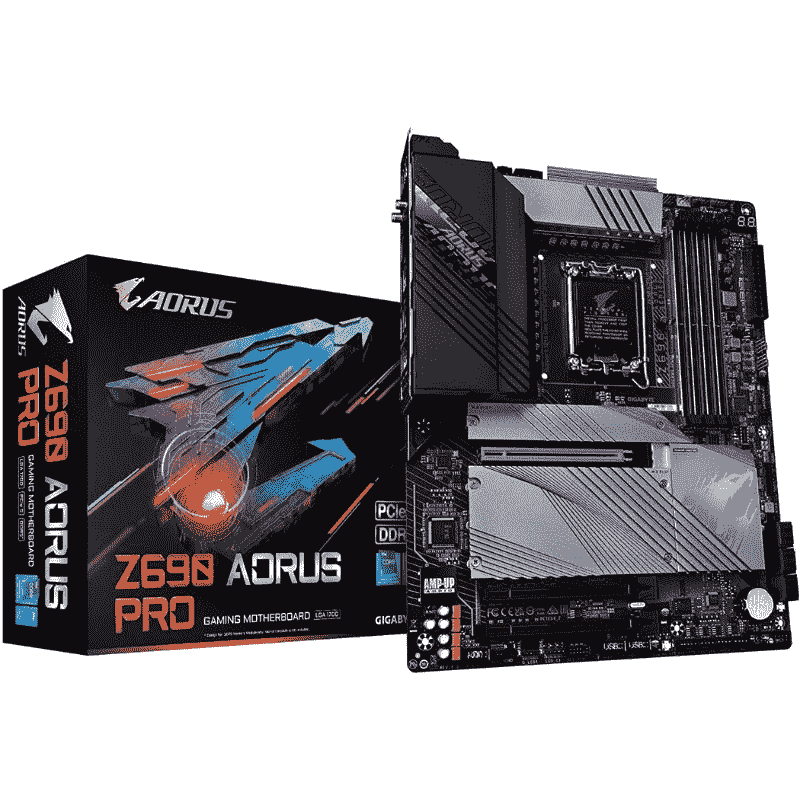

# 技嘉 Z690 Aorus Pro DDR5 主板评测

> 原文：<https://www.xda-developers.com/gigabyte-z690-aorus-pro-review/>

英特尔扣动了其最新 Z690 主板芯片组的扳机，以支持其新的第 12 代 Alder Lake 处理器的发布。这些新主板搭载了新的 [LGA 1700 CPU 插槽](https://www.xda-developers.com/cpu-coolers-socket-lga-1700/)以及其他一些进步，包括 PCIe Gen 5 以及 [DDR5 内存](https://www.xda-developers.com/best-ddr5-ram/)支持。新的[阿尔德湖 CPU](https://www.xda-developers.com/intel-12th-gen-alder-lake/)上市已经有几个月了，这些 Z690 主板并不短缺。技嘉 Z690 Aorus Pro 恰好是首批上市的 Z690 主板之一。事实上，这是 Z690 宇宙中第一批中端主板之一。

售价 329 美元的 Gigabyte Z690 Aorus Pro 是价格较低的 Z690 主板之一，支持 DDR5 内存以及一长串其他值得注意的功能。但是，这真的值得考虑你的下一个阿尔德湖电脑建设吗？好吧，让我们在这篇评论中找到答案。

**浏览此评论:**

## 技嘉 Z690 Aorus Pro 主板:规格

开始我们进入审查，让我们快速看一下技嘉 Z690 Aorus Pro 主板的规格:

| 

规格

 | 

技嘉 Z690 Aorus Pro

 |
| --- | --- |
| **主板芯片组** | 英特尔 Z690 高速芯片组 |
| **插座** | LGA 1700 |
| **外形尺寸** | ATX |
| **电压调节模块** | 19 相(16+1+2，90A MOSFETs 用于 Vcore) |
| **内存** | 4 个 DDR5 6200+(OC)，最高 128GB |
| **M.2 插槽** | 

*   3 个 PCIe 4.0 x4 (64 Gbps)
*   1 个 PCIe 4.0 x4 (64 Gbps)

 |
| **萨塔** | 6x SATA3 6 Gbps |
| **扩展槽** | 

*   1x PCIe 5.0 x16
*   2 个 PCIe x16 插槽，运行速度为 x4

 |
| **后面板 IO** | 

*   1 个 USB Type-C 端口，支持 USB 3.2 Gen 2x2
*   4 个 USB 3.2 第二代 A 类端口(红色)
*   4 个 USB 3.2 第 1 代端口
*   4 个 USB 2.0/1.1 端口
*   2 个 SMA 天线连接器(2T2R)
*   1 个显示端口
*   1 个 RJ-45 港
*   1 个光学 S/PDIF 输出连接器
*   2 个音频插孔

 |
| **保修** | 3 年 |

Z690 Aorus Pro 主板的盒子里有一堆东西，包括 SATA 电缆、Wi-Fi 天线、M.2 螺钉、RGB 扩展等等。您还将获得一份安装指南和用户手册，因此在组装电脑时请务必将它放在手边。好了，现在让我们进入设计和硬件部分，看看该板能提供什么样的器件支持。

## 技嘉 Z690 Aorus Pro 主板:设计和硬件

谈到设计，Z690 Aorus Pro 看起来非常简单。你实际上看到的是一个哑光黑色 PCB，板上有一些对比鲜明的灰色线条，以匹配散热器和护罩。与市场上许多其他优质主板不同，这款主板在护罩和散热器方面的覆盖范围较小。VRM 散热器带有 Aorus 品牌，而芯片组外壳带有镜面抛光的 Aorus Eagle。M.2 插槽还覆盖有散热器，以保持热量输出。它基本上被金属板覆盖，里面有隔热垫。

正如你所看到的，主板在主 PCIe 插槽和所有四个 DRAM 插槽上都有加固。这是一个受欢迎的补充，尽管对于这个价格范围的主板来说并不罕见。还值得指出的是，主板上唯一的 RGB 照明部分是 VRM 散热器上的 Aorus 品牌。这不一定是一个交易破坏者，但如果你打算购买更多 RGB 闪亮的东西，你可能不得不去别处看看。

VRM 散热器占据了电路板的很大一部分。这个特殊的散热器由两个独立的铝块组成，左边一排延伸到 IO 区域。散热片中有足够的通风来进行热传递，这很好。CPU 本身从位于散热器上方顶部边缘的 8 针和 4 针 EPS 连接器组合中获得电力。你只需要 8 针来给 CPU 供电，但是你可以两个都插。

接下来你会注意到的是 LGA 1700 CPU 插座本身。你可能已经知道，这个插座比我们过去见过的其他 LGA 插座要大。它被一些电容器包围，并在这个特殊的主板上印刷文字，使它具有独特的外观。插槽右侧有四个加固的 DRAM 插槽，能够处理高达 128GB 的 DDR5 RAM。

根据 Gigabyte 的说法，这种特殊的主板最高支持 DDR5 6200(OC)，这意味着它提供了超过基线 DDR5-4800 规格的充足空间。我们能够毫无问题地运行我们的[Kingston Fury Beast DDR 5-5200 RAM 套件](https://www.xda-developers.com/kingston-fury-beast-ddr5-review/)。然后，您就有了一系列 fan 和 RGB 接头以及一系列 USB 接头。值得注意的是，Z690 Aorus Pro 在 24 针 ATX 连接器旁边有一个双字符调试显示和四个 LED 调试功能。双字符调试指示灯为您提供详细说明问题的代码，四个指示灯在开机自检过程中让您了解问题。

移到主板的下半部分，你会看到几个 PCIe 插槽，一个音频部分，四个隐藏在散热器下的 m.2 插槽，以及更多的接头。主板自带 Realtek ALC4080 编解码器，我们认为对于大多数用户来说已经相当不错了。它不是最好的编解码器，但与这个价格范围内的大多数其他音频芯片不相上下。

主板中间的主全长插槽以 PCIe 5.0 x16 速度运行。它使用技嘉的超耐用 SMD PCIe 5.0 装甲进行 EMI 保护，并为更重的 GPU 提供额外支持。主板底部还有两个 PCIe 插槽，但它们通过芯片组连接，运行速度高达 PCIe 3.0 x4。在 PCIe 插槽(上面一个)之间是隐藏在散热器下的四个 M.2 插座。主插槽上方的 M.2 插槽支持最大 110 毫米的 PCIe 4.0 x4 驱动器。第二个插槽通过芯片组连接，运行 SATA 和 PCIe 4.0 x4 模块，最大 110 毫米。最后，底部的两个插槽通过芯片组连接，支持高达 110 毫米的驱动器和 PCIe 4.0 x4 速度。

此外，您还可以获得六个支持 RAID 0/1/5/10 模式的 SATA 端口。最后，靠近主板底部的是一些接头。这包括 USB 端口和 RGB 接头。Z690 Aorus Pro 还配有温度传感器接头来控制您的冷却系统。

在我们进入本次评测的性能部分之前，先来快速浏览一下后 IO 面板。这款主板最大的优点之一是预装了后 IO 面板保护罩，这意味着您不必担心在构建 PC 时单独安装它。您可以参考上面的规格表来检查您在此主板的后 IO 面板上获得的所有端口。

## 技嘉 Z690 Aorus Pro 主板:性能

Gigabyte Z690 Aorus Pro 的 BIOS 布局与几乎所有其他 Gigabyte 主板非常相似。它允许你不用看任何手册就能快速调整设置。Gigabyte Z690 Aorus Pro 是 Alder Lake 芯片的坚实平台，我们能够运行未锁定的 [Core i9-12900K](https://www.xda-developers.com/intel-core-i9-12900k-vs-amd-ryzen-5950x/) 而没有任何问题。借助英特尔酷睿 i9-12900K 和强大的 [CPU 冷却器](https://www.xda-developers.com/best-cpu-coolers/)，我们能够快速启动并运行一切。

下面快速浏览一下我们能够在该主板上使用 12900K 运行的一些综合基准测试。这些数字应该让你知道主板是如何处理 CPU 和其他组件的，即使是在高负载的情况下。

| 

试验

 | 

英特尔酷睿 i9-12900K

 | 

英特尔酷睿 i9-12900K (OC)

 |
| --- | --- | --- |
| **Cinebench R23 - Single(越高越好)** | 1962 | 2137 |
| **Cinebench R23 - Multi(越高越好)** | 27086 | 28597 |
| **CPU-Z Single(越高越好)** | 814 | 892 |
| **CPU-Z Multi(越高越好)** | 11396 | 11923 |
| **电晕 1.3** **(越低越好)** | 59 | 54 |
| **搅拌机宝马(越低越好)** | 87 | 86 |
| **PCMark 10(越高越好)** | 12145 | 11038 |

用这种特殊的主板超频 CPU 也是一个相当简单的过程。我们能够将 12900K 在 P 内核上提升到 5.0GHz 以上，在 E 内核上提升到 4.0Ghz 以上，从而大幅提升时钟速度。值得指出的是，你仍然需要一个高质量的 CPU 冷却器来保持超频设置下的热输出。

## 技嘉 Z690 Aorus Pro 主板:最终想法

售价 329 美元的 Gigabyte Z690 Aorus Pro 是阿尔德湖 CPU 的坚实平台。它不像市场上许多其他优质 Z690 主板那样昂贵，但它提供了一些值得注意的功能，包括 DDR5 兼容性、四个 M.2 插槽、2.5 GbE、引人注目的设计等等。整体性能也和很多其他高端 Z690 主板不相上下，不错。我们能够在库存和超频设置下运行酷睿 i9-12900K 和[酷睿 i5-12600K](https://www.xda-developers.com/amd-ryzen-5-5600x-vs-intel-core-i5-12600k/) ，没有出现任何问题。

在缺点方面没有太多可说的，但如果我们要选择，我们会说主板可以使用 WiFi 6E 支持，甚至一些集成的 RGB 灯。很多人不喜欢主板上的 RGB 灯，但我们认为最好有可以关闭的灯，而不是完全没有灯。也就是说，Gigabyte Z690 Aorus Pro 是那些希望在 2022 年建造新奥尔德湖 PC 的人的可靠选择。在撰写本文时，其他 600 系列芯片组主板尚未上市，但我们认为 Aorus Pro 将继续成为最佳选择之一，并且肯定会成为我们在 2022 年购买的[最佳主板](https://www.xda-developers.com/best-motherboard/)的一部分。

 <picture></picture> 

Gigabyte Z690 Aorus Pro DDR5 motherboard

##### 技嘉 Z690 Aorus Pro DDR5

技嘉 Z690 Aorus Pro 是目前市场上最好的 Z690 主板之一。它以相对实惠的价格提供了包括 DDR5 支持在内的多种功能。